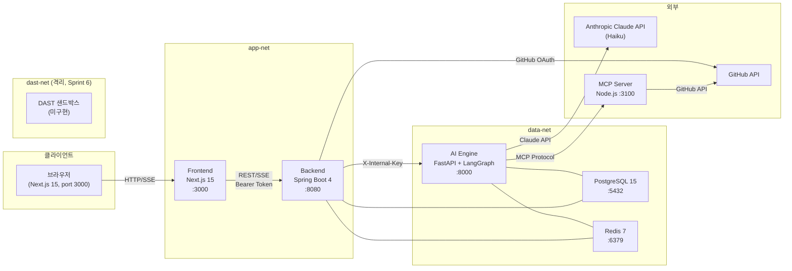
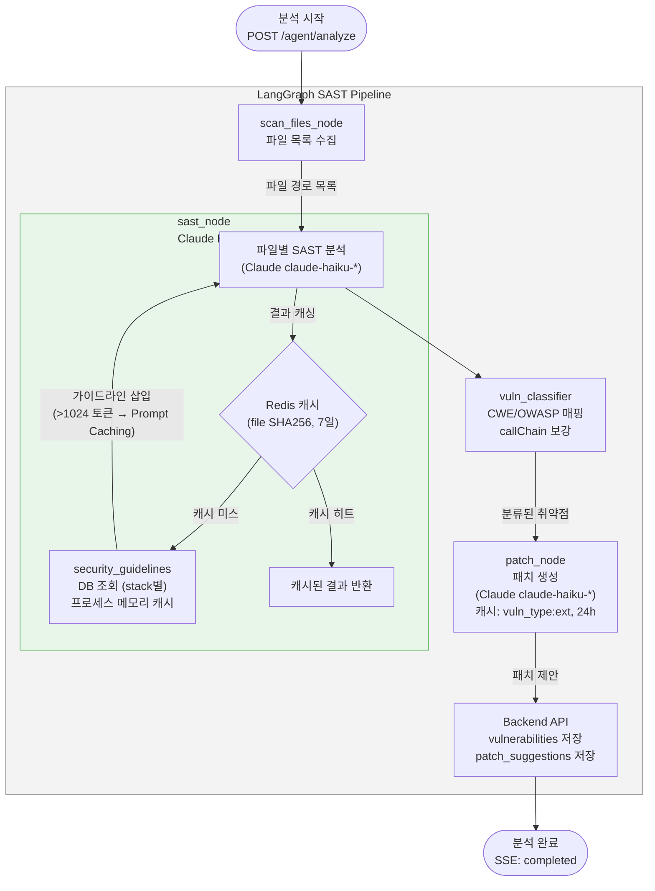
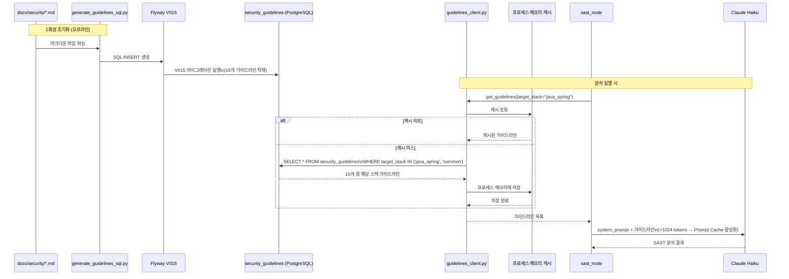
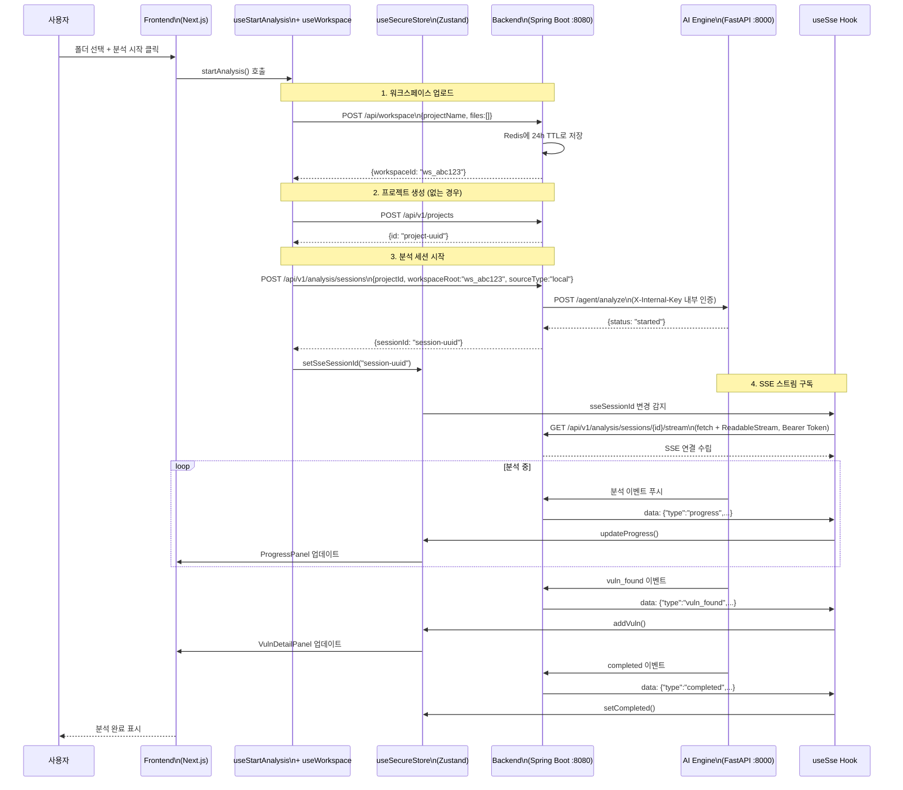
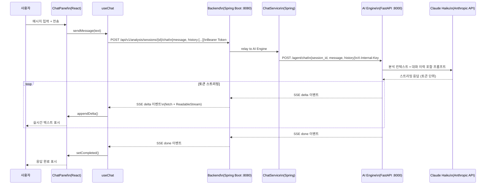
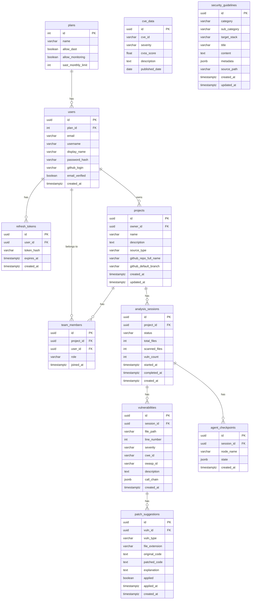
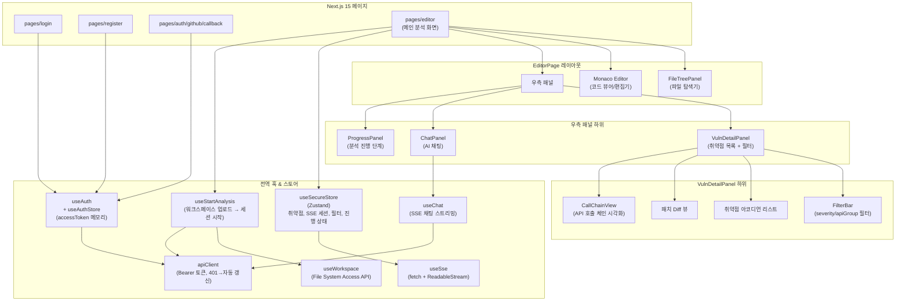
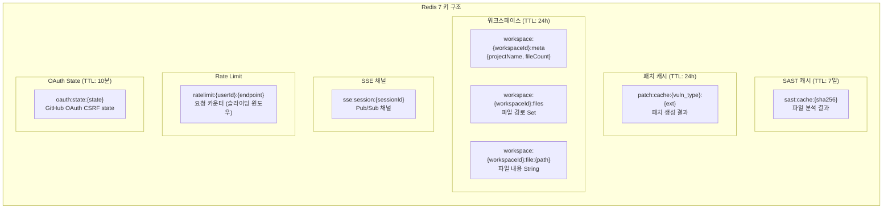
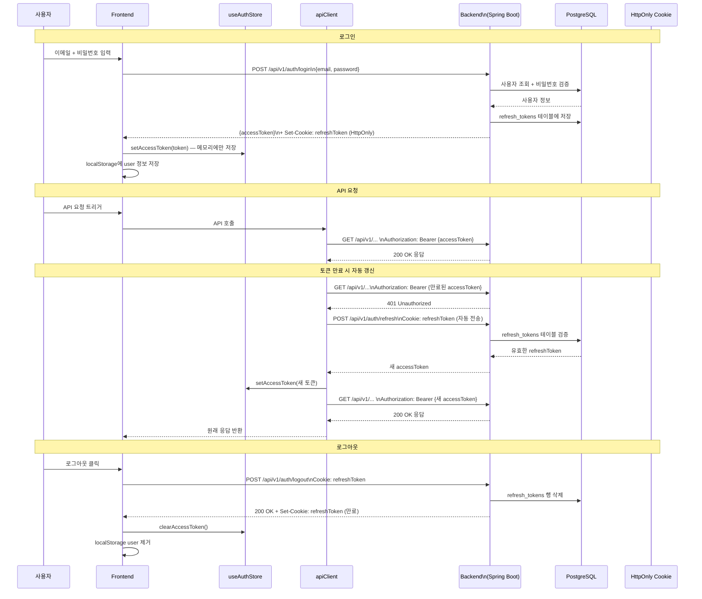
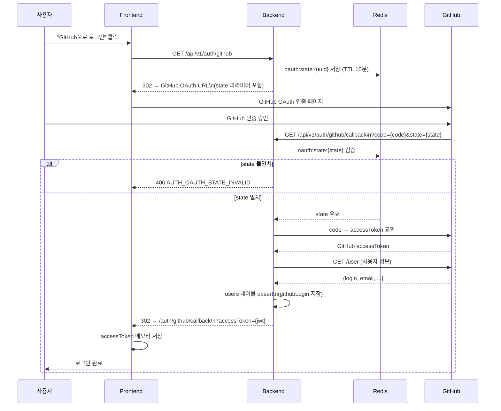

# SecureAI — 현재 아키텍처 개요
> 기준: Sprint 4 완료 + TASK-306 (보안 가이드라인 DB) 완료  
> 작성일: 2026-05-06  
> 완료된 스프린트: Sprint 0, 1, 2, 3, 4 + TASK-306

---

## 목차

1. [시스템 전체 구성](#1-시스템-전체-구성)
2. [SAST 분석 파이프라인](#2-sast-분석-파이프라인)
3. [Security Guidelines 흐름](#3-security-guidelines-흐름)
4. [실시간 분석 SSE 흐름](#4-실시간-분석-sse-흐름)
5. [AI 채팅 흐름](#5-ai-채팅-흐름)
6. [DB ERD (주요 테이블)](#6-db-erd-주요-테이블)
7. [프론트엔드 컴포넌트 구조](#7-프론트엔드-컴포넌트-구조)
8. [스프린트 완료 현황](#8-스프린트-완료-현황)
9. [Redis 키 구조](#9-redis-키-구조)
10. [인증 흐름](#10-인증-흐름)
11. [기술 스택 상세](#11-기술-스택-상세)

---

## 1. 시스템 전체 구성



### 1.1 서비스 포트 요약

| 서비스 | 스택 | 포트 | 네트워크 |
|--------|------|------|---------|
| Frontend | Next.js 15, React 18 | 3000 | app-net |
| Backend | Spring Boot 4, Java 21 | 8080 | app-net, data-net |
| AI Engine | Python 3.12, FastAPI + LangGraph | 8000 | data-net |
| MCP Server | Node.js | 3100 | data-net |
| PostgreSQL | postgres:15-alpine | 5432 | data-net |
| Redis | redis:7-alpine | 6379 | data-net |

### 1.2 네트워크 격리 정책

| 네트워크 | 구성원 | 목적 |
|---------|-------|------|
| `app-net` | Frontend, Backend | 클라이언트 요청 처리 |
| `data-net` | Backend, AI Engine, PostgreSQL, Redis | 데이터 레이어 통신 |
| `dast-net` | DAST 샌드박스 (Sprint 6 예정) | DAST 실행 격리 |

Frontend는 `data-net`에 속하지 않으므로 PostgreSQL, Redis에 직접 접근할 수 없다.  
AI Engine은 `app-net`에 속하지 않으므로 외부 클라이언트가 직접 접근할 수 없다.

---

## 2. SAST 분석 파이프라인

LangGraph로 구현된 5단계 SAST 파이프라인이다.



### 2.1 파이프라인 노드 상세

#### `scan_files_node`
- **역할**: 분석 대상 파일 목록 수집
- **로컬 소스** (`source_type: local`): Redis에서 workspace 파일 목록 조회
- **GitHub 소스** (`source_type: github`): GitHub API를 통해 레포지토리 파일 트리 조회
- **출력**: 파일 경로 목록, `totalFiles` 카운트

#### `sast_node`
- **역할**: 각 파일을 Claude Haiku로 SAST 분석
- **캐시**: 파일 SHA256 해시 기준 Redis 캐시 (TTL 7일)
- **보안 가이드라인**: `target_stack` 기준으로 DB에서 조회하고 프로세스 메모리에 캐싱
- **지원 스택**: `java_spring`, `python_fastapi`, `frontend_react_nextjs`, `go_gin_echo`, `node_express_nestjs`, `common`
- **Prompt Caching**: 가이드라인 삽입으로 시스템 프롬프트가 1024 토큰을 초과하여 Anthropic Prompt Caching이 활성화됨

#### `vuln_classifier`
- **역할**: 취약점에 CWE ID, OWASP ID 매핑 및 API callChain 보강
- **출력**: `cweId`, `owaspId`, `callChain` JSONB 포함 취약점 목록

#### `patch_node`
- **역할**: 취약점별 패치 코드 생성 (Claude Haiku)
- **캐시**: `vuln_type:file_extension` 기준 Redis 캐시 (TTL 24시간)
- **출력**: `originalCode`, `patchedCode`, `explanation` 포함 패치 제안

#### Backend 저장
- **역할**: `vulnerabilities`, `patch_suggestions` 테이블에 결과 저장
- Backend REST API를 통해 AI Engine이 호출

---

## 3. Security Guidelines 흐름

TASK-306에서 구현한 보안 가이드라인 DB 연동 흐름이다.



### 3.1 보안 가이드라인 DB 스키마

```sql
-- V015__create_security_guidelines.sql
CREATE TABLE security_guidelines (
    id           UUID PRIMARY KEY DEFAULT gen_random_uuid(),
    category     VARCHAR(50)  NOT NULL,  -- Injection, Cryptography 등
    sub_category VARCHAR(50),            -- SQLi, XSS, JWT 등
    target_stack VARCHAR(50)  NOT NULL,  -- java_spring, python_fastapi, common 등
    title        VARCHAR(255) NOT NULL,
    content      TEXT         NOT NULL,  -- 가이드 본문 (마크다운)
    metadata     JSONB        DEFAULT '{}',  -- CWE ID, OWASP ID, 참고 링크
    source_path  VARCHAR(500),           -- 출처 파일 경로 (동기화용)
    created_at   TIMESTAMPTZ  NOT NULL DEFAULT NOW(),
    updated_at   TIMESTAMPTZ  NOT NULL DEFAULT NOW(),
    CONSTRAINT uq_guideline_title_stack UNIQUE (title, target_stack)
);

CREATE INDEX idx_guidelines_category ON security_guidelines(category, sub_category);
CREATE INDEX idx_guidelines_stack    ON security_guidelines(target_stack);
CREATE INDEX idx_guidelines_metadata ON security_guidelines USING GIN(metadata);
```

### 3.2 적재된 가이드라인 현황

| 분류 | 대상 스택 | 개수 | 소스 파일 |
|------|---------|------|---------|
| 공격 패턴 (SQLi, XSS, CSRF 등) | common | 7 | `docs/security/attacks/B*.md` |
| Java Spring 스택 가이드라인 | java_spring | 1 | `docs/security/stacks/STACK_java_spring.md` |
| Python FastAPI 스택 가이드라인 | python_fastapi | 1 | `docs/security/stacks/STACK_python_fastapi.md` |
| Frontend React/Next.js 가이드라인 | frontend_react_nextjs | 1 | `docs/security/stacks/STACK_frontend_react_nextjs.md` |
| Go Gin/Echo 가이드라인 | go_gin_echo | 1 | `docs/security/stacks/STACK_go_gin_echo.md` |
| Node.js Express/NestJS 가이드라인 | node_express_nestjs | 1 | `docs/security/stacks/STACK_node_express_nestjs.md` |
| 공통 Python 가이드라인 | common | 1 | `docs/security/stacks/STACK_common_python.md` |
| **합계** | | **13+** | |

> 실제 총 개수는 15개이며, 마크다운 파일의 섹션 분할 방식에 따라 달라진다.

---

## 4. 실시간 분석 SSE 흐름

프론트엔드에서 분석을 시작하고 SSE로 실시간 결과를 받는 전체 흐름이다.



### 4.1 EventSource 대신 fetch를 사용하는 이유

브라우저의 `EventSource` API는 `Authorization` 헤더를 지원하지 않는다.  
`useSse` 훅은 `fetch + ReadableStream`을 사용하여 `Authorization: Bearer {accessToken}` 헤더를 전달한다.

```typescript
// useSse.ts — 핵심 구현 패턴
const response = await fetch(`/api/v1/analysis/sessions/${sessionId}/stream`, {
  headers: {
    Authorization: `Bearer ${accessToken}`,
    Accept: 'text/event-stream',
  },
});
const reader = response.body!.getReader();
// ReadableStream으로 파싱
```

---

## 5. AI 채팅 흐름

분석 완료 후 사용자가 AI와 채팅하는 흐름이다.



---

## 6. DB ERD (주요 테이블)



### 6.1 Flyway 마이그레이션 순서

| 버전 | 파일명 | 내용 |
|------|--------|------|
| V001 | `create_plans` | 요금제 테이블 |
| V002 | `create_users` | 사용자 테이블 |
| V003 | `create_refresh_tokens` | 리프레시 토큰 |
| V004 | `create_projects` | 프로젝트 테이블 |
| V005 | `create_team_members` | 팀 멤버 |
| V006 | `create_analysis_sessions` | 분석 세션 |
| V007 | `create_vulnerabilities` | 취약점 테이블 |
| V008 | `create_analysis_progress_log` | 진행 로그 |
| V009 | `create_cve_data` | CVE 데이터 |
| V010 | `create_dependency_components` | 의존성 컴포넌트 |
| V011 | `create_patch_suggestions` | 패치 제안 |
| V012 | `add_cve_component_mapping` | CVE-컴포넌트 매핑 |
| V013 | `alter_vulnerabilities_call_chain_jsonb` | callChain JSONB 컬럼 추가 |
| V015 | `create_security_guidelines` | 보안 가이드라인 (TASK-306) |

> V014는 현재 사용하지 않는다. (예약됨)

---

## 7. 프론트엔드 컴포넌트 구조



### 7.1 상태 관리 전략

| 상태 종류 | 저장 위치 | 이유 |
|---------|---------|------|
| `accessToken` | 메모리 (useAuthStore) | XSS 방어 — localStorage에 저장하지 않음 |
| 사용자 정보 (`user`) | localStorage | 페이지 새로고침 후 복원 필요 |
| `refreshToken` | HttpOnly 쿠키 | JavaScript에서 접근 불가 (XSS 방어) |
| 취약점 목록 | useSecureStore (Zustand) | SSE로 실시간 업데이트 필요 |
| 분석 진행 상태 | useSecureStore (Zustand) | SSE로 실시간 업데이트 필요 |
| Monaco 에디터 상태 | useSecureStore (Zustand) | 파일 선택, 내용, 스크롤 위치 공유 |

---

## 8. 스프린트 완료 현황

### 8.1 전체 로드맵

| 스프린트 | 기간 | 주요 목표 | 상태 |
|---------|------|---------|------|
| Sprint 0 | Week 01-02 | 환경 세팅 & 인프라 기반 | 완료 |
| Sprint 1 | Week 03-04 | 인증 & 프로젝트 관리 | 완료 |
| Sprint 2 | Week 05-06 | AI Agent 기반 & MCP + 체크포인트 시스템 | 완료 |
| Sprint 3 | Week 07-08 | SAST 파이프라인 & GitHub 레포 스캔 | 완료 |
| Sprint 4 | Week 09-10 | 웹 에디터 UI & 실시간 SSE | 완료 |
| TASK-306 | 2026-05-06 | 보안 가이드라인 DB & SAST 주입 | 완료 |
| Sprint 5 | Week 11-12 | GitHub Layer 2 완성 | 예정 |
| Sprint 6 | Week 13-14 | DAST 엔진 & Docker 샌드박스 | 예정 |
| Sprint 7 | Week 15-16 | 리포트 & 대시보드 & Android MVP | 예정 |
| Sprint 8 | Week 17-18 | 안정화 & 성능 최적화 | 예정 |
| Sprint 9 | Week 19-20 | VSCode Extension & 지속 모니터링 | 예정 |

### 8.2 Sprint별 구현 완료 항목

#### Sprint 0 — 인프라 기반
- Docker Compose 전체 서비스 구성 (postgres, redis, backend, ai_engine, frontend)
- 네트워크 3종 (app-net, data-net, dast-isolated-net) 정의
- Flyway 초기화 (V001)
- Makefile 단축 명령어

#### Sprint 1 — Auth & Project
- JWT 이메일 인증 (register → verify-email → login)
- refreshToken HttpOnly 쿠키 + Silent Refresh
- GitHub OAuth (CSRF state Redis 저장)
- 비밀번호 찾기/재설정
- Project CRUD + 팀 멤버 관리
- Flyway V001–V006

#### Sprint 2 — AI Agent & MCP
- LangGraph 파이프라인 기반 구조
- MCP Server (filesystem, GitHub, Docker 도구)
- LangGraph 체크포인트 (`agent_checkpoints` 테이블)
- SseEmitterService (Spring Boot SSE 기반)
- AI Engine FastAPI 기본 구조

#### Sprint 3 — SAST 파이프라인
- `scan_files_node`: 로컬 워크스페이스 + GitHub 파일 목록 수집
- `sast_node`: Claude Haiku 파일별 분석, Redis 캐시 7일 (SHA256)
- `vuln_classifier`: CWE/OWASP 자동 매핑, callChain JSONB 보강
- `patch_node`: 패치 생성, Redis 캐시 24h (vuln_type:ext)
- GitHubRestClient + GitHub API 연동
- Flyway V007–V013

#### Sprint 4 — 프론트엔드 UI
- Monaco Editor 통합 (dynamic import, 언어 감지)
- `useSse` (fetch + ReadableStream, Authorization 헤더 지원)
- `useStartAnalysis` (워크스페이스 업로드 → 프로젝트 생성 → 세션 시작)
- `VulnDetailPanel` (아코디언, FilterBar, 패치 diff)
- `CallChainView` (수평 API 호출 체인 시각화)
- `ProgressPanel` (실시간 단계 체크리스트)
- `ChatPanel` + `useChat` (SSE 스트리밍 채팅)
- `useWorkspace` (File System Access API 폴더 선택)

#### TASK-306 — 보안 가이드라인 DB (2026-05-06)
- `security_guidelines` 테이블 (Flyway V015)
- `generate_guidelines_sql.py`: MD 파일 → SQL INSERT 변환
- `sync_guidelines.py`: 가이드라인 동기화 스크립트
- `guidelines_client.py`: 비동기 PostgreSQL 조회 + 프로세스 메모리 캐시
- 15개 가이드라인 적재 (공격 패턴 7개 + 스택별 6개 + common 2개)
- sast_node에 가이드라인 주입 → Prompt Caching 활성화

---

## 9. Redis 키 구조



### 9.1 Redis 키 패턴 상세

| 키 패턴 | TTL | 데이터 타입 | 용도 |
|---------|-----|-----------|------|
| `sast:cache:{sha256}` | 7일 | String (JSON) | 파일 SAST 분석 결과 캐시 |
| `patch:cache:{vuln_type}:{ext}` | 24시간 | String (JSON) | 패치 생성 결과 캐시 |
| `workspace:{id}:meta` | 24시간 | Hash | 워크스페이스 메타 정보 |
| `workspace:{id}:files` | 24시간 | Set | 파일 경로 목록 |
| `workspace:{id}:file:{path}` | 24시간 | String | 파일 내용 |
| `sse:session:{sessionId}` | 세션 종료 시 삭제 | Pub/Sub | AI Engine → Backend SSE 이벤트 전달 |
| `ratelimit:{userId}:{endpoint}` | 슬라이딩 윈도우 | String (카운터) | API Rate Limiting |
| `oauth:state:{state}` | 10분 | String | GitHub OAuth CSRF 방어 |

---

## 10. 인증 흐름

### 10.1 이메일 로그인 + JWT Refresh 흐름



### 10.2 GitHub OAuth 흐름



---

## 11. 기술 스택 상세

### 11.1 Backend (Spring Boot 4)

| 구분 | 기술 | 버전 | 용도 |
|------|------|------|------|
| 언어 | Java | 21 | Virtual Threads (Project Loom) |
| 프레임워크 | Spring Boot | 4.x | 웹 레이어, DI, 자동 구성 |
| ORM | Spring Data JPA (Hibernate 6) | 6.x | DB 접근 |
| DB | PostgreSQL | 15 | 메인 데이터 저장소 |
| 캐시/메시지 | Redis | 7 | SAST 캐시, 워크스페이스, SSE 채널 |
| 마이그레이션 | Flyway | - | DB 스키마 버전 관리 (V001-V015) |
| 인증 | JWT (JJWT) | - | Access/Refresh Token |
| SSE | SseEmitter | Spring 내장 | 실시간 분석 결과 스트리밍 |

### 11.2 AI Engine (FastAPI)

| 구분 | 기술 | 버전 | 용도 |
|------|------|------|------|
| 언어 | Python | 3.12 | - |
| 웹 프레임워크 | FastAPI | - | REST + SSE API |
| AI 오케스트레이션 | LangGraph | - | SAST 파이프라인 상태 머신 |
| AI 모델 | Claude Haiku | (Anthropic) | SAST 분석, 패치 생성, 채팅 |
| DB 접근 | asyncpg | - | 비동기 PostgreSQL (guidelines_client) |
| 캐시 | Redis (aioredis) | - | SAST 결과, 패치 캐시 |
| MCP 통신 | MCP Protocol | - | 파일시스템, GitHub, Docker 도구 |

### 11.3 Frontend (Next.js 15)

| 구분 | 기술 | 버전 | 용도 |
|------|------|------|------|
| 프레임워크 | Next.js | 15 | SSR/CSR 하이브리드 |
| UI 라이브러리 | React | 18 | 컴포넌트 기반 UI |
| 상태 관리 | Zustand | - | 전역 상태 (취약점, 분석 상태) |
| 코드 에디터 | Monaco Editor | - | VSCode 기반 코드 뷰어/편집기 |
| SSE 클라이언트 | fetch + ReadableStream | 브라우저 내장 | Authorization 헤더 지원 |
| 파일 접근 | File System Access API | 브라우저 내장 | 로컬 폴더 선택 |

### 11.4 MCP Server (Node.js)

| 구분 | 기술 | 용도 |
|------|------|------|
| 런타임 | Node.js | MCP 프로토콜 서버 |
| 도구 | filesystem | 워크스페이스 파일 읽기 |
| 도구 | GitHub | 레포지토리 파일 트리, 내용 조회 |
| 도구 | Docker | (DAST, Sprint 6 예정) |

---

*이 문서는 Sprint 4 완료 + TASK-306 완료 시점(2026-05-06)의 구현 상태를 반영한다.*  
*다음 업데이트 예정: Sprint 5 완료 후*
