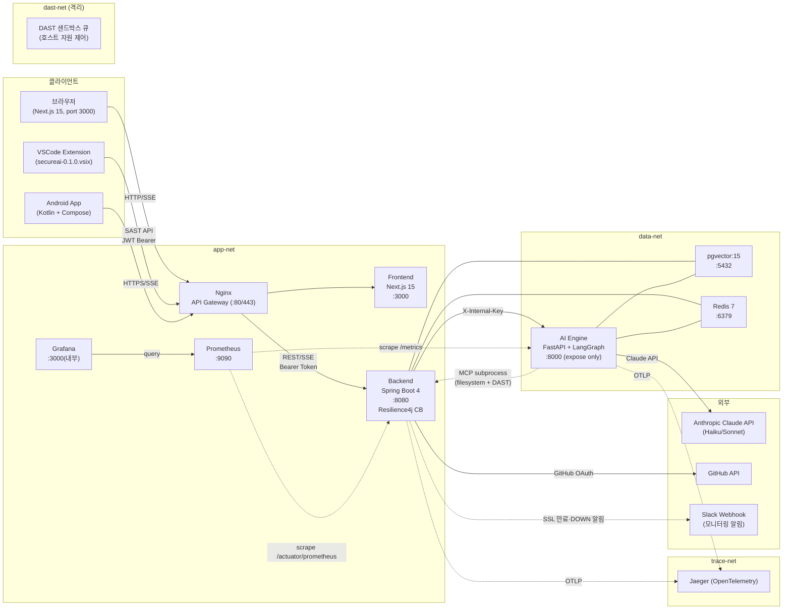
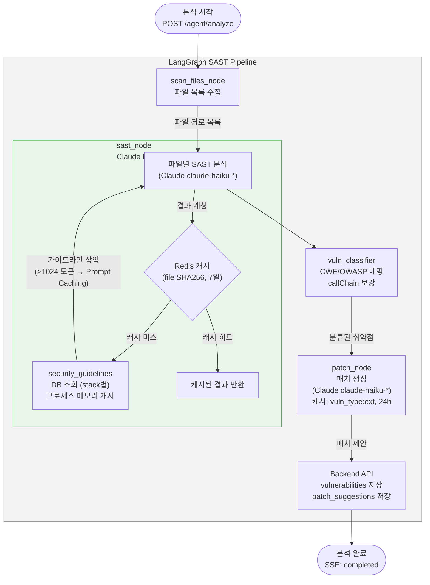
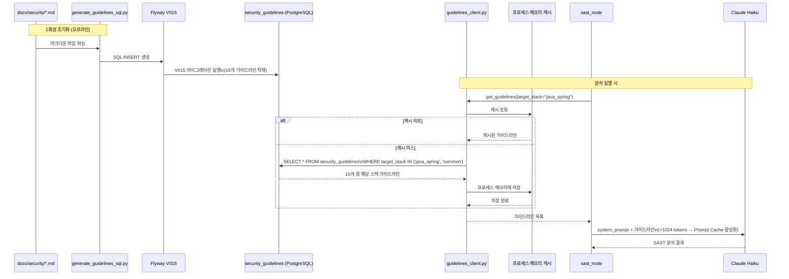
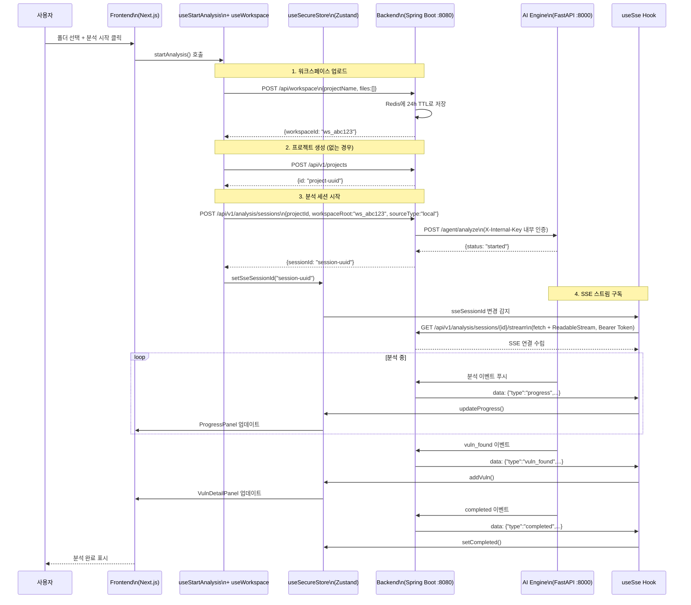
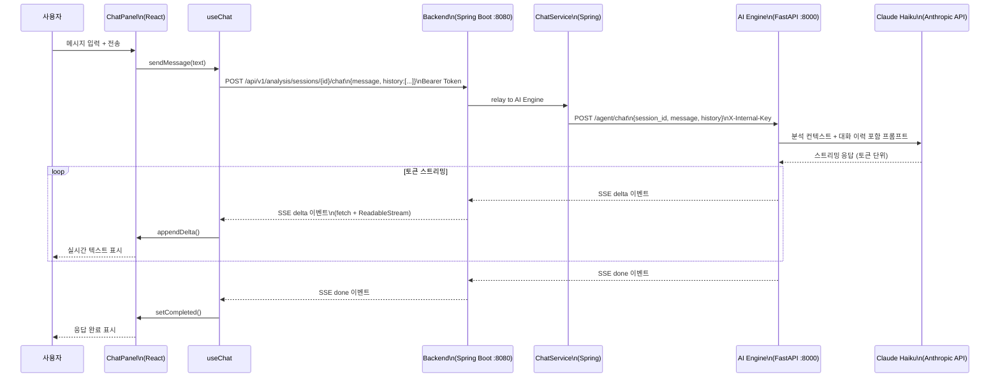
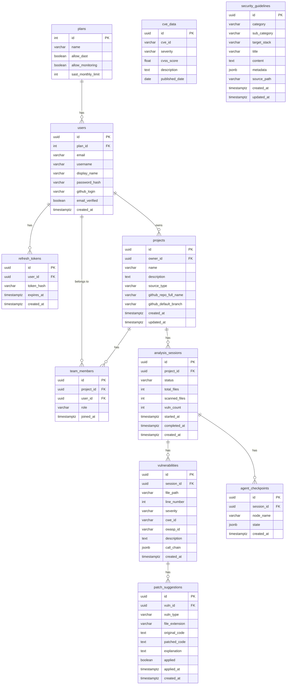
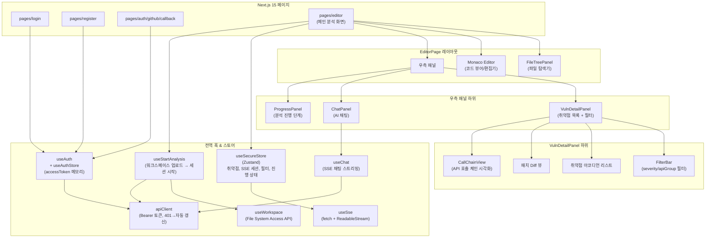
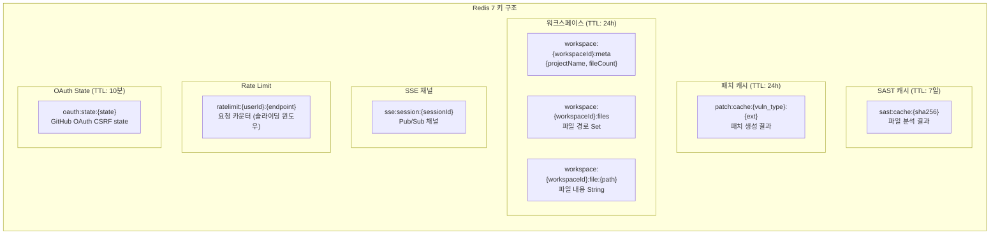
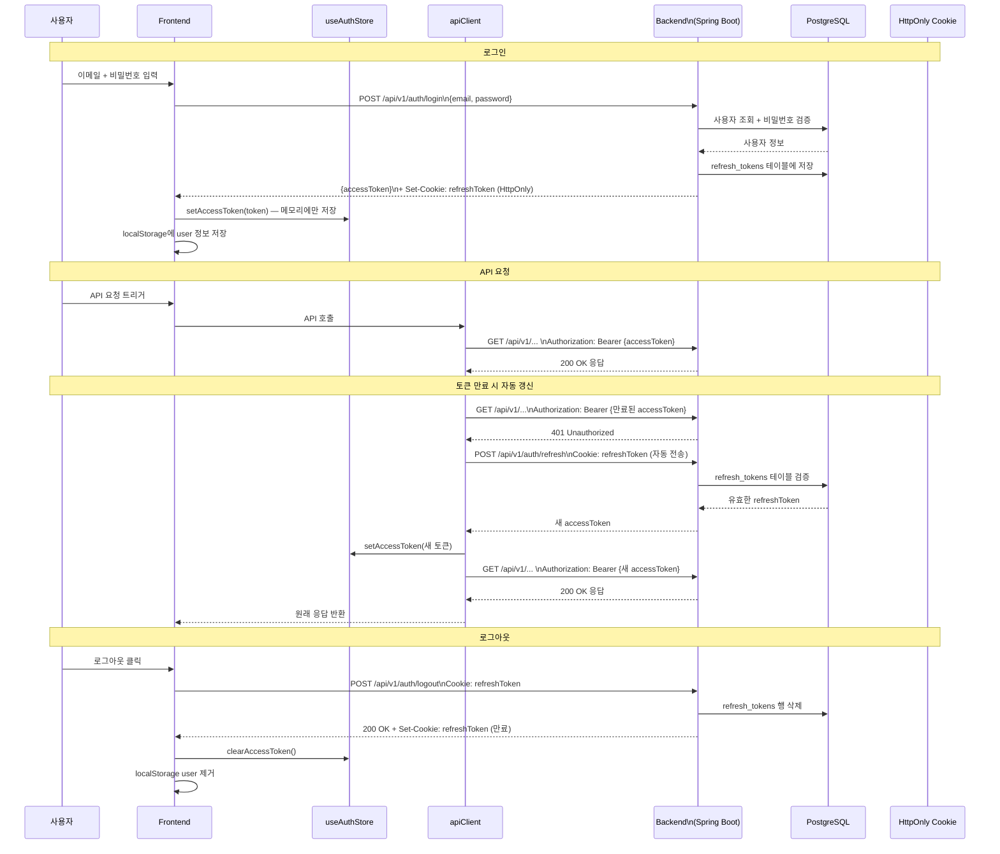
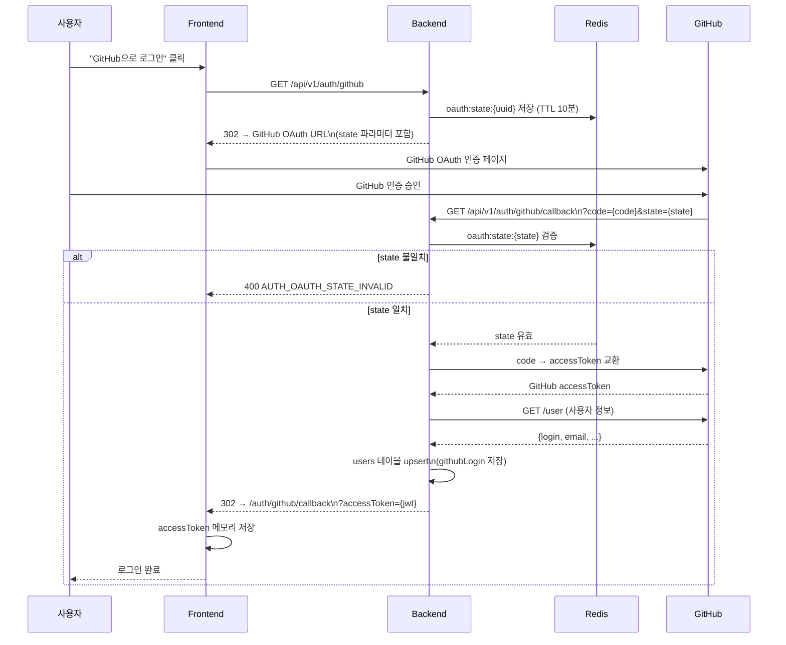

# SecureAI — 현재 아키텍처 개요 v3.0
> 기준: Sprint 9 완료  
> 작성일: 2026-05-22 | 최종 업데이트: 2026-05-23  
> 완료된 스프린트: Sprint 0 ~ Sprint 9  
> **정본 지정일**: 2026-05-23 | 구버전(`16_ARCHITECTURE_CURRENT.md`) 아카이브 완료

## 버전 이력

| 버전 | 파일명 | 기준일 | 주요 변경 |
|------|--------|--------|---------|
| V1 | `16_ARCHITECTURE_CURRENT.md` | Sprint 6 완료 | 초기 아키텍처 스냅샷 — SAST+DAST+SSE 파이프라인, Sprint 1~6 기준, pgvector 임베딩, Redis 키 구조, 인증 흐름 |
| V2 | `17_ARCHITECTURE_CURRENT_V2.md` | 2026-05-22 | Sprint 8 완료 기준 전면 개편: Nginx API Gateway, Jaeger 분산 트레이싱, 2FA/IP Allowlist/GDPR 보안 강화, VC 피드백 3항목(AI 환각 제어·DAST 자원 통제·API 토큰 Hard Limit) 대응 |
| V3 | `17_ARCHITECTURE_CURRENT_V2_260523.md` | 2026-05-23 | Sprint 9 완료 기준 업데이트: PostgreSQL MCP + Docker DAST MCP 전환, Prometheus+Grafana 관측성 추가, GDPR 소프트→하드 삭제 분리, 지속 모니터링 서비스(MonitoringJob), VSCode Extension MVP, Android 고도화 |
| **V4 정정 (현재)** | (본 파일 §0 정합 섹션) | 2026-06-29 | **코드 정합 정정** — 본문 §1(Sprint9 스냅샷)이 5스프린트 stale라 아래 §0에 현재 구현 기준 정정을 추가. 네트워크 3종(trace-net 미존재)·AI엔진 host 노출·제품 DAST 비격리·Loki/Sentry 추가 반영 |

---

## 0. ⚠️ 현재 구현 정합 (2026-06-29 정정 — 본 섹션이 우선)

> 아래 §1~§12 본문은 **Sprint 9 스냅샷**이며 다음 항목이 현재 코드(`docker-compose.yml`, Flyway V064)와 다르다. **충돌 시 본 §0이 정본.**

### 0.1 네트워크 — 실제 3종 (trace-net·frontend-net 미존재)

| 네트워크 | 실제 구성원 | 비고 |
|---------|-----------|------|
| `app-net` (bridge) | nginx, backend, ai_engine, jaeger, prometheus, grafana, loki, promtail | FE는 dev에서 **로컬 npm**(컨테이너 아님) |
| `data-net` (bridge) | backend, ai_engine, postgres, redis, jaeger | backend·ai_engine·jaeger는 **app-net+data-net 멀티홈** |
| `dast-isolated-net` (**external:true**) | nginx, zap(profile:zap) | 호스트에서 `docker network create` 선행. backend는 docker.sock(DooD)로 호스트 네트워크 직접 참조 |

> ❌ `trace-net`은 **존재하지 않는다**(Jaeger는 app-net+data-net). 본문 §1.2 표는 무효.

### 0.2 정정 핵심 (본문 §1 대비)

| 항목 | 본문(§1, Sprint9) | **현재 코드** |
|------|------------------|--------------|
| AI 엔진 노출 | `expose:8000` 외부 차단·data-net 전용 | **`ports: 8000:8000` host publish + app-net+data-net** — FE가 DAST 배치 SSE를 ai_engine에 직접 구독. *"외부차단" 더 이상 사실 아님* |
| 제품 DAST 격리 | dast-net 격리 샌드박스 | **ai_engine 프로세스 內 httpx**가 app-net에서 타깃 직접 공격(비격리). dast-isolated-net 격리는 **ZAP 회귀스캔(profile:zap) 한정** → 격리화 백로그 **TASK-1227** |
| 로그 집계 | 없음 | **Loki + Promtail + Grafana(Loki DS)** (TASK-1603) |
| 에러 추적 | 없음 | **Sentry** env-gated (backend·ai_engine·frontend, TASK-1804) |
| Frontend | app-net 컨테이너 :3000 | dev는 **로컬 실행**(compose 주석). backend/ai_engine 직접 호출(CORS) |
| GitHub App | 없음 | backend가 `github-app.pem` 마운트 + APP_ID/WEBHOOK_SECRET (TASK-1201/1211) |
| 포트 | pg 5432 / grafana 3000 | pg **5434→5432** / grafana **3001→3000** / jaeger **+4318(OTLP HTTP)** |
| Flyway | V001~V043 | **V064까지**(§6.1 ERD 정정 참조) |

### 0.3 현재 시스템 구성도 (실제)

```mermaid
graph TB
    subgraph HOST["호스트 / 외부 (비컨테이너)"]
        FE["Frontend — 로컬 npm :3000"]
        VULN["fastapi-vuln(데모타깃)<br/>docker run · app-net"]
        EXT["Anthropic/Gemini/OpenAI · GitHub API"]
    end
    subgraph APPNET["app-net"]
        NGINX["nginx :80/443"]
        BE["backend :8080 (app+data 멀티홈)"]
        AE["ai_engine :8000 host publish (app+data 멀티홈)"]
        JAEGER["jaeger :16686/4317/4318 (app+data)"]
        PROM["prometheus :9090"]
        GRAF["grafana :3001→3000"]
        LOKI["loki :3100"]
        PT["promtail (docker.sock)"]
    end
    subgraph DATANET["data-net"]
        PG["postgres :5434→5432 pgvector"]
        RD["redis :6379 db1"]
    end
    subgraph DASTNET["dast-isolated-net (external)"]
        ZAP["zap (profile:zap)"]
    end
    FE -->|REST/SSE| BE
    FE -->|DAST 배치 SSE 직접| AE
    BE -->|X-Internal-Key| AE
    AE -->|내부 API| BE
    BE --- PG
    BE --- RD
    AE --- PG
    AE --- RD
    AE -->|httpx in-process 익스플로잇| VULN
    AE --> EXT
    BE --> EXT
    BE -.docker.sock DooD.-> DASTNET
    BE -.OTLP 4318.-> JAEGER
    AE -.OTLP 4317.-> JAEGER
    PROM -.scrape.-> BE
    PROM -.scrape.-> AE
    GRAF --> PROM
    GRAF --> LOKI
    PT --> LOKI
    NGINX --> BE
    ZAP -.scan.-> NGINX
```

---

## 목차

1. [시스템 전체 구성](#1-시스템-전체-구성)
2. [SAST 분석 파이프라인](#2-sast-분석-파이프라인)
3. [Security Guidelines 흐름](#3-security-guidelines-흐름)
4. [실시간 분석 SSE 흐름](#4-실시간-분석-sse-흐름)
5. [AI 채팅 흐름](#5-ai-채팅-흐름)
6. [DB ERD (주요 테이블)](#6-db-erd-주요-테이블)
7. [프론트엔드 컴포넌트 구조](#7-프론트엔드-컴포넌트-구조)
8. [스프린트 완료 현황](#8-스프린트-완료-현황)
9. [Redis 키 구조](#9-redis-키-구조)
10. [인증 흐름](#10-인증-흐름)
11. [기술 스택 상세](#11-기술-스택-상세)
12. [VC 피드백 대응 (보안/인프라 전략)](#12-vc-피드백-대응-보안인프라-전략)

---

## 1. 시스템 전체 구성



> **Sprint 9 변경**: AI Engine 포트가 `ports: 8000` → `expose: 8000`으로 전환되어 외부 직접 접근 차단.  
> MCP Server는 별도 컨테이너 없이 AI Engine subprocess(stdio)로 실행.  
> `@modelcontextprotocol/server-postgres`(v0.6.2)는 `npx -y` 방식으로 AI Engine이 on-demand 기동.

### 1.1 서비스 포트 요약

| 서비스 | 스택 | 포트 | 네트워크 |
|--------|------|------|---------|
| Frontend | Next.js 15, React 18 | 3000 | app-net |
| Backend | Spring Boot 4, Java 21 | 8080 | app-net, data-net |
| AI Engine | Python 3.12, FastAPI + LangGraph | 8000 (내부 전용) | data-net |
| MCP Server (filesystem/DAST) | Node.js subprocess | — | AI Engine 내부 |
| MCP Server (PostgreSQL RO) | npx subprocess | — | AI Engine 내부 |
| PostgreSQL | pgvector/pgvector:pg15 | 5432 | data-net |
| Redis | redis:7-alpine | 6379 | data-net |
| Jaeger | jaegertracing/all-in-one | 16686, 4317 | trace-net |
| Prometheus | prom/prometheus | 9090 | app-net |
| Grafana | grafana/grafana | 3000 (내부) | app-net |

### 1.2 네트워크 격리 정책

| 네트워크 | 구성원 | 목적 |
|---------|-------|------|
| `app-net` | Nginx, Frontend, Backend, Prometheus, Grafana | 클라이언트 요청 처리, 관측성 |
| `data-net` | Backend, AI Engine, PostgreSQL, Redis | 데이터 레이어 통신 |
| `trace-net` | Backend, AI Engine, Jaeger | OpenTelemetry 트레이싱 |
| `dast-net` | DAST 샌드박스 컨테이너 | DAST 실행 격리 |

Frontend는 `data-net`에 속하지 않으므로 PostgreSQL, Redis에 직접 접근할 수 없다.  
AI Engine은 `app-net`에 속하지 않으므로 외부 클라이언트가 직접 접근할 수 없다.  
AI Engine의 `expose: 8000`은 Docker 내부 네트워크에서만 접근 가능 (호스트 포트 바인딩 없음).

---

## 2. SAST 분석 파이프라인

LangGraph로 구현된 5단계 SAST 파이프라인이다.



### 2.1 파이프라인 노드 상세

#### `scan_files_node`
- **역할**: 분석 대상 파일 목록 수집
- **로컬 소스** (`source_type: local`): Redis에서 workspace 파일 목록 조회
- **GitHub 소스** (`source_type: github`): GitHub API를 통해 레포지토리 파일 트리 조회
- **출력**: 파일 경로 목록, `totalFiles` 카운트

#### `sast_node`
- **역할**: 각 파일을 Claude Haiku로 SAST 분석
- **캐시**: 파일 SHA256 해시 기준 Redis 캐시 (TTL 7일)
- **보안 가이드라인**: `target_stack` 기준으로 DB에서 조회하고 프로세스 메모리에 캐싱
- **지원 스택**: `java_spring`, `python_fastapi`, `frontend_react_nextjs`, `go_gin_echo`, `node_express_nestjs`, `common`
- **Prompt Caching**: 가이드라인 삽입으로 시스템 프롬프트가 1024 토큰을 초과하여 Anthropic Prompt Caching이 활성화됨

#### `vuln_classifier`
- **역할**: 취약점에 CWE ID, OWASP ID 매핑 및 API callChain 보강
- **출력**: `cweId`, `owaspId`, `callChain` JSONB 포함 취약점 목록

#### `patch_node`
- **역할**: 취약점별 패치 코드 생성 (Claude Haiku)
- **캐시**: `vuln_type:file_extension` 기준 Redis 캐시 (TTL 24시간)
- **출력**: `originalCode`, `patchedCode`, `explanation` 포함 패치 제안

#### Backend 저장
- **역할**: `vulnerabilities`, `patch_suggestions` 테이블에 결과 저장
- Backend REST API를 통해 AI Engine이 호출

---

## 3. Security Guidelines 흐름

TASK-306에서 구현한 보안 가이드라인 DB 연동 흐름이다.



### 3.1 보안 가이드라인 DB 스키마

```sql
-- V015__create_security_guidelines.sql
CREATE TABLE security_guidelines (
    id           UUID PRIMARY KEY DEFAULT gen_random_uuid(),
    category     VARCHAR(50)  NOT NULL,  -- Injection, Cryptography 등
    sub_category VARCHAR(50),            -- SQLi, XSS, JWT 등
    target_stack VARCHAR(50)  NOT NULL,  -- java_spring, python_fastapi, common 등
    title        VARCHAR(255) NOT NULL,
    content      TEXT         NOT NULL,  -- 가이드 본문 (마크다운)
    metadata     JSONB        DEFAULT '{}',  -- CWE ID, OWASP ID, 참고 링크
    source_path  VARCHAR(500),           -- 출처 파일 경로 (동기화용)
    created_at   TIMESTAMPTZ  NOT NULL DEFAULT NOW(),
    updated_at   TIMESTAMPTZ  NOT NULL DEFAULT NOW(),
    CONSTRAINT uq_guideline_title_stack UNIQUE (title, target_stack)
);

CREATE INDEX idx_guidelines_category ON security_guidelines(category, sub_category);
CREATE INDEX idx_guidelines_stack    ON security_guidelines(target_stack);
CREATE INDEX idx_guidelines_metadata ON security_guidelines USING GIN(metadata);
```

### 3.2 적재된 가이드라인 현황

| 분류 | 대상 스택 | 개수 | 소스 파일 |
|------|---------|------|---------|
| 공격 패턴 (SQLi, XSS, CSRF 등) | common | 7 | `docs/security/attacks/B*.md` |
| Java Spring 스택 가이드라인 | java_spring | 1 | `docs/security/stacks/STACK_java_spring.md` |
| Python FastAPI 스택 가이드라인 | python_fastapi | 1 | `docs/security/stacks/STACK_python_fastapi.md` |
| Frontend React/Next.js 가이드라인 | frontend_react_nextjs | 1 | `docs/security/stacks/STACK_frontend_react_nextjs.md` |
| Go Gin/Echo 가이드라인 | go_gin_echo | 1 | `docs/security/stacks/STACK_go_gin_echo.md` |
| Node.js Express/NestJS 가이드라인 | node_express_nestjs | 1 | `docs/security/stacks/STACK_node_express_nestjs.md` |
| 공통 Python 가이드라인 | common | 1 | `docs/security/stacks/STACK_common_python.md` |
| **합계** | | **13+** | |

> 실제 총 개수는 15개이며, 마크다운 파일의 섹션 분할 방식에 따라 달라진다.

---

## 4. 실시간 분석 SSE 흐름

프론트엔드에서 분석을 시작하고 SSE로 실시간 결과를 받는 전체 흐름이다.



### 4.1 EventSource 대신 fetch를 사용하는 이유

브라우저의 `EventSource` API는 `Authorization` 헤더를 지원하지 않는다.  
`useSse` 훅은 `fetch + ReadableStream`을 사용하여 `Authorization: Bearer {accessToken}` 헤더를 전달한다.

```typescript
// useSse.ts — 핵심 구현 패턴
const response = await fetch(`/api/v1/analysis/sessions/${sessionId}/stream`, {
  headers: {
    Authorization: `Bearer ${accessToken}`,
    Accept: 'text/event-stream',
  },
});
const reader = response.body!.getReader();
// ReadableStream으로 파싱
```

---

## 5. AI 채팅 흐름

분석 완료 후 사용자가 AI와 채팅하는 흐름이다.



---

## 6. DB ERD (주요 테이블)



### 6.1 Flyway 마이그레이션 순서

| 버전 | 파일명 | 내용 |
|------|--------|------|
| V001 | `create_plans` | 요금제 테이블 |
| V002 | `create_users` | 사용자 테이블 |
| V003 | `create_refresh_tokens` | 리프레시 토큰 |
| V004 | `create_projects` | 프로젝트 테이블 |
| V005 | `create_team_members` | 팀 멤버 |
| V006 | `create_analysis_sessions` | 분석 세션 |
| V007 | `create_vulnerabilities` | 취약점 테이블 |
| V008 | `create_analysis_progress_log` | 진행 로그 |
| V009 | `create_cve_data` | CVE 데이터 |
| V010 | `create_dependency_components` | 의존성 컴포넌트 |
| V011 | `create_patch_suggestions` | 패치 제안 |
| V012 | `add_cve_component_mapping` | CVE-컴포넌트 매핑 |
| V013 | `alter_vulnerabilities_call_chain_jsonb` | callChain JSONB 컬럼 추가 |
| V015 | `create_security_guidelines` | 보안 가이드라인 (TASK-306) |

> V014는 현재 사용하지 않는다. (예약됨)

---

## 7. 프론트엔드 컴포넌트 구조



### 7.1 상태 관리 전략

| 상태 종류 | 저장 위치 | 이유 |
|---------|---------|------|
| `accessToken` | 메모리 (useAuthStore) | XSS 방어 — localStorage에 저장하지 않음 |
| 사용자 정보 (`user`) | localStorage | 페이지 새로고침 후 복원 필요 |
| `refreshToken` | HttpOnly 쿠키 | JavaScript에서 접근 불가 (XSS 방어) |
| 취약점 목록 | useSecureStore (Zustand) | SSE로 실시간 업데이트 필요 |
| 분석 진행 상태 | useSecureStore (Zustand) | SSE로 실시간 업데이트 필요 |
| Monaco 에디터 상태 | useSecureStore (Zustand) | 파일 선택, 내용, 스크롤 위치 공유 |

---

## 8. 스프린트 완료 현황

### 8.1 전체 로드맵

| 스프린트 | 기간 | 주요 목표 | 상태 |
|---------|------|---------|------|
| Sprint 0 | Week 01-02 | 환경 세팅 & 인프라 기반 | 완료 |
| Sprint 1 | Week 03-04 | 인증 & 프로젝트 관리 | 완료 |
| Sprint 2 | Week 05-06 | AI Agent 기반 & MCP + 체크포인트 시스템 | 완료 |
| Sprint 3 | Week 07-08 | SAST 파이프라인 & GitHub 레포 스캔 | 완료 |
| Sprint 4 | Week 09-10 | 웹 에디터 UI & 실시간 SSE | 완료 |
| TASK-306 | 2026-05-06 | 보안 가이드라인 DB & SAST 주입 | 완료 |
| Sprint 5 | Week 11-12 | GitHub 연동 고도화 (Webhooks) | 완료 |
| Sprint 6 | Week 13-14 | DAST 엔진 & Docker 샌드박스 제어 | 완료 |
| Sprint 7 | Week 15-16 | 리포트 & 대시보드 & Android MVP | 완료 |
| Sprint 8 | Week 17-18 | 안정화 & 성능 최적화, 보안 피드백 반영 | 완료 |
| Sprint 9 | Week 19-20 | MCP 전환 + 관측성 + GDPR + 모니터링 + VSCode Extension + Android 고도화 | 완료 |

### 8.2 Sprint별 구현 완료 항목

#### Sprint 0 — 인프라 기반
- Docker Compose 전체 서비스 구성 (postgres, redis, backend, ai_engine, frontend)
- 네트워크 3종 (app-net, data-net, dast-isolated-net) 정의
- Flyway 초기화 (V001)
- Makefile 단축 명령어

#### Sprint 1 — Auth & Project
- JWT 이메일 인증 (register → verify-email → login)
- refreshToken HttpOnly 쿠키 + Silent Refresh
- GitHub OAuth (CSRF state Redis 저장)
- 비밀번호 찾기/재설정
- Project CRUD + 팀 멤버 관리
- Flyway V001–V006

#### Sprint 2 — AI Agent & MCP
- LangGraph 파이프라인 기반 구조
- MCP Server (filesystem, GitHub, Docker 도구)
- LangGraph 체크포인트 (`agent_checkpoints` 테이블)
- SseEmitterService (Spring Boot SSE 기반)
- AI Engine FastAPI 기본 구조

#### Sprint 3 — SAST 파이프라인
- `scan_files_node`: 로컬 워크스페이스 + GitHub 파일 목록 수집
- `sast_node`: Claude Haiku 파일별 분석, Redis 캐시 7일 (SHA256)
- `vuln_classifier`: CWE/OWASP 자동 매핑, callChain JSONB 보강
- `patch_node`: 패치 생성, Redis 캐시 24h (vuln_type:ext)
- GitHubRestClient + GitHub API 연동
- Flyway V007–V013

#### Sprint 4 — 프론트엔드 UI
- Monaco Editor 통합 (dynamic import, 언어 감지)
- `useSse` (fetch + ReadableStream, Authorization 헤더 지원)
- `useStartAnalysis` (워크스페이스 업로드 → 프로젝트 생성 → 세션 시작)
- `VulnDetailPanel` (아코디언, FilterBar, 패치 diff)
- `CallChainView` (수평 API 호출 체인 시각화)
- `ProgressPanel` (실시간 단계 체크리스트)
- `ChatPanel` + `useChat` (SSE 스트리밍 채팅)
- `useWorkspace` (File System Access API 폴더 선택)

#### TASK-306 — 보안 가이드라인 DB (2026-05-06)
- `security_guidelines` 테이블 (Flyway V015)
- `generate_guidelines_sql.py`: MD 파일 → SQL INSERT 변환
- `sync_guidelines.py`: 가이드라인 동기화 스크립트
- `guidelines_client.py`: 비동기 PostgreSQL 조회 + 프로세스 메모리 캐시
- 15개 가이드라인 적재 (공격 패턴 7개 + 스택별 6개 + common 2개)
- sast_node에 가이드라인 주입 → Prompt Caching 활성화

#### Sprint 5 — GitHub Layer 2 (일부 완료, 일부 Sprint 10 이월)
- GitHub 레포 파일 전체 SAST 최적화 (TASK-503)
- SBOM 완성 & CVE 매칭 (TASK-504): `pom.xml`/`package.json`/`requirements.txt`/`go.mod` 파서, NVD API 연동
- pgvector 임베딩 (FEAT-SEC-006): `security_guidelines` embedding 컬럼, IVFFlat 인덱스
- 이월: TASK-501(Webhook), TASK-502(PR Auto-trigger), TASK-505(GitHub Settings UI) → Sprint 10 배정

#### Sprint 6 — DAST 엔진 & Docker 샌드박스
- `dast_node.py`: OWASP ZAP 기반 능동 스캔, `dast-isolated-net` 네트워크 격리
- Docker SDK 기반 샌드박스 컨테이너 생명주기 관리
- DAST 결과 `exploit_results` 테이블 저장 (Flyway V016~V020)
- DomainVerificationService: SSRF 방어용 도메인 소유권 검증

#### Sprint 7 — 리포트 & 대시보드 & Android MVP
- PDF 리포트 (OpenPDF): `ReportAsyncProcessor`, `PdfReportGenerator`, `Report` 엔티티 (Flyway V035)
- JSON 리포트 생성, 다운로드 토큰 + Path Traversal 방어
- 보안 문서 자동 생성 (TASK-MISC-002): CISO/행안부/ISMS-P 3종 (OpenHTMLtoPDF)
- Android MVP: `AnalysisViewModel`, `SseClient` (SSE 스트리밍), Room DB, FCM 푸시
- AuditLog 활성화 (Flyway V030, V031)
- Dashboard UI: KpiCard, SecurityScoreRing, SeverityBarChart, TrendLineChart, FileHeatmap, OwaspCoverageMatrix

#### Sprint 8 — 안정화 & 보안 강화 & 런칭 준비
- Nginx API Gateway (`:80/443`), SSL 터미네이션
- Jaeger + OpenTelemetry 분산 트레이싱 (`trace-net`)
- Resilience4j Circuit Breaker (Backend → AI Engine)
- 2FA/TOTP (`dev.samstevens.totp`), 복구 코드 8개 (Flyway V038)
- IP Allowlist 관리 (Flyway V036)
- ShedLock 분산 스케줄링 (6개 Job: NvdSyncJob, ExpiredDataCleanupJob, PartitionMaintenanceJob, SastUsageResetJob, SessionInterruptionScheduler, RefreshTokenCleanupJob)
- GDPR 소프트 삭제 API (`POST /me/gdpr/delete`) — Sprint 9에서 실제 소프트 삭제로 전환
- pgvector 시맨틱 가이드라인 검색 (TASK-808)
- k6 성능 테스트 컨테이너 환경

#### Sprint 9 — MCP 전환 & 관측성 & GDPR & 모니터링 & 클라이언트 확장
- **PostgreSQL MCP** (TASK-904): `@modelcontextprotocol/server-postgres` v0.6.2 채택 (npm), `secureai_mcp_ro` Read-Only 계정 (Flyway V041), `_fetch_prev_vuln_context()` + `_fetch_prev_patch_example()` MCP 조회
- **Docker DAST MCP** (TASK-905): `dast_backend.ts` thin wrapper (Option B — AI Engine → MCP → Backend HTTP → Docker), `mcp_client.py` AsyncExitStack 멀티서버 관리
- **Prometheus + Grafana** (TASK-906): `micrometer-registry-prometheus` (backend), `prometheus-fastapi-instrumentator` (ai_engine), 커스텀 메트릭 6종, Grafana 4패널 대시보드 프로비저닝
- **GDPR 하드 삭제** (TASK-907): `User.markAsDeleted()` 소프트 삭제 전환, `GdprHardDeleteJob` (매일 04:00, PT30M ShedLock), `GdprUserHardDeleteEvent` ApplicationEvent 패턴, 배치 50건 삭제
- **지속 모니터링** (TASK-901): `MonitoringJob` (매시, PT50M ShedLock), `SslCertChecker` X.509 파싱, `SlackWebhookAdapter` (ConditionalOnProperty), `MonitoringPartitionJob`, `NvdSyncCompletedEvent` (Flyway V042, V043)
- **VSCode Extension MVP** (TASK-902): `apps/vscode_ext/` TypeScript, JWT SecretStorage, DiagnosticProvider, `.vsix` 빌드
- **Android 고도화** (TASK-903): `ChatScreen.kt` SSE 스트리밍, `SharePdfIntent.kt` (FileProvider), `NotificationChannelConfig.kt` 3채널

---

## 9. Redis 키 구조



### 9.1 Redis 키 패턴 상세

| 키 패턴 | TTL | 데이터 타입 | 용도 |
|---------|-----|-----------|------|
| `sast:cache:{sha256}` | 7일 | String (JSON) | 파일 SAST 분석 결과 캐시 |
| `patch:cache:{vuln_type}:{ext}` | 24시간 | String (JSON) | 패치 생성 결과 캐시 |
| `workspace:{id}:meta` | 24시간 | Hash | 워크스페이스 메타 정보 |
| `workspace:{id}:files` | 24시간 | Set | 파일 경로 목록 |
| `workspace:{id}:file:{path}` | 24시간 | String | 파일 내용 |
| `sse:session:{sessionId}` | 세션 종료 시 삭제 | Pub/Sub | AI Engine → Backend SSE 이벤트 전달 |
| `ratelimit:{userId}:{endpoint}` | 슬라이딩 윈도우 | String (카운터) | API Rate Limiting |
| `oauth:state:{state}` | 10분 | String | GitHub OAuth CSRF 방어 |

---

## 10. 인증 흐름

### 10.1 이메일 로그인 + JWT Refresh 흐름



### 10.2 GitHub OAuth 흐름



---

## 11. 기술 스택 상세

### 11.1 Backend (Spring Boot 4)

| 구분 | 기술 | 버전 | 용도 |
|------|------|------|------|
| 언어 | Java | 21 | Virtual Threads (Project Loom) |
| 프레임워크 | Spring Boot | 4.x | 웹 레이어, DI, 자동 구성 |
| ORM | Spring Data JPA (Hibernate 6) | 6.x | DB 접근 |
| DB | PostgreSQL | 15 (pgvector) | 메인 데이터 저장소 + 벡터 검색 |
| 캐시/메시지 | Redis | 7 | SAST 캐시, 워크스페이스, SSE 채널 |
| 마이그레이션 | Flyway | - | DB 스키마 버전 관리 (V001-V043) |
| 인증 | JWT (JJWT) + 2FA (TOTP) | - | Access/Refresh Token + OTP |
| SSE | SseEmitter | Spring 내장 | 실시간 분석 결과 스트리밍 |
| 분산 락 | ShedLock | - | 9개 스케줄 Job 중복 실행 방지 |
| 메트릭 | Micrometer + Prometheus | - | `/actuator/prometheus` 노출 |
| 트레이싱 | OpenTelemetry (OTLP) | - | Jaeger로 분산 트레이싱 전송 |
| 복원성 | Resilience4j | - | Circuit Breaker (AI Engine 연결) |

### 11.2 AI Engine (FastAPI)

| 구분 | 기술 | 버전 | 용도 |
|------|------|------|------|
| 언어 | Python | 3.12 | - |
| 웹 프레임워크 | FastAPI | - | REST + SSE API |
| AI 오케스트레이션 | LangGraph | - | SAST 파이프라인 상태 머신 |
| AI 모델 | Claude Haiku/Sonnet | (Anthropic) | SAST 분석, 패치 생성, 채팅 |
| DB 접근 | psycopg3 (asyncpg) | - | 비동기 PostgreSQL (LangGraph 체크포인터) |
| 캐시 | Redis (aioredis) | - | SAST 결과, 패치 캐시 |
| MCP 통신 | langchain-mcp-adapters | - | MultiServerMCPClient (filesystem + postgres_ro) |
| 메트릭 | prometheus-fastapi-instrumentator | 7.1.0 | `/metrics` 노출 |
| 트레이싱 | OpenTelemetry | - | Jaeger로 분산 트레이싱 전송 |

### 11.3 Frontend (Next.js 15)

| 구분 | 기술 | 버전 | 용도 |
|------|------|------|------|
| 프레임워크 | Next.js | 15 | SSR/CSR 하이브리드 |
| UI 라이브러리 | React | 18 | 컴포넌트 기반 UI |
| 상태 관리 | Zustand | - | 전역 상태 (취약점, 분석 상태) |
| 코드 에디터 | Monaco Editor | - | VSCode 기반 코드 뷰어/편집기 |
| SSE 클라이언트 | fetch + ReadableStream | 브라우저 내장 | Authorization 헤더 지원 |
| 파일 접근 | File System Access API | 브라우저 내장 | 로컬 폴더 선택 |

### 11.4 MCP Server (Node.js subprocess)

> Sprint 9 이후 MCP Server는 별도 Docker 컨테이너 없이 AI Engine subprocess(stdio)로 실행된다.

| 구분 | 기술 | 기동 방식 | 용도 |
|------|------|----------|------|
| filesystem + DAST | `apps/mcp_server/dist/index.js` | AI Engine subprocess (항상) | 워크스페이스 파일 읽기, DAST thin wrapper |
| PostgreSQL Read-Only | `@modelcontextprotocol/server-postgres` v0.6.2 | `npx -y` subprocess (POSTGRES_MCP_URL 설정 시) | 이전 취약점·패치 이력 조회 (Read-Only) |

### 11.5 관측성 스택 (Sprint 8/9 추가)

| 구분 | 기술 | 포트 | 용도 |
|------|------|------|------|
| 분산 트레이싱 | Jaeger (all-in-one) | 16686 (UI), 4317 (OTLP) | Backend + AI Engine 스팬 수집 |
| 메트릭 수집 | Prometheus | 9090 | Backend + AI Engine 메트릭 스크레이프 |
| 메트릭 시각화 | Grafana | 3000 (내부) | 4패널 운영 대시보드 (분석 처리량·에러율·DAST·AI 토큰) |

### 11.6 클라이언트 확장 (Sprint 9 추가)

| 구분 | 기술 | 용도 |
|------|------|------|
| VSCode Extension | TypeScript, `@vscode/vsce` | 인라인 취약점 Diagnostic, Backend SAST API 연동 |
| Android | Kotlin, Jetpack Compose, Room DB | SSE 스트리밍 채팅, PDF 공유, FCM 푸시 3채널 |

---

---

## 12. VC 피드백 대응 (보안/인프라 전략)

Sprint 8에서 투자자(엑셀러레이터) 피드백을 기반으로 다음 3가지 핵심 아키텍처 방어책을 도입했다.

### 12.1 단위 테스트를 통한 AI 환각 제어
- AI가 생성한 패치 코드가 기존 로직을 파괴하지 않도록 보장한다.
- 패치 적용 전 단위 테스트 코드를 동시 생성하여 임시 컨테이너에서 실행.
- 테스트 통과(Verified) 상태인 패치만 사용자에게 추천되도록 파이프라인 보강.

### 12.2 DAST 샌드박스 호스트 자원 통제
- Docker API를 통해 동적으로 샌드박스 컨테이너를 띄울 때 호스트 자원이 고갈되는 문제를 해결.
- `dast-net` 내부 큐잉 시스템을 도입하여 활성 컨테이너 수를 제한 (예: Max 5개).
- 초과 요청은 대기 상태(`queued`)로 전환되며 예상 대기 시간(`estimatedWaitTimeMs`)을 반환.

### 12.3 API 토큰 사용량 제어 (Hard Limit)
- 무제한 프롬프트 사용으로 인한 LLM 비용 폭탄(Bill Shock) 방지.
- 팀/프로젝트 단위로 월별 최대 사용 예산(USD)과 토큰 수를 할당.
- Redis의 Rate Limiter 및 Token Counter를 통해 실시간 차감, 초과 시 `429 Too Many Requests` + 경고 알림 전송.

---

*이 문서는 Sprint 9 완료 시점(2026-05-23)의 구현 상태를 반영한다.*
*다음 업데이트 예정: Sprint 10 완료 후*
