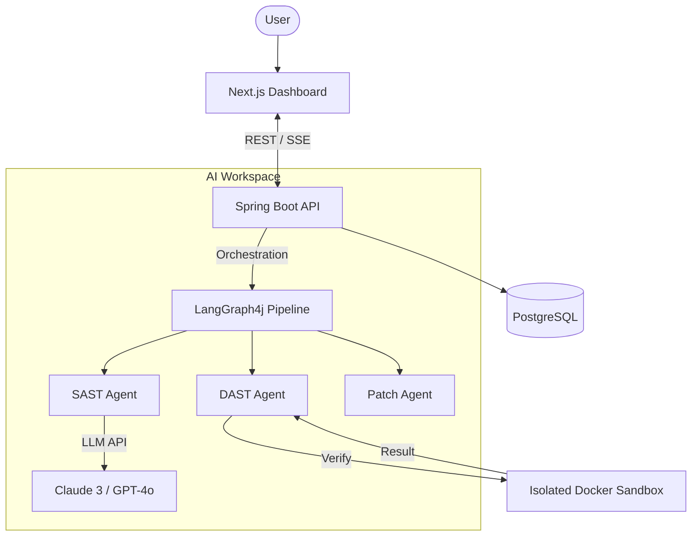

# 📑 Project Specification: SecureAI Engine (v1)

**SecureAI Engine** is an AI-driven security auditing platform that doesn't just find vulnerabilities—it proves them and fixes them.

---

## 🌟 Mission
To democratize advanced security auditing by providing an autonomous agent that mimics the workflow of a senior security researcher.

---

## 🛠️ Core Features

### 1. SAST Analysis Engine
- **Context-Aware**: Uses LLMs for semantic analysis (beyond simple pattern matching).
- **Detects**: Business logic flaws, permission bypasses, and complex injection points.
- **Clarifies**: Explains vulnerabilities in natural language with high accuracy.

### 2. Exploit Agent (DAST)
- **Payload Generation**: Creates actual attack payloads based on SAST findings.
- **Secure Validation**: Executes payloads within an isolated **Docker Sandbox**.
- **Proof of Concept**: Provides verifiable "Proof of Concept" (PoC) for critical findings.

### 3. Auto-Remediation (Self-Healing)
- **Patch Generation**: Proposes secure code fixes for discovered exploits.
- **Visual Diff**: Shows proposed changes side-by-side using a Diff viewer.

### 4. Vulnerability Reporting
- **Severity Mapping**: Categorizes by Critical/High/Medium/Low.
- **Compliance**: Maps findings to CVE/CWE standards.
- **Exports**: Generates professional PDF/JSON reports for stakeholders.

---

## 🏗️ Technical Architecture

---

*This document is subject to change as the project evolves.*