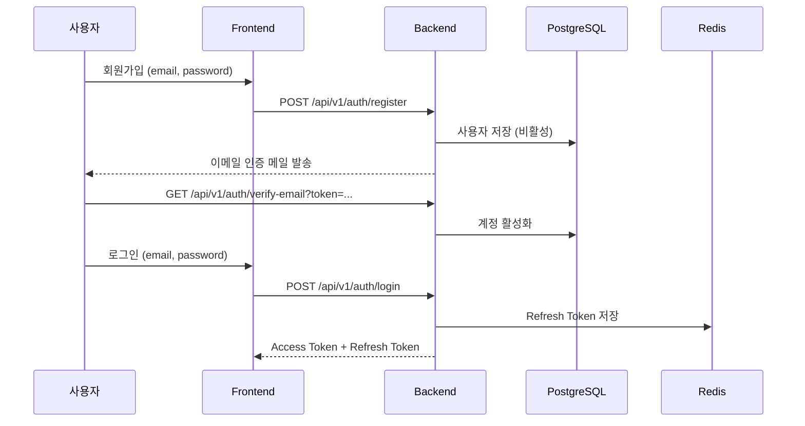
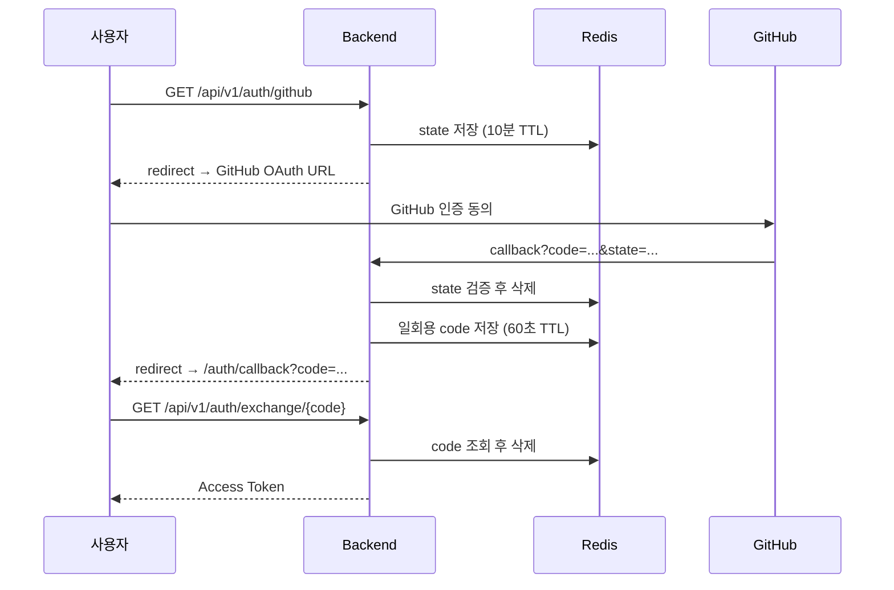
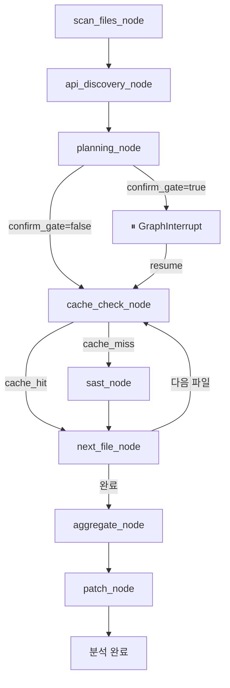
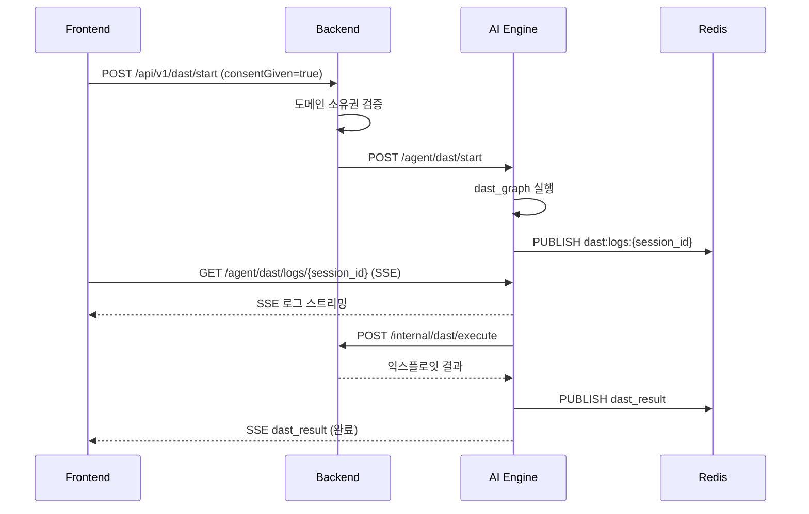
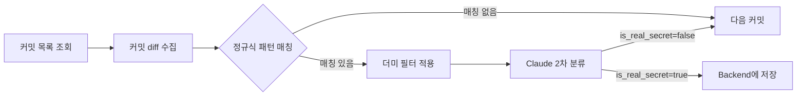
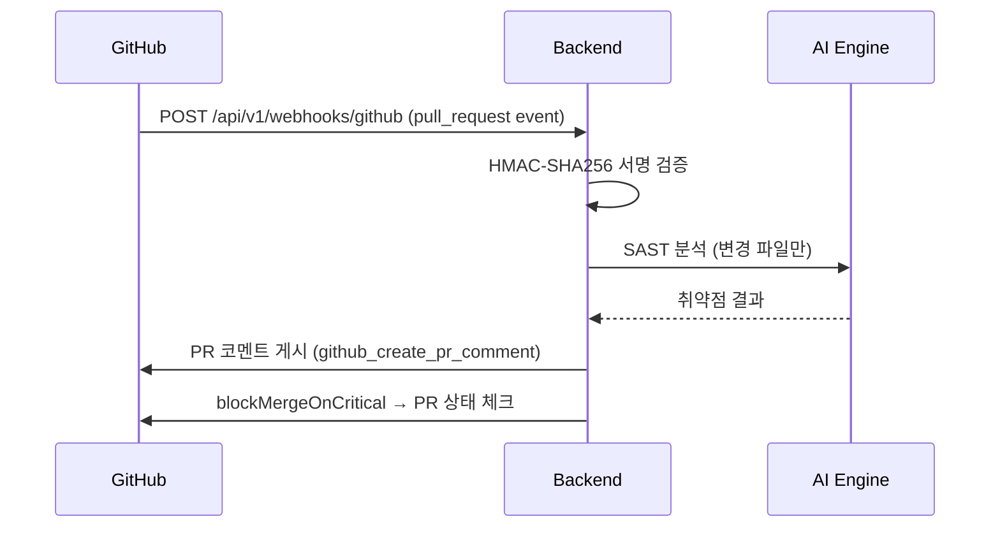

# SecureAI Editor — 구현된 기능 목록

> 코드베이스 직접 분석 기준 (2026-06-17, **2026-06-24 델타 갱신**). 실제 동작하는 기능만 포함.
> 2026-06-17 이후 추가분(Sprint 13~14 + 후속)은 **§22**에 정리. UI 공백은 §22 표의 ❌ 표기 참조.

---

## 1. 사용자 인증 (Authentication & Security)

- **기능명**: 이메일/패스워드 회원가입 및 로그인
- **한 줄 요약**: JWT + Refresh Token Rotation 기반 이메일 인증 포함 일반 계정 인증
- **동작 설명**:
  사용자가 이메일·패스워드로 회원가입하면 이메일 인증 토큰이 발송된다. 인증 후 로그인 시 Access Token(JWT)과 Refresh Token이 발급되며, `/refresh` 엔드포인트로 토큰을 갱신한다. 로그아웃 시 Refresh Token을 폐기한다. 비밀번호 분실 시 이메일로 재설정 링크를 전송한다.

- **관련 핵심 파일/함수**:
  - [AuthController.java](file:///c:/Users/ttogl/workspace/secureai-editor/apps/backend/src/main/java/io/secureai/backend/domain/auth/controller/AuthController.java)
  - [AuthService.java](file:///c:/Users/ttogl/workspace/secureai-editor/apps/backend/src/main/java/io/secureai/backend/domain/auth/service/AuthService.java)
- **의존성**: Redis (Refresh Token 저장), PostgreSQL (사용자 DB), 이메일 서비스 (인증 링크)

---

- **기능명**: GitHub OAuth 로그인
- **한 줄 요약**: GitHub 계정으로 소셜 로그인 (CSRF state 검증, 일회용 코드 교환)
- **동작 설명**:
  사용자가 GitHub 로그인 버튼을 클릭하면 CSRF state를 Redis에 저장 후 GitHub 인증 URL로 리다이렉트한다. GitHub 콜백 수신 시 state 검증 후 사용자를 생성/조회하고, JWT를 URL에 직접 노출하지 않기 위해 60초 TTL의 일회용 코드를 Redis에 저장한 뒤 프론트엔드 `/auth/callback?code=...`로 리다이렉트한다. 프론트엔드는 `/exchange/{code}`로 실제 Access Token을 교환한다.

- **관련 핵심 파일/함수**: [AuthController.java#githubCallback](file:///c:/Users/ttogl/workspace/secureai-editor/apps/backend/src/main/java/io/secureai/backend/domain/auth/controller/AuthController.java#L90-L117), [GitHubOAuthService.java](file:///c:/Users/ttogl/workspace/secureai-editor/apps/backend/src/main/java/io/secureai/backend/domain/auth/service/GitHubOAuthService.java)
- **의존성**: GitHub OAuth API, Redis

---

- **기능명**: TOTP 2단계 인증 (2FA)
- **한 줄 요약**: TOTP 기반 2FA 설정/검증/비활성화 (복구 코드 8개 제공)
- **동작 설명**:
  사용자가 2FA 설정을 요청하면 QR 코드 URL, secret, 복구 코드 8개를 반환한다. 사용자가 OTP 앱에 등록 후 코드를 제출하면 검증 후 2FA가 활성화된다. 비활성화 시 secret과 복구 코드를 완전히 삭제한다.

- **관련 핵심 파일/함수**: [TotpController.java](file:///c:/Users/ttogl/workspace/secureai-editor/apps/backend/src/main/java/io/secureai/backend/domain/user/controller/TotpController.java), [TotpService.java](file:///c:/Users/ttogl/workspace/secureai-editor/apps/backend/src/main/java/io/secureai/backend/domain/user/service/TotpService.java)
- **의존성**: PostgreSQL (TOTP secret 저장)

---

## 2. SAST 정적 코드 분석 (Static Analysis)

- **기능명**: AI 기반 SAST 분석 (LangGraph 파이프라인)
- **한 줄 요약**: LangGraph 에이전트가 소스 파일을 단계별로 분석해 취약점을 탐지하고 Redis로 실시간 진행률을 Push
- **동작 설명**:
  사용자가 분석 시작을 요청하면 Backend가 분석 세션을 생성하고 AI Engine에 위임한다. AI Engine은 LangGraph 그래프를 구성하여 다음 노드 순서로 실행한다:
  1. `scan_files_node` — 분석 대상 파일 목록 수집
  2. `api_discovery_node` — REST/GraphQL API 그룹 탐지
  3. `planning_node` — 파일을 API 그룹 기반으로 Stage 분류 (DETERMINISTIC 또는 LLM 모드)
  4. `cache_check_node` → `sast_node` → `next_file_node` (파일 단위 루프)
  5. `aggregate_node` — 취약점 집계
  6. `patch_node` — 패치 생성 및 세션 종료
  Redis Pub/Sub으로 진행 이벤트를 실시간으로 Frontend에 전달한다. 300라인 이상 파일은 청크로 분할하여 병렬 분석한다. Redis 캐시 (SHA256, TTL 7일)로 동일 파일 중복 분석을 방지한다.

- **관련 핵심 파일/함수**:
  - [analyze.py](file:///c:/Users/ttogl/workspace/secureai-editor/apps/ai_engine/api/routes/analyze.py) — API 엔드포인트 및 스트리밍 로직
  - [sast_node.py](file:///c:/Users/ttogl/workspace/secureai-editor/apps/ai_engine/agent/nodes/sast_node.py) — LLM 분석 실행
  - [planning_node.py](file:///c:/Users/ttogl/workspace/secureai-editor/apps/ai_engine/agent/nodes/planning_node.py) — 분석 단계 계획
  - [graph_builder.py](file:///c:/Users/ttogl/workspace/secureai-editor/apps/ai_engine/agent/graph_builder.py)
  - [AnalysisController.java](file:///c:/Users/ttogl/workspace/secureai-editor/apps/backend/src/main/java/io/secureai/backend/domain/analysis/controller/AnalysisController.java)
- **의존성**: Claude API (Anthropic) / Gemini API / OpenAI API (멀티 프로바이더), Redis (진행 이벤트 Pub/Sub + 캐시), MCP Server (파일 읽기), PostgreSQL (취약점 저장)

---

- **기능명**: GitHub 레포지토리 원격 SAST 분석
- **한 줄 요약**: GitHub repo URL과 PAT를 입력하면 원격 소스를 MCP 도구로 가져와 분석
- **동작 설명**:
  `source_type=github`로 분석 요청 시 MCP 서버의 `github_get_file_content` / `github_list_directory` 도구로 GitHub API를 통해 파일을 읽어 로컬 파일과 동일한 분석 파이프라인을 수행한다. GitHub Personal Access Token은 상태에 저장되며 로그에는 절대 출력되지 않는다.

- **관련 핵심 파일/함수**:
  - [sast_node.py#get_github_file_content](file:///c:/Users/ttogl/workspace/secureai-editor/apps/ai_engine/agent/nodes/sast_node.py#L246-L257)
  - [get_repo_contents.ts](file:///c:/Users/ttogl/workspace/secureai-editor/apps/mcp_server/src/github/get_repo_contents.ts)
  - [list_directory.ts](file:///c:/Users/ttogl/workspace/secureai-editor/apps/mcp_server/src/github/list_directory.ts)
- **의존성**: GitHub REST API, MCP Server (Node.js)

---

- **기능명**: 분석 진행 실시간 스트리밍 (SSE)
- **한 줄 요약**: 분석 진행률을 SSE로 실시간 브라우저에 Push (Redis Pub/Sub → Backend SSE 브리지)
- **동작 설명**:
  AI Engine이 Redis 채널 `secureai:progress:{session_id}`에 이벤트를 Publish하면, Backend의 `RedisSubscriber`가 이를 수신하여 `SseEmitterService`를 통해 Frontend SSE 연결에 브로드캐스트한다. Frontend는 `GET /api/v1/analysis/sessions/{id}/stream`을 구독한다. 지원 이벤트: `started`, `scan_complete`, `stage_started`, `stage_completed`, `progress`, `awaiting_confirmation`, `completed`, `error`, `cancelled`.

- **관련 핵심 파일/함수**:
  - [AnalysisController.java#streamSession](file:///c:/Users/ttogl/workspace/secureai-editor/apps/backend/src/main/java/io/secureai/backend/domain/analysis/controller/AnalysisController.java#L61-L100)
  - [RedisSubscriber.java](file:///c:/Users/ttogl/workspace/secureai-editor/apps/backend/src/main/java/io/secureai/backend/domain/analysis/service/RedisSubscriber.java)
  - [SseEmitterService.java](file:///c:/Users/ttogl/workspace/secureai-editor/apps/backend/src/main/java/io/secureai/backend/domain/analysis/service/SseEmitterService.java)
- **의존성**: Redis Pub/Sub, Spring SSE

---

- **기능명**: 멀티 AI 프로바이더 지원 (BYOK)
- **한 줄 요약**: Anthropic / Gemini / OpenAI 중 선택하여 분석 실행, 사용자 API 키 등록(BYOK) 가능
- **동작 설명**:
  사용자는 `ProviderKeyController`를 통해 Anthropic·Gemini·OpenAI 키를 AES-256-GCM으로 암호화하여 저장한다. 분석 요청 시 `preferred_provider`로 프로바이더를 선택하거나 scan_mode 기반으로 자동 라우팅된다(AUDIT→Gemini, PIPELINE→Anthropic). Gemini 키가 없으면 Anthropic으로 자동 폴백한다.

- **관련 핵심 파일/함수**:
  - [ProviderKeyController.java](file:///c:/Users/ttogl/workspace/secureai-editor/apps/backend/src/main/java/io/secureai/backend/domain/user/controller/ProviderKeyController.java)
  - [sast_node.py#provider 결정 블록](file:///c:/Users/ttogl/workspace/secureai-editor/apps/ai_engine/agent/nodes/sast_node.py#L272-L315)
- **의존성**: AES-256-GCM 암호화, Anthropic/Gemini/OpenAI API

---

## 3. DAST 동적 취약점 검증

- **기능명**: AI 기반 DAST 취약점 익스플로잇 실행
- **한 줄 요약**: SAST로 발견된 취약점을 실제 타겟 URL에 동적으로 검증하는 자동화된 익스플로잇 실행기
- **동작 설명**:
  사용자가 DAST 시작을 요청하면 Backend는 도메인 소유권 확인 및 Rate Limit 검증 후 AI Engine에 위임한다. AI Engine의 `dast_graph_builder`로 구성된 LangGraph 그래프가 실행되며, `dast_node`가 취약점 유형에 맞는 익스플로잇을 Backend 내부 엔드포인트(`/api/v1/internal/dast/execute`)로 요청한다. 실행 결과는 Redis Pub/Sub으로 스트리밍되어 Frontend의 SSE 터미널에 실시간 표시된다. localhost/127.0.0.1 타겟은 도메인 소유권 검증을 생략한다.

- **관련 핵심 파일/함수**:
  - [dast.py](file:///c:/Users/ttogl/workspace/secureai-editor/apps/ai_engine/api/routes/dast.py) — DAST API 및 SSE
  - [dast_node.py](file:///c:/Users/ttogl/workspace/secureai-editor/apps/ai_engine/agent/nodes/dast/dast_node.py)
  - [DastController.java](file:///c:/Users/ttogl/workspace/secureai-editor/apps/backend/src/main/java/io/secureai/backend/domain/dast/controller/DastController.java)
- **의존성**: Redis, LangGraph, Docker (dast-isolated-net 네트워크 격리)

---

## 4. 시크릿 스캔 (Secret Scanning)

- **기능명**: GitHub 커밋 히스토리 시크릿 스캔
- **한 줄 요약**: GitHub 커밋 diff에서 AWS Key·GitHub Token·JWT 등을 정규식 + Claude 2차 분류로 탐지
- **동작 설명**:
  사용자가 GitHub owner/repo와 PAT를 제출하면 AI Engine이 백그라운드에서 최대 100개의 커밋 diff를 순회한다. 각 커밋의 추가된 라인(+로 시작)에 8가지 정규식 패턴(AWS Access Key, GitHub Token, JWT, Private Key, Google API Key, Slack Token 등)을 적용해 1차 필터링하고, Claude가 더미/테스트 값을 2차 분류하여 제거한 뒤, 실제 시크릿만 Backend 내부 API에 `SECRET_EXPOSURE(CRITICAL)` 취약점으로 저장한다.

- **관련 핵심 파일/함수**:
  - [secret_scan.py](file:///c:/Users/ttogl/workspace/secureai-editor/apps/ai_engine/api/routes/secret_scan.py)
  - [CommitSecretController.java](file:///c:/Users/ttogl/workspace/secureai-editor/apps/backend/src/main/java/io/secureai/backend/domain/analysis/controller/CommitSecretController.java)
- **의존성**: GitHub REST API, Claude API, PostgreSQL

---

## 5. 패치 제안 생성

- **기능명**: AI 자동 패치 코드 생성
- **한 줄 요약**: SAST 취약점마다 언어별 안전한 수정 코드(diff)를 Claude로 자동 생성
- **동작 설명**:
  분석 파이프라인의 마지막 단계(`patch_node`)에서 SAST 결과의 모든 취약점에 대해 Jinja2 프롬프트 템플릿을 렌더링하여 Claude에 요청한다. Redis 캐시(언어+취약점타입 키, TTL 24h)를 먼저 확인하고, 캐시 미스 시 Backend에서 이전 성공 패치 예시를 조회하여 프롬프트에 포함한다. 생성된 패치는 original/patched diff 형태로 Backend에 저장된다. 사용자는 UI에서 패치를 확인하고 `apply` 처리를 할 수 있다.

- **관련 핵심 파일/함수**:
  - [patch_node.py](file:///c:/Users/ttogl/workspace/secureai-editor/apps/ai_engine/agent/nodes/patch_node.py)
  - [PatchController.java](file:///c:/Users/ttogl/workspace/secureai-editor/apps/backend/src/main/java/io/secureai/backend/domain/patch/controller/PatchController.java)
  - [patch_generation.jinja2](file:///c:/Users/ttogl/workspace/secureai-editor/apps/ai_engine/agent/prompts/patch_generation.jinja2)
- **의존성**: Claude API, Redis, PostgreSQL

---

## 6. SBOM 분석 및 CVE 매칭

- **기능명**: SBOM 파일 분석 및 CVE 매칭
- **한 줄 요약**: pom.xml·package.json 등 의존성 파일을 파싱하여 컴포넌트 추출 후 CVE를 매칭하고 CycloneDX 형식으로 출력
- **동작 설명**:
  사용자가 의존성 파일을 업로드하면 AI Engine이 파일명을 기반으로 파서(Maven/NPM 등)를 자동 선택하여 컴포넌트 목록을 추출한다. Backend CVE 검색 API로 각 컴포넌트의 알려진 취약점(CVE)을 매칭하고, CycloneDX JSON 형식의 SBOM 보고서를 생성하여 Backend에 저장한다.

- **관련 핵심 파일/함수**:
  - [sbom.py](file:///c:/Users/ttogl/workspace/secureai-editor/apps/ai_engine/api/routes/sbom.py)
  - [sbom_parser.py](file:///c:/Users/ttogl/workspace/secureai-editor/apps/ai_engine/agent/tools/sbom_parser.py)
  - [cve_matcher.py](file:///c:/Users/ttogl/workspace/secureai-editor/apps/ai_engine/agent/tools/cve_matcher.py)
- **의존성**: Backend CVE DB API, PostgreSQL

---

## 7. 보안 전문가 AI 채팅

- **기능명**: 보안 AI 채팅 (SSE 스트리밍)
- **한 줄 요약**: 분석 컨텍스트를 바탕으로 보안 전문가 AI와 실시간 채팅 (최대 10턴 이력 유지)
- **동작 설명**:
  사용자가 채팅 메시지를 전송하면 Backend가 AI Engine `/agent/chat`으로 프록시한다. AI Engine의 `stream_chat`이 대화 이력(최대 20개 메시지)과 함께 Claude에 스트리밍 요청을 보내고, SSE delta 이벤트로 토큰이 생성될 때마다 Frontend에 실시간 전달한다.

- **관련 핵심 파일/함수**:
  - [chat.py](file:///c:/Users/ttogl/workspace/secureai-editor/apps/ai_engine/api/routes/chat.py)
  - [chat_client.py](file:///c:/Users/ttogl/workspace/secureai-editor/apps/ai_engine/agent/chat_client.py)
  - [ChatController.java](file:///c:/Users/ttogl/workspace/secureai-editor/apps/backend/src/main/java/io/secureai/backend/domain/analysis/controller/ChatController.java)
  - [ChatFAB.tsx](file:///c:/Users/ttogl/workspace/secureai-editor/apps/frontend/src/components/analysis/ChatFAB.tsx)
- **의존성**: Claude API, SSE

---

## 8. 보안 보고서 생성

- **기능명**: PDF 보안 보고서 생성 (비동기)
- **한 줄 요약**: 분석 세션의 취약점 결과를 기반으로 PDF 보고서를 비동기 생성하고 이메일 전송 지원
- **동작 설명**:
  사용자가 보고서 생성을 요청하면 Backend가 PENDING 상태의 레코드를 즉시 생성하고 202를 반환한다. 비동기로 PDF가 생성되면 상태가 COMPLETED로 변경된다. 다운로드 토큰(일회성)으로 인증 없이 파일을 다운로드할 수 있으며, 이메일로 다운로드 링크를 전송하는 기능도 지원한다. ROI(투자 대비 절감 효과) 계산 및 ROI PDF 다운로드도 제공한다.

- **관련 핵심 파일/함수**:
  - [ReportController.java](file:///c:/Users/ttogl/workspace/secureai-editor/apps/backend/src/main/java/io/secureai/backend/domain/report/controller/ReportController.java)
  - [PdfReportModal.tsx](file:///c:/Users/ttogl/workspace/secureai-editor/apps/frontend/src/components/analysis/PdfReportModal.tsx)
- **의존성**: PostgreSQL, 이메일 서비스, PDF 생성 라이브러리

---

- **기능명**: 보안 문서 생성 (CISO/HANAFOS/ISMS)
- **한 줄 요약**: 분석 결과를 기반으로 CISO 보고서, 한국 금융보안원, ISMS-P 형식의 보안 문서를 자동 생성
- **동작 설명**:
  `type=CISO|HANAFOS|ISMS` 파라미터로 요청하면 비동기로 문서를 생성하고, 토큰 기반 다운로드를 제공한다. 각 형식은 해당 규제 기관의 보안 보고서 양식에 맞게 포맷된다.

- **관련 핵심 파일/함수**:
  - [SecurityDocController.java](file:///c:/Users/ttogl/workspace/secureai-editor/apps/backend/src/main/java/io/secureai/backend/domain/report/controller/SecurityDocController.java)
  - [SecurityDocPage.tsx](file:///c:/Users/ttogl/workspace/secureai-editor/apps/frontend/src/components/analysis/SecurityDocPage.tsx)
- **의존성**: PostgreSQL, PDF 생성, AI Engine

---

## 9. 컴플라이언스 매핑

- **기능명**: 취약점 컴플라이언스 프레임워크 매핑
- **한 줄 요약**: 분석된 취약점을 ISO27001 또는 NIST CSF 프레임워크의 항목으로 자동 매핑
- **동작 설명**:
  세션의 취약점 목록을 조회하여 각 취약점의 CWE/OWASP 분류를 기반으로 ISO27001(정보보안 관리체계) 또는 NIST CSF(사이버보안 프레임워크)의 해당 통제 항목에 매핑한다. 결과는 컴플라이언스 준수율과 함께 반환된다.

- **관련 핵심 파일/함수**:
  - [ComplianceController.java](file:///c:/Users/ttogl/workspace/secureai-editor/apps/backend/src/main/java/io/secureai/backend/domain/compliance/controller/ComplianceController.java)
  - [ComplianceMappingService.java](file:///c:/Users/ttogl/workspace/secureai-editor/apps/backend/src/main/java/io/secureai/backend/domain/compliance/service/ComplianceMappingService.java)
- **의존성**: PostgreSQL (취약점 DB)

---

## 10. GitHub 앱 PR 자동 리뷰

- **기능명**: GitHub PR 보안 자동 리뷰 (Webhook + GitHub App)
- **한 줄 요약**: GitHub PR 오픈/동기화 이벤트 수신 시 자동 SAST 분석 후 PR 코멘트로 결과 게시
- **동작 설명**:
  GitHub App이 설치된 레포지토리에서 PR이 오픈/재동기화되면 HMAC-SHA256 서명 검증 후 `GitHubWebhookService.handlePullRequest`가 비동기로 실행된다. 변경된 파일만 대상으로 SAST 분석을 수행하고, 결과를 PR 코멘트로 게시한다. `blockMergeOnCritical=true`이면 Critical 취약점 발견 시 PR merge를 차단한다. PR 리뷰 이력을 조회할 수 있다.

- **관련 핵심 파일/함수**:
  - [GitHubWebhookController.java](file:///c:/Users/ttogl/workspace/secureai-editor/apps/backend/src/main/java/io/secureai/backend/domain/analysis/controller/GitHubWebhookController.java)
  - [GitHubWebhookService.java](file:///c:/Users/ttogl/workspace/secureai-editor/apps/backend/src/main/java/io/secureai/backend/domain/analysis/service/GitHubWebhookService.java)
  - [create_pr_comment.ts](file:///c:/Users/ttogl/workspace/secureai-editor/apps/mcp_server/src/github/create_pr_comment.ts)
  - [commit_history_handler.ts](file:///c:/Users/ttogl/workspace/secureai-editor/apps/mcp_server/src/github/commit_history_handler.ts)
- **의존성**: GitHub App (JWT 인증), GitHub REST API, HMAC-SHA256

---

## 11. 프로젝트 관리

- **기능명**: 프로젝트 CRUD
- **한 줄 요약**: 보안 분석 단위인 프로젝트를 생성·조회·수정·삭제하고 분석 세션을 관리
- **동작 설명**:
  사용자는 프로젝트를 생성하여 반복적인 분석의 기준점으로 활용한다. 각 프로젝트는 여러 분석 세션을 가질 수 있으며, 이전 분석 결과(취약점 유형 집계)가 다음 분석의 컨텍스트로 활용된다.

- **관련 핵심 파일/함수**:
  - [ProjectController.java](file:///c:/Users/ttogl/workspace/secureai-editor/apps/backend/src/main/java/io/secureai/backend/domain/project/controller/ProjectController.java)
- **의존성**: PostgreSQL

---

## 12. 예약 자동 스캔

- **기능명**: 프로젝트 야간 자동 스캔 스케줄
- **한 줄 요약**: 특정 시간에 지정된 GitHub 레포지토리를 자동으로 분석하는 크론 스케줄 관리
- **동작 설명**:
  사용자가 프로젝트별 스캔 스케줄(요일/시간)을 Upsert하면, 백엔드 스케줄러가 해당 시간에 자동으로 분석을 트리거한다.

- **관련 핵심 파일/함수**:
  - [ProjectScheduleController.java](file:///c:/Users/ttogl/workspace/secureai-editor/apps/backend/src/main/java/io/secureai/backend/domain/scheduling/controller/ProjectScheduleController.java)
  - [ProjectScheduleService.java](file:///c:/Users/ttogl/workspace/secureai-editor/apps/backend/src/main/java/io/secureai/backend/domain/scheduling/service/ProjectScheduleService.java)
- **의존성**: Spring Scheduler, PostgreSQL

---

## 13. 지속 모니터링

- **기능명**: 도메인 HTTPS/SSL 지속 모니터링
- **한 줄 요약**: 등록된 도메인의 HTTP 헬스체크 및 SSL 인증서 만료(30일 이내)를 주기적으로 점검하고 Slack 알림 전송
- **동작 설명**:
  `dast-isolated-net`으로 도메인 소유권이 검증된 도메인(`ScanTarget.verified=true`)을 대상으로 HTTPS 헬스체크(HTTP 상태코드, 응답 시간)와 SSL 인증서 만료일을 주기적으로 점검한다. 이상 감지 시 Slack Webhook으로 알림을 전송하고 결과를 저장한다. SSRF 방어를 위해 verified 도메인만 점검한다.

- **관련 핵심 파일/함수**:
  - [MonitoringService.java](file:///c:/Users/ttogl/workspace/secureai-editor/apps/backend/src/main/java/io/secureai/backend/domain/monitoring/service/MonitoringService.java)
  - [MonitoringJob.java](file:///c:/Users/ttogl/workspace/secureai-editor/apps/backend/src/main/java/io/secureai/backend/domain/monitoring/service/MonitoringJob.java)
  - [SslCertChecker.java](file:///c:/Users/ttogl/workspace/secureai-editor/apps/backend/src/main/java/io/secureai/backend/domain/monitoring/service/SslCertChecker.java)
- **의존성**: Slack Webhook, PostgreSQL, Spring Scheduler

---

## 14. 조직/팀 관리

- **기능명**: 조직 및 멤버 초대 관리
- **한 줄 요약**: 조직을 생성하고 멤버를 초대(이메일)하며 역할(OWNER/ADMIN/MEMBER)을 관리
- **동작 설명**:
  사용자가 조직을 생성하면 slug 기반 URL로 접근 가능하다. OWNER/ADMIN 권한으로 멤버를 이메일 초대하고 역할을 변경·제거할 수 있다. `@orgGuard`를 통해 역할 기반 접근 제어가 적용된다.

- **관련 핵심 파일/함수**:
  - [OrganizationController.java](file:///c:/Users/ttogl/workspace/secureai-editor/apps/backend/src/main/java/io/secureai/backend/domain/organization/controller/OrganizationController.java)
  - [InvitationController.java](file:///c:/Users/ttogl/workspace/secureai-editor/apps/backend/src/main/java/io/secureai/backend/domain/organization/controller/InvitationController.java)
- **의존성**: PostgreSQL, 이메일 서비스

---

## 15. 사용자 프로필 및 설정

- **기능명**: 사용자 프로필 관리 및 세션 제어
- **한 줄 요약**: 프로필 수정, 비밀번호 변경, 활성 세션 조회 및 개별 세션 폐기
- **동작 설명**:
  사용자는 이름·이메일 등 프로필 정보를 수정하고, 현재 로그인된 모든 세션 목록을 조회하여 원하는 세션을 폐기할 수 있다. 계정 삭제(소프트 딜리트, 30일 후 하드 딜리트)도 지원한다.

- **관련 핵심 파일/함수**:
  - [UserController.java](file:///c:/Users/ttogl/workspace/secureai-editor/apps/backend/src/main/java/io/secureai/backend/domain/user/controller/UserController.java)
- **의존성**: PostgreSQL, Redis (세션 토큰)

---

## 16. GDPR 데이터 권리

- **기능명**: GDPR 데이터 이동권 및 삭제권
- **한 줄 요약**: 사용자의 전체 개인 데이터를 JSON으로 내보내거나 계정을 삭제 (30일 유예 후 하드 딜리트)
- **동작 설명**:
  사용자가 데이터 내보내기를 요청하면 계정 정보, 분석 이력, 취약점 데이터를 JSON 형태로 반환한다. 삭제 요청 시 소프트 딜리트 후 30일 내에 `GdprHardDeleteJob`이 완전 삭제를 수행한다.

- **관련 핵심 파일/함수**:
  - [GdprController.java](file:///c:/Users/ttogl/workspace/secureai-editor/apps/backend/src/main/java/io/secureai/backend/domain/user/controller/GdprController.java)
  - [GdprService.java](file:///c:/Users/ttogl/workspace/secureai-editor/apps/backend/src/main/java/io/secureai/backend/domain/user/service/GdprService.java)
- **의존성**: PostgreSQL

---

## 17. 관리자 기능

- **기능명**: 관리자 대시보드 (Admin Panel)
- **한 줄 요약**: 관리자가 전체 사용자의 플랜 변경, 활성화/비활성화, 크레딧 조정, 감사 로그 조회를 수행
- **동작 설명**:
  `@adminGuard.check(authentication)` 인가 검사를 통해 관리자만 접근 가능하다. 사용자 목록을 이름/플랜/상태로 필터링하여 조회하고, 플랜을 변경하거나 계정을 비활성화하거나 크레딧을 수동 조정할 수 있다. 모든 관리자 행위는 감사 로그에 기록된다.

- **관련 핵심 파일/함수**:
  - [AdminController.java](file:///c:/Users/ttogl/workspace/secureai-editor/apps/backend/src/main/java/io/secureai/backend/domain/admin/controller/AdminController.java)
  - [AuditLogAdminController.java](file:///c:/Users/ttogl/workspace/secureai-editor/apps/backend/src/main/java/io/secureai/backend/domain/admin/controller/AuditLogAdminController.java)
- **의존성**: PostgreSQL, `@AuditLog` AOP

---

## 18. MCP 서버 (파일시스템 + GitHub 도구)

- **기능명**: MCP Server — AI 에이전트용 도구 허브
- **한 줄 요약**: AI Engine이 호출하는 파일시스템·GitHub·DAST 도구를 MCP(Model Context Protocol) 표준으로 제공
- **동작 설명**:
  Node.js 기반 MCP 서버가 stdio 전송으로 AI Engine(LangGraph)과 통신한다. 제공하는 도구:
  - `read_file` / `list_directory` / `search_files` / `get_file_info` — 로컬 워크스페이스 파일 접근 (경로 순회 방어)
  - `github_get_file_content` / `github_list_directory` — GitHub 원격 파일 접근
  - `github_list_commits` / `github_get_commit_diff` — 커밋 히스토리 접근
  - `github_create_pr_comment` — PR 코멘트 게시
  - `run_dast_in_sandbox` — DAST 익스플로잇 실행 위임

- **관련 핵심 파일/함수**:
  - [index.ts](file:///c:/Users/ttogl/workspace/secureai-editor/apps/mcp_server/src/index.ts)
  - [path_validator.ts](file:///c:/Users/ttogl/workspace/secureai-editor/apps/mcp_server/src/path_validator.ts)
  - [file_filter.ts](file:///c:/Users/ttogl/workspace/secureai-editor/apps/mcp_server/src/file_filter.ts)
- **의존성**: GitHub REST API, Backend DAST API

---

## 19. Frontend 코드 에디터

- **기능명**: Monaco 기반 코드 에디터 + 분석 통합 UI
- **한 줄 요약**: 로컬 파일 트리 탐색, Monaco 코드 에디터, 취약점 패널, DAST 터미널, 패치 매니저를 하나의 UI에 통합
- **동작 설명**:
  `/editor` 페이지는 분할 레이아웃으로 구성된다:
  - 왼쪽: 파일 트리 + Monaco 에디터 (탭 지원)
  - 오른쪽: 취약점 목록(`VulnPanel`), 취약점 상세(`VulnDetailPanel`), 패치 제안(`PatchManagerPage`), DAST 터미널(`DastTerminal`)
  - 상단: 분석 진행률 스트립 (실시간 파일 진행, 토큰 사용량 표시)
  - 우하단: AI 채팅 플로팅 버튼(`ChatFAB`)
  분석 모드(스캔 모드, 소스 타입) 선택, 분석 히스토리 모달, SAST 대시보드, SBOM 페이지를 사이드바에서 전환할 수 있다.

- **관련 핵심 파일/함수**:
  - [editor/page.tsx](file:///c:/Users/ttogl/workspace/secureai-editor/apps/frontend/src/app/editor/page.tsx)
  - [EditorLayout.tsx](file:///c:/Users/ttogl/workspace/secureai-editor/apps/frontend/src/components/editor/EditorLayout.tsx)
  - [VulnPanel.tsx](file:///c:/Users/ttogl/workspace/secureai-editor/apps/frontend/src/components/analysis/VulnPanel.tsx)
  - [VulnDetailPanel.tsx](file:///c:/Users/ttogl/workspace/secureai-editor/apps/frontend/src/components/analysis/VulnDetailPanel.tsx)
  - [DastTerminal.tsx](file:///c:/Users/ttogl/workspace/secureai-editor/apps/frontend/src/components/analysis/DastTerminal.tsx)
- **의존성**: Monaco Editor, Zustand (상태관리), SSE

---

## 20. Android 모바일 앱

- **기능명**: Android 모바일 클라이언트
- **한 줄 요약**: Kotlin + Jetpack Compose 기반 Android 앱 (로그인, 대시보드, 취약점 목록/상세, 채팅, 보고서)
- **동작 설명**:
  Android 앱은 다음 화면을 포함한다: 인증 화면(auth), 대시보드(dashboard), 취약점 목록(vulnlist), 취약점 상세(vulndetail), AI 채팅(chat), 보고서(report). SSE 클라이언트(`sse/`)로 분석 진행 상황을 실시간 수신하고, Room DB로 로컬 캐싱하며, 푸시 알림(`notification/`)을 지원한다. 생체인증 등 보안 기능(`security/`)도 포함된다.

- **관련 핵심 파일/함수**:
  - [MainActivity.kt](file:///c:/Users/ttogl/workspace/secureai-editor/apps/android/app/src/main/java/io/secureai/android/MainActivity.kt)
  - `apps/android/app/src/main/java/io/secureai/android/ui/`
- **의존성**: Room DB, Retrofit, Backend REST API, SSE

---

## 21. 크레딧 시스템

- **기능명**: 토큰 사용량 기반 크레딧 차감
- **한 줄 요약**: AI 분석 시 소비된 토큰을 기반으로 사용자 크레딧을 자동 차감하고 잔액을 조회
- **동작 설명**:
  분석 세션이 완료될 때(`patch_node`의 `_report_session_token_usage`) AI Engine이 Backend에 토큰 사용량을 1회 보고한다. Backend는 provider/model 기반으로 크레딧을 계산하여 차감한다. 사용자는 `/api/v1/users/me/credits`로 잔액을 조회할 수 있다.

- **관련 핵심 파일/함수**:
  - [patch_node.py#_report_session_token_usage](file:///c:/Users/ttogl/workspace/secureai-editor/apps/ai_engine/agent/nodes/patch_node.py#L205-L254)
  - [CreditService.java](file:///c:/Users/ttogl/workspace/secureai-editor/apps/backend/src/main/java/io/secureai/backend/domain/credit/service/CreditService.java)
  - [UserController.java#getCredits](file:///c:/Users/ttogl/workspace/secureai-editor/apps/backend/src/main/java/io/secureai/backend/domain/user/controller/UserController.java#L66-L70)
- **의존성**: PostgreSQL

---

## 22. 2026-06-17 이후 추가 기능 (Sprint 13~14 + 후속)

> 코드 실측(git 이력 + 신규 파일) 기준. **백엔드/AI는 완료**이나 일부는 **프론트 UI 미구현(❌)** — 디자인 핸드오프(`docs/design/claude-design-handoff/`)의 ★공백 항목과 일치.

---

- **기능명**: AST 할루시네이션 가드 (VAL-3)
- **한 줄 요약**: AI가 보고한 file:line·source→sink를 AST로 실재 검증해 가짜 취약점을 자동 폐기
- **동작 설명**: `validate_findings_node`가 SAST findings를 AST로 교차검증하여 존재하지 않는 라인/공백/주석 대상 오탐을 `discarded_findings`로 폐기한다. `ast_pre_filter`(AST_PRE_FILTER_ENABLED 플래그)로 LLM 호출 전 결정론적 사전필터도 지원한다. (UI: 로그 수준, 표면 노출 미미)
- **핵심 파일**: `apps/ai_engine/agent/nodes/validate_findings_node.py`, `apps/ai_engine/agent/validation/ast_pre_filter.py`

---

- **기능명**: 취약점 트리아지 (단건 + 벌크) — MOAT-1
- **한 줄 요약**: 취약점을 확인(CONFIRM)/기각(DISMISS)/패치채택(ACCEPT_PATCH)으로 판정, 단건·다건 일괄
- **동작 설명**: 단건 `PATCH /api/v1/vulnerabilities/{id}/triage`, 벌크 `PATCH /api/v1/vulnerabilities/bulk-triage`(1~200건). action에 따라 상태가 open/false_positive/fixed로 전이. 소유X/미존재는 조용히 skip 집계. 기각 사유는 `triage_feedback`(append-only)에 리랭커 학습자산으로 적재. **단건 UI는 있음, 벌크 UI는 ❌ 미구현.**
- **핵심 파일**: `VulnerabilityController.java`(triage/bulk-triage), `BulkTriageRequest/Response.java`, FE `VulnDetailPanel.tsx`(단건)

---

- **기능명**: 패치 자동 PR 생성 (TASK-1401)
- **한 줄 요약**: 검증된 패치를 GitHub 새 브랜치+PR로 자동 오픈 (PR-only, auto-merge 금지)
- **동작 설명**: `POST /api/v1/patches/{id}/pull-request`로 `GitHubRestClient`가 `secureai/patch-*` 브랜치를 만들고 PR을 생성한다. originalSnippet 구간만 치환(파일 손상 방지). 권한/App 미등록 시 `GITHUB_AUTH_REQUIRED` 경고. **UI: 있음**(PatchManagerPage PR 생성 버튼).
- **핵심 파일**: `PatchPrService.java`, `CreatePatchPrRequest/PatchPrResponse.java`, FE `PatchManagerPage.tsx`

---

- **기능명**: 패치 자가검증 (TASK-1402)
- **한 줄 요약**: AI 패치를 Docker pytest 샌드박스에서 실행해 VERIFIED/FAILED 판정
- **동작 설명**: `patch_verify_node`가 Claude로 pytest 검증코드를 생성하고 `dast-isolated-net` 격리 컨테이너에서 실행 → `verification_status`(PENDING/VERIFIED/FAILED). Python+pytest 단일 언어 한정. **UI: 있음**(PatchManagerPage 배지 그린/레드).
- **핵심 파일**: `apps/ai_engine/agent/nodes/patch_verify_node.py`, `PatchVerificationRequest.java`, FE `PatchManagerPage.tsx`(VerificationBadge)

---

- **기능명**: SAST→DAST proven_exploitable 하니스 (VAL-4)
- **한 줄 요약**: SAST 의심 취약점을 격리 샌드박스에서 실제 익스플로잇해 "증명됨" 라벨링 + 스코어카드
- **동작 설명**: `benchmarks/proven_exploit/runner`가 WebGoat/Juice Shop 대상에 SAST→DAST 익스플로잇을 시도하고 `proven_scorecard.md`/`proven_exploitable.csv`를 산출한다(`dast-isolated-net` 격리 필수). 벤치 하니스(프로덕션 DB 미수정 — 프로덕션 라벨링은 VAL-18로 이월).
- **핵심 파일**: `apps/ai_engine/benchmarks/proven_exploit/runner.py`, `mapping.py`

---

- **기능명**: 배치 DAST (다건 일괄 익스플로잇)
- **한 줄 요약**: 여러 취약점을 한 요청으로 묶어 동적 검증 — vuln_type 그룹핑·동시성 제어·단일 SSE
- **동작 설명**: `POST /api/v1/dast/batch`(targets 1~50) → ai_engine `POST /agent/dast/batch`. vuln_type별 지침 1회 로드, `Semaphore(4)` 동시성, 개별 실패 skip&log. 단일 SSE(`?batch=true`)로 각 `dast_result` + 최종 `dast_batch_complete` 구독. consent/도메인 게이트 단건 재사용. **프론트 UI는 ❌ 미구현.**
- **핵심 파일**: `DastController.java`(batch), `DastBatchRequest/Target.java`, `apps/ai_engine/api/routes/dast.py`

---

- **기능명**: 멀티 프로바이더 모델 선택 확장
- **한 줄 요약**: Claude/Gemini/OpenAI 세부 모델을 UI에서 선택 (BYOK 확장)
- **동작 설명**: 프로바이더별 선택 가능한 모델 목록을 프론트 상수로 정의해 분석 요청 시 세부 모델을 지정한다. **UI: 있음**(설정/모델 선택).
- **핵심 파일**: FE `apps/frontend/src/lib/constants/models.ts`

---

- **(내부 개선, UI 무관)**: API-허브 우선 읽기(`api_discovery_node` 허브 파일 우선), path-aware 스택 탐지(`sast_node`), 평가 CI 회귀 게이트(VAL-2, eval-check), Audit 기본 프로바이더 anthropic 전환.

---

## 전체 기능 요약 표

| 기능명 | 분류 | 상태 |
|--------|------|------|
| 이메일/패스워드 회원가입·로그인 | 인증 | ✅ 구현 |
| GitHub OAuth 로그인 | 인증 | ✅ 구현 |
| TOTP 2단계 인증 (2FA) | 인증·보안 | ✅ 구현 |
| SAST 정적 코드 분석 (LangGraph 파이프라인) | 핵심 분석 | ✅ 구현 |
| GitHub 레포지토리 원격 SAST 분석 | 핵심 분석 | ✅ 구현 |
| 분석 진행 실시간 스트리밍 (SSE) | 핵심 분석 | ✅ 구현 |
| 멀티 AI 프로바이더 지원 (BYOK) | 핵심 분석 | ✅ 구현 |
| DAST 동적 취약점 익스플로잇 실행 | 핵심 분석 | ✅ 구현 |
| GitHub 커밋 히스토리 시크릿 스캔 | 핵심 분석 | ✅ 구현 |
| AI 자동 패치 코드 생성 | 패치 | ✅ 구현 |
| SBOM 파일 분석 및 CVE 매칭 | SBOM | ✅ 구현 |
| 보안 AI 채팅 (SSE 스트리밍) | AI 채팅 | ✅ 구현 |
| PDF 보안 보고서 생성 | 보고서 | ✅ 구현 |
| 보안 문서 생성 (CISO/HANAFOS/ISMS) | 보고서 | ✅ 구현 |
| 취약점 컴플라이언스 매핑 (ISO27001/NIST CSF) | 컴플라이언스 | ✅ 구현 |
| GitHub PR 보안 자동 리뷰 (Webhook) | DevSecOps | ✅ 구현 |
| 프로젝트 CRUD | 프로젝트 관리 | ✅ 구현 |
| 프로젝트 야간 자동 스캔 스케줄 | 자동화 | ✅ 구현 |
| 도메인 HTTPS/SSL 지속 모니터링 | 모니터링 | ✅ 구현 |
| 조직 및 멤버 초대 관리 | 조직 관리 | ✅ 구현 |
| 사용자 프로필 관리 및 세션 제어 | 사용자 관리 | ✅ 구현 |
| GDPR 데이터 이동권·삭제권 | 규정 준수 | ✅ 구현 |
| 관리자 대시보드 (Admin Panel) | 어드민 | ✅ 구현 |
| MCP Server — AI 도구 허브 | 인프라 | ✅ 구현 |
| Monaco 기반 코드 에디터 + 분석 통합 UI | Frontend | ✅ 구현 |
| Android 모바일 앱 | Mobile | ✅ 구현 |
| 토큰 사용량 기반 크레딧 차감 | 과금 | ✅ 구현 |
| AST 할루시네이션 가드 (VAL-3) | 핵심 분석 | ✅ 구현 (§22) |
| 취약점 트리아지 — 단건 | 트리아지 | ✅ 구현 (§22) |
| 취약점 트리아지 — 벌크 | 트리아지 | ⚠️ 백엔드만 (FE UI 미구현, §22) |
| 패치 자동 PR 생성 (TASK-1401) | 패치·DevSecOps | ✅ 구현 (§22) |
| 패치 자가검증 (TASK-1402, VERIFIED/FAILED) | 패치 | ✅ 구현 (§22) |
| SAST→DAST proven_exploitable 하니스 (VAL-4) | 검증 | ✅ 구현(벤치) (§22) |
| 배치 DAST (다건 일괄 익스플로잇) | 핵심 분석 | ⚠️ 백엔드만 (FE UI 미구현, §22) |
| 멀티 프로바이더 모델 선택 확장 | 핵심 분석 | ✅ 구현 (§22) |
