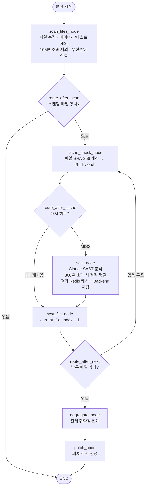
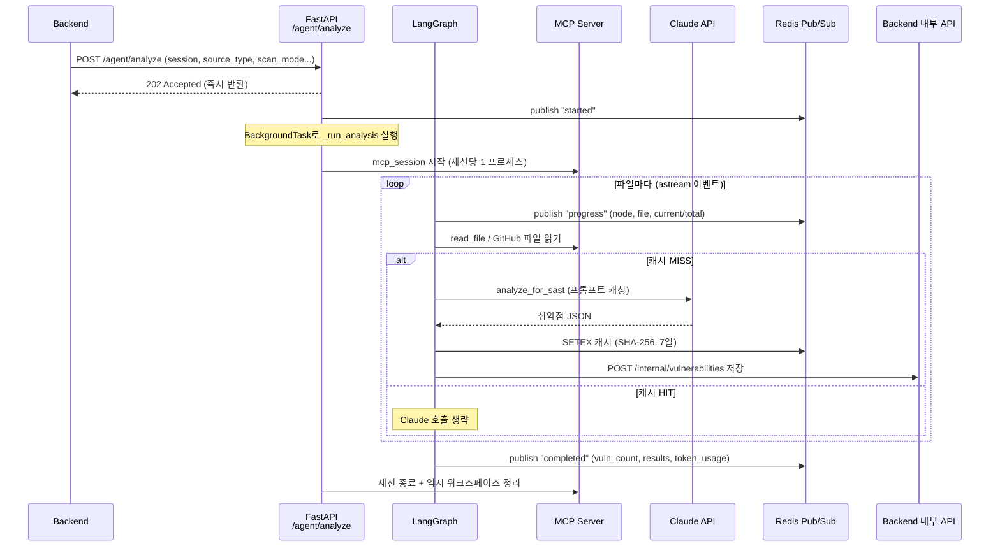

# 01. SAST 분석 엔진 (정적 보안 분석)

> **이 기능이 푸는 문제(Why)**
> 코드를 실행하지 않고도 SQL Injection·XSS·하드코딩된 비밀키 같은 **실제로 악용 가능한 취약점**을
> 자동으로 찾아낸다. 단순 룰 기반 도구와 달리 **Claude LLM이 프레임워크 맥락까지 이해**해
> 오탐(false positive)을 줄이고, 대용량 코드베이스도 **캐시·청킹·병렬**로 빠르고 저렴하게 처리한다.

---

## 📊 슬라이드용 요약

### 한 줄 정의
**LangGraph 상태 그래프**로 파일을 한 개씩 순회하며, **Redis 캐시 → Claude 분석 → 결과 저장**을
반복하는 정적 보안 분석 파이프라인. 분석 중간에 끊겨도 **체크포인트에서 재개**된다.

### 워크플로우



### 신경쓴 점
- **파일 우선순위 정렬**: `.env`·`.key`·`.pem`(0순위) → 설정파일(1) → 소스코드(2) → 문서(3). 비밀키 노출처럼 치명적인 파일을 *가장 먼저* 검사한다.
- **SHA-256 + Redis 7일 캐시**: 파일 내용 해시가 같으면 Claude 호출을 건너뛰어 **토큰 비용·시간 절감**. 캐시 키는 경로가 아닌 *내용 해시*라 파일을 옮겨도 캐시가 유효하다.
- **300줄 초과 파일 청킹 병렬 분석**: 25줄 오버랩 슬라이딩 윈도우로 분할 → `asyncio.gather`로 동시 호출 → 경계에서 잘린 취약점은 `(line, type)` 기준 **중복 제거**.
- **프롬프트 캐싱**: 시스템 프롬프트 + 스택별 가이드라인에 `cache_control: ephemeral` 적용 → 반복 호출 시 입력 토큰 대폭 절감.
- **장애 격리**: 파일 1개 분석이 실패해도 `skip & log`로 넘어가 **전체 세션은 죽지 않는다**.
- **상태 최소화**: 파일 *내용*을 그래프 상태에 담지 않고 MCP로 다시 읽는다 → 체크포인트 크기 축소.

### 유의할 점
- **비밀값 로그 금지**: `github_token`, `user_api_key`는 복호화된 값이라 로그에 절대 출력하지 않는다 (코드 주석으로 명시·강제).
- **캐시 무효화 한계**: 가이드라인/모델이 바뀌어도 파일 내용이 같으면 캐시를 재사용한다 → 분석 정책이 크게 바뀌면 캐시 prefix(`secureai:sast:cache:`) 무효화 필요.
- **재개(resume) 의존성**: 체크포인트 미초기화 시 resume 불가 → PostgreSQL `AsyncPostgresSaver`가 떠 있어야 한다.
- **테스트/목 파일 제외 패턴**: `__tests__`, `.spec.`, `mockData` 등은 분석에서 빠진다 → 의도된 오탐 감소이나, *실제 비밀이 테스트 파일에 있는* 경우는 놓칠 수 있음(시크릿 스캔이 보완).
- **모델 선택 우선순위**: `preferred_model`(BYOK) > `scan_mode`(AUDIT=빠름/저렴, PIPELINE=고품질). 명시 안 하면 PIPELINE이 기본.

### 특장점
- **프레임워크 인지형 분석**: React JSX 자동 이스케이프, inline style 등은 XSS로 오탐하지 않고, PHP `$_GET` 직접 사용 같은 패턴은 항상 CRITICAL로 잡는 등 **스택별 룰**이 시스템 프롬프트에 내장.
- **자가 치유 JSON 파서**: 응답이 잘려도 3단계 복구로 취약점을 최대한 살린다 (07번 문서 상세).
- **자동 CWE/OWASP 매핑 + 호출 경로 추론**: LLM이 빠뜨린 CWE/OWASP 번호를 보완하고, 파일 경로로 `Controller→Service→Repository` 호출 체인을 추론해 UI에 시각화.
- **중단·재개 가능**: 긴 분석도 LangGraph 체크포인트로 이어서 진행.
- **관측성**: OpenTelemetry span + Prometheus 토큰 카운터로 파일별 분석 시간·토큰을 추적.

---

<details>
<summary>🔍 깊은 기술 레퍼런스 (클릭해서 펼치기)</summary>

### 관련 파일
| 역할 | 파일 |
|---|---|
| 그래프 컴파일 · 싱글턴 캐싱 | [graph_builder.py](../../apps/ai_engine/agent/graph_builder.py) |
| 조건부 엣지 라우팅 | [security_audit_graph.py](../../apps/ai_engine/agent/security_audit_graph.py) |
| 상태 정의 (TypedDict) | [agent_state.py](../../apps/ai_engine/agent/agent_state.py) |
| 파일 수집·필터·우선순위 | [nodes/scan_files_node.py](../../apps/ai_engine/agent/nodes/scan_files_node.py) |
| SHA-256 캐시 조회 | [nodes/cache_check_node.py](../../apps/ai_engine/agent/nodes/cache_check_node.py) |
| Claude SAST 분석 노드 | [nodes/sast_node.py](../../apps/ai_engine/agent/nodes/sast_node.py) |
| Claude SDK 래퍼 (프롬프트 캐싱) | [claude_client.py](../../apps/ai_engine/agent/claude_client.py) |
| 청킹 (순수 함수) | [nodes/code_chunker.py](../../apps/ai_engine/agent/nodes/code_chunker.py) |
| CWE/OWASP 매핑 · 호출체인 | [nodes/vuln_classifier.py](../../apps/ai_engine/agent/nodes/vuln_classifier.py) |
| 응답 JSON 3단계 복구 | [response_parser.py](../../apps/ai_engine/agent/response_parser.py) |
| 집계 | [nodes/aggregate_node.py](../../apps/ai_engine/agent/nodes/aggregate_node.py) |
| HTTP 진입점 (BackgroundTask) | [api/routes/analyze.py](../../apps/ai_engine/api/routes/analyze.py) |

### 그래프 정의 (graph_builder.py)
LangGraph `StateGraph`에 6개 노드를 등록하고, 3개의 조건부 엣지로 루프를 구성한다.
컴파일된 그래프는 `_graph_cache`에 싱글턴으로 캐싱한다(체크포인터별로 분리).

```python
builder.set_entry_point("scan_files_node")
builder.add_conditional_edges("scan_files_node", route_after_scan,
    {"cache_check_node": "cache_check_node", "__end__": END})
builder.add_conditional_edges("cache_check_node", route_after_cache,
    {"sast_node": "sast_node", "next_file_node": "next_file_node"})
builder.add_edge("sast_node", "next_file_node")
builder.add_conditional_edges("next_file_node", route_after_next,
    {"cache_check_node": "cache_check_node", "aggregate_node": "aggregate_node"})
builder.add_edge("aggregate_node", "patch_node")
builder.add_edge("patch_node", END)
return builder.compile(checkpointer=checkpointer)   # checkpointer=중단/재개
```

### 파일 우선순위 (scan_files_node.py)
`PRIORITY_EXTENSIONS` 딕셔너리로 값이 낮을수록 먼저 스캔. 후처리 순서가 중요하다.

```python
# 1) 바이너리 제외 → 2) 10MB 초과 제외 → 3) 테스트/목 제외 → 4) 우선순위 정렬
files = get_scannable_files(files)          # .png/.jar/.exe 등 BINARY_EXTENSIONS 제거
if size_map: files = filter_by_size(files, size_map)   # >10MB skip & log
files = [f for f in files if not _should_exclude(f)]   # __tests__/.spec./mockData 등
files = prioritize_files(files)             # .env(0) → .yml(1) → .py/.java(2) → .md(3)
```
> ⚠️ `.pfx`·`.p12`는 바이너리지만 *인증서 시크릿 스캔 대상*이라 BINARY_EXTENSIONS에서 의도적으로 제외.

### 캐시 키 전략 (cache_check_node.py)
경로가 아닌 **파일 내용 SHA-256**이 키. 히트 시 Claude 호출 없이 캐시 결과를 `sast_results`에 추가.

```python
content = await read_file(session_id, file_path)
sha256 = hashlib.sha256(content.encode()).hexdigest()
cached_raw = await r.get(f"secureai:sast:cache:{sha256}")   # TTL 7일
if cached_raw:
    return {"cache_hit": True, "sast_results": ... + [{"file":..., "cached": True}]}
return {"current_file_sha256": sha256, "cache_hit": False}  # MISS → sast_node로
```

### 청킹 + 병렬 분석 (sast_node.py · code_chunker.py)
300줄 초과만 분할(`max_lines=250`, `overlap=25`). 단일 청크면 단순 호출, 다중이면 `gather` 병렬.

```python
chunks = chunk_file(file_path, content)            # ≤300줄이면 [전체] 1개
if len(chunks) == 1:
    raw, usage = await analyze_for_sast(...)
    return parse_sast_response(raw, file_path), usage
tasks = [analyze_for_sast(f"{file_path}[chunk {i}/{n}]", c.content, ...) for c in chunks]
results = await asyncio.gather(*tasks, return_exceptions=True)  # 청크 1개 실패해도 계속
# ... 결과 병합 후 (line, type) 기준 _dedup_vulns 로 오버랩 중복 제거
```

### 프롬프트 캐싱 (claude_client.py)
시스템 프롬프트(보안 룰 + 스택 가이드라인)에 `cache_control: ephemeral`을 걸어 반복 호출 비용 절감.
사용자 BYOK 키가 있으면 1회용 클라이언트, 없으면 플랫폼 싱글턴.

```python
system=[{"type": "text", "text": system_text, "cache_control": {"type": "ephemeral"}}]
# usage에서 cache_creation_input_tokens / cache_read_input_tokens 를 분리 집계
```
> 시스템 프롬프트에는 프레임워크 인지형 룰이 내장 — 예: "React `{variable}`는 자동 이스케이프 → XSS 아님",
> "PHP `$_GET`을 SQL에 직접 사용 → SQL_INJECTION CRITICAL".

### JSON 3단계 복구 (response_parser.py)
```text
1) json.loads(text)                          # 정상
2) regex로 {...}"vulnerabilities"...{} 블록 추출 후 재파싱
3) "vulnerabilities":[ ... 부터 대괄호 깊이를 세어 마지막 ']' 까지만 잘라 복구
```
모두 실패하면 빈 리스트 반환(세션 유지). `category` 누락 시 기본값 `SECURITY` 보장.

### 분류·강화 (vuln_classifier.py)
- `normalize_vuln`: `type` → `_CWE_OWASP_MAP`으로 CWE/OWASP 보완 (이미 있으면 보존).
- `build_call_chain`: 파일 경로 키워드(controller/service/repository…)로 계층 감지 →
  `Frontend→Controller→Service→Repository` 순서로 호출 체인 추론 (UI 시각화용, 추론값).

### 시퀀스 (POST /agent/analyze)



### 진행률 이벤트 (analyze.py)
`graph.astream()`이 노드별로 이벤트를 흘려보내고, 각 노드 이름에 따라 Redis 채널
`secureai:progress:{session_id}`로 SSE용 이벤트를 발행한다.

| 노드 | 발행 이벤트 |
|---|---|
| scan_files_node | `scan_complete` (total) |
| cache_check_node | `progress` (node=cache_check, file, current/total, cache_hit) |
| sast_node | `progress` (node=sast, file, current/total) |
| aggregate_node | `progress` (node=aggregate, vuln_count) |
| patch_node | `completed` (vuln_count, results, token_usage) |

### 엣지케이스 · 성능
- **취소**: `_cancel_flags[session_id]`를 polling → `cancelled` 발행 후 즉시 종료.
- **워크스페이스 스테이징**: 로컬 업로드는 Redis ID → 임시 디렉토리로 staging, `finally`에서 정리.
- **재개**: `graph.astream(None, config)` 로 체크포인트 채널값(`workspace_root`, `source_type`)을 읽어 이어감.
- **토큰 누적**: `input/output/cache_creation/cache_read` 4종을 파일마다 합산해 비용 산정.
- **관측성**: 노드별 OTel span + `secureai_ai_tokens_total{service="sast"}` Prometheus 카운터.

</details>
