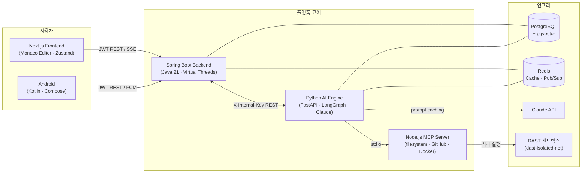
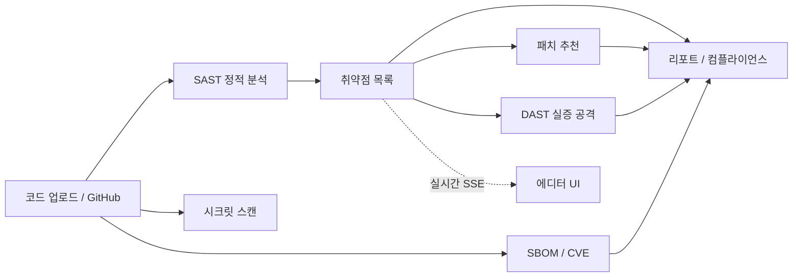

# SecureAI Engine — 기능별 개발 문서 (PPT 발표용)

> 이 폴더는 **발표(PPT)용 기능별 개발 문서**입니다.
> 각 문서는 **① 슬라이드용 요약**(워크플로우 다이어그램 · 신경쓴 점 · 유의할 점 · 특장점)과
> **② `
` 토글 안의 깊은 기술 레퍼런스**(실제 코드 발췌 · 시퀀스 · 엣지케이스)로 구성됩니다.
>
> 모든 내용은 **실제 소스 코드를 직접 읽고** 작성했습니다. (문서가 아닌 코드가 기준)

---

## 🏛️ 전체 아키텍처 한눈에

**데이터 흐름 요약**
1. 프론트엔드가 코드를 업로드/GitHub 연동 → Backend가 분석 세션 생성
2. Backend → AI Engine(`X-Internal-Key`)로 분석 위임
3. AI Engine이 LangGraph 워크플로우로 SAST/DAST/패치/SBOM 분석 (MCP로 파일·GitHub·Docker 접근)
4. 결과를 Backend 내부 API로 저장 + Redis Pub/Sub로 진행률 브로드캐스트
5. Backend가 SSE로 프론트엔드에 실시간 전달 + 완료 시 FCM 푸시

---

## 📚 용어집 (발표 청중용)

| 약어 | 풀이 | 한 줄 설명 |
|---|---|---|
| **SAST** | Static Application Security Testing | 코드를 *실행하지 않고* 정적 분석으로 취약점 탐지 |
| **DAST** | Dynamic Application Security Testing | 실제로 *공격을 실행*해 취약점을 검증(PoC) |
| **SBOM** | Software Bill of Materials | 소프트웨어 의존성 목록(부품 명세서) |
| **CVE** | Common Vulnerabilities and Exposures | 공개된 알려진 취약점 식별자 |
| **CWE** | Common Weakness Enumeration | 취약점 *유형* 분류 체계 (예: CWE-89 SQLi) |
| **OWASP Top 10** | — | 가장 치명적인 웹 보안 위험 10선 |
| **MCP** | Model Context Protocol | LLM이 외부 도구(파일/GitHub/Docker)에 접근하는 표준 프로토콜 |
| **BYOK** | Bring Your Own Key | 사용자가 자신의 Claude API 키를 사용 |
| **SSE** | Server-Sent Events | 서버→클라이언트 단방향 실시간 스트리밍 |

---

## 🗂️ 문서 목록

### Batch 1 — AI / 보안 분석 엔진 (핵심)
| # | 기능 | 문서 | 핵심 포인트 |
|---|---|---|---|
| 01 | **SAST 분석 엔진** | [01-sast-engine.md](01-sast-engine.md) | LangGraph 파이프라인 · 파일 우선순위 · SHA-256 캐시 · 청킹 병렬 |
| 02 | DAST 동적 분석 | (예정) | Docker 샌드박스 · 취약점별 executor · 재시도 |
| 03 | 패치 추천 | (예정) | Claude + 템플릿 · 24h 캐시 |
| 04 | SBOM / CVE 분석 | (예정) | 파서 자동감지 · CVE 매칭 · CycloneDX |
| 05 | 시크릿 스캔 | (예정) | 정규식 1차 + Claude 분류 2차 |
| 06 | AI 보안 챗 | (예정) | 멀티턴 스트리밍 · 프롬프트 캐싱 |
| 07 | AI 엔진 횡단 관심사 | (예정) | JSON 3단계 복구 · MCP 수명주기 · 가이드라인 검색 |

### Batch 2 — 백엔드 핵심 (예정)
세션 오케스트레이션 · 실시간 SSE · 인증/OAuth · 리포트 생성 · GitHub 웹훅 · 컴플라이언스 매핑

### Batch 3 — 프론트엔드 / 플랫폼 (예정)
Monaco 통합 · 상태관리 · 조직/팀 관리 · 기타 도메인

---

## 🔗 기능 간 연결고리 (발표 스토리라인)

> "정적으로 찾고(SAST) → 고치는 법을 알려주고(패치) → 진짜 뚫리는지 증명하고(DAST) →
> 부품·비밀까지 점검(SBOM/시크릿) → 경영진용 리포트로 마무리" 가 발표의 큰 줄기입니다.
