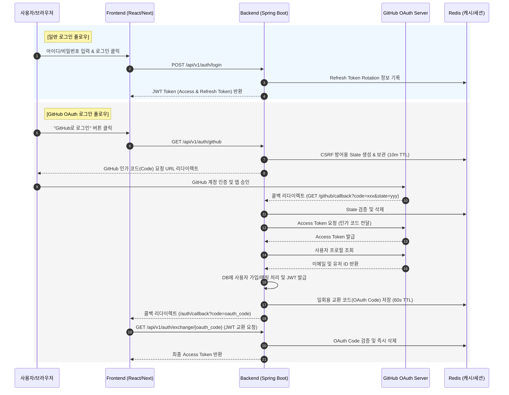
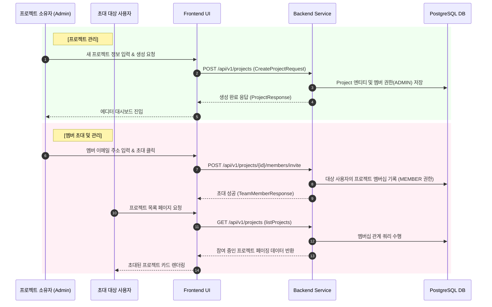
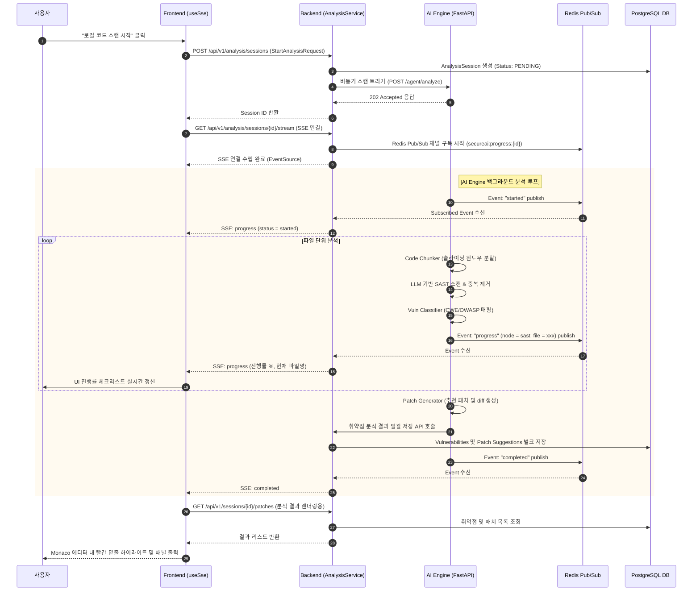
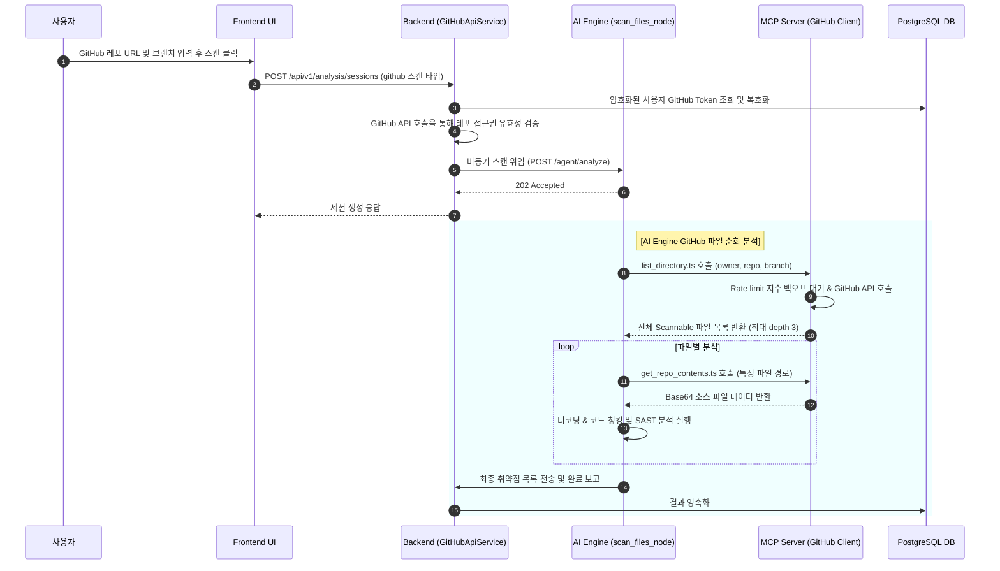
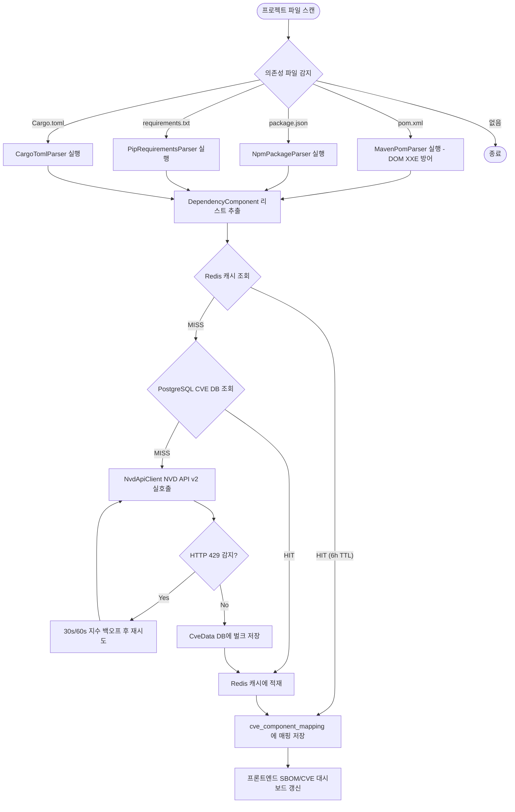
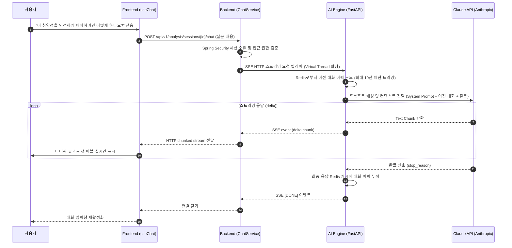

# SecureAI Sprint 1~4 상세 리뷰 및 기능 명세

이 문서는 Sprint 1에서 Sprint 4까지 구현된 주요 기능들의 구현 위치(Backend, AI Engine, Frontend, MCP Server)를 구체적인 파일 및 메소드 레벨로 요약하고, 관련 테스트 스크립트의 상세 경로 및 시나리오 검증 현황을 정리하며, 시나리오별 유즈케이스 Flow를 Mermaid 시퀀스/플로우 다이어그램으로 제공합니다.

---

## 1. 기능 구현 요약 및 코드 매핑

### 1) JWT & OAuth 인증 (Sprint 1)
*   **회원가입, 일반 로그인 및 로그아웃**
    *   **Backend Controller**: `apps/backend/src/main/java/io/secureai/backend/domain/auth/controller/AuthController.java`
        *   `register()`: 회원 등록
        *   `login()`: JWT 발급 및 로그인 처리 (`@AuditLog` 기록)
        *   `logout()`: 로그아웃 및 Redis 토큰 취소
    *   **Backend Service**: `apps/backend/src/main/java/io/secureai/backend/domain/auth/service/AuthService.java`
        *   `register()`, `login()`, `logout()`, `refresh()`
*   **GitHub OAuth 연동 및 JWT 교환**
    *   **Backend Controller**: `apps/backend/src/main/java/io/secureai/backend/domain/auth/controller/AuthController.java`
        *   `githubLogin()`: OAuth 인가 요청 리다이렉트 (CSRF 방어 state 생성)
        *   `githubCallback()`: 콜백 수신 및 일회용 코드 발급 (Redis 60s TTL)
        *   `exchangeOAuthCode()`: 일회용 코드를 프론트엔드 Access Token으로 교환
    *   **Backend Service**: `apps/backend/src/main/java/io/secureai/backend/domain/auth/service/GitHubOAuthService.java`
        *   `buildAuthorizationUrl()`, `handleCallback()`

### 2) 프로젝트 CRUD & 멤버 초대 (Sprint 1)
*   **프로젝트 생성, 조회, 수정 및 삭제**
    *   **Backend Controller**: `apps/backend/src/main/java/io/secureai/backend/domain/project/controller/ProjectController.java`
        *   `listProjects()`, `createProject()`, `getProject()`, `updateProject()`, `deleteProject()`
    *   **Backend Service**: `apps/backend/src/main/java/io/secureai/backend/domain/project/service/ProjectService.java`
        *   `listProjects()`, `createProject()`, `getProject()`, `updateProject()`, `deleteProject()`
*   **프로젝트 멤버 관리 (초대/추방)**
    *   **Backend Controller**: `apps/backend/src/main/java/io/secureai/backend/domain/project/controller/ProjectController.java`
        *   `listMembers()`, `inviteMember()`, `removeMember()`
    *   **Backend Service**: `apps/backend/src/main/java/io/secureai/backend/domain/project/service/ProjectService.java`
        *   `listMembers()`, `inviteMember()`, `removeMember()`

### 3) AI 에이전트 & SAST 파이프라인 (Sprint 2, 3)
*   **코드 청킹 및 분석 병렬화 (Code Chunker)**
    *   **AI Engine Chunker**: `apps/ai_engine/agent/nodes/code_chunker.py`
        *   `_analyze_chunks()`: 300라인 기준 슬라이딩 윈도우 분할
        *   `_dedup_vulns()`: (line, type) 기준 취약점 중복 제거
*   **취약점 분류 및 CWE/OWASP 자동 매핑**
    *   **AI Engine Classifier**: `apps/ai_engine/agent/nodes/vuln_classifier.py`
        *   `normalize_vuln()`: 취약점 타입 소문자/구분자 정규화
        *   `build_call_chain()`: 경로 기반 MVC 계층 감지 및 가상 체인 생성
        *   `classify_and_enrich()`: CWE/OWASP 매핑 테이블 매치 및 체인 주입
*   **배치 SAST 스캔 노드**
    *   **AI Engine Node**: `apps/ai_engine/agent/nodes/sast_node.py`
        *   `analyze_for_sast()`: 파일별 분석 순회 및 Progress SSE 이벤트 브로드캐스트
    *   **Backend Query Service**: `apps/backend/src/main/java/io/secureai/backend/domain/analysis/service/VulnerabilityQueryService.java`
        *   `countBySeverity()`, `countByFilePath()`: CQRS 읽기 전용 통계 조회

### 4) GitHub API 기반 원격 레포 스캔 (Sprint 3)
*   **GitHub 파일 탐색 및 조회 (MCP Server & Wrapper)**
    *   **MCP Server (Node.js)**: `apps/mcp_server/src/github/github_client.ts` - `getContents()` (Rate limit 지수 백오프)
    *   **MCP Server (Node.js)**: `apps/mcp_server/src/github/list_directory.ts` - `handleListDirectory()` (MAX_DEPTH=3)
    *   **AI Engine Wrapper**: `apps/ai_engine/agent/nodes/mcp_github_tools.py`
        *   `list_github_files()`, `get_github_file_content()`
*   **원격 분석 분기 오케스트레이션**
    *   **AI Engine Node**: `apps/ai_engine/agent/nodes/scan_files_node.py`
        *   `scan_files_node()`: `source_type=github`에 따른 파일 수집 분기
    *   **Backend Service**: `apps/backend/src/main/java/io/secureai/backend/domain/analysis/service/GitHubApiService.java`
        *   `validateAccess()`: DB에 암호화된 토큰 복호화 및 GitHub 접근권 검증

### 5) 패치 생성 및 SBOM (Sprint 3)
*   **자동 패치 코드 생성 및 적용**
    *   **AI Engine Diff Generator**: `apps/ai_engine/agent/nodes/diff_generator.py`
        *   `generate_unified_diff()`: 원본과 수정본의 unified diff 포맷 생성
        *   `parse_patch_response()`: LLM 응답 마크다운 제거 및 JSON 파싱
    *   **AI Engine Patch Node**: `apps/ai_engine/agent/nodes/patch_node.py`
        *   `patch_node()`: Redis 캐시(`secureai:patch:{type}:{ext}`) 적용 및 패치 자동 생성
    *   **Backend Service**: `apps/backend/src/main/java/io/secureai/backend/domain/patch/service/PatchService.java`
        *   `savePatchResults()`, `applyPatch()`: 패치 이력 저장 및 적용 상태 업데이트
*   **CVE DB 및 SBOM 파싱 (Strategy 패턴)**
    *   **Backend CVE Client**: `apps/backend/src/main/java/io/secureai/backend/domain/cve/service/NvdApiClient.java`
        *   `syncCveData()`: NVD API v2 증분 갱신 및 429 backoff 처리
    *   **Backend SBOM strategy**: `apps/backend/src/main/java/io/secureai/backend/domain/sbom/service/parser/MavenPomParser.java` (DOM XXE 방어 적용)
    *   **Backend SBOM strategy**: `NpmPackageParser.java`, `PipRequirementsParser.java`, `CargoTomlParser.java`
    *   **Backend SBOM Service**: `apps/backend/src/main/java/io/secureai/backend/domain/sbom/service/SbomService.java`
        *   `saveSbomComponents()`: 파서 팩토리를 통해 적합한 파서 자동 매핑 및 components 수집

### 6) 프론트엔드 UI & SSE 실시간 스트리밍 & AI 채팅 (Sprint 4)
*   **SSE 실시간 진행률 및 취약점 스트리밍**
    *   **Backend Service**: `apps/backend/src/main/java/io/secureai/backend/domain/analysis/service/SseEmitterService.java`
        *   `subscribe()`, `send()`, `complete()`: Redis Pub/Sub을 SSE로 중계
    *   **Frontend Hook**: `apps/frontend/src/hooks/useSse.ts`
        *   `useSse()`: fetch + ReadableStream으로 JWT Authorization 헤더 전달 및 지수 백오프 자동 재연결
*   **진행률 체크리스트 및 Markdown 생성**
    *   **Backend Service**: `apps/backend/src/main/java/io/secureai/backend/domain/analysis/service/ProgressLogService.java`
        *   `getSummary()`: 세션 로그 취합 및 % 단위 계산
    *   **Frontend UI**: `apps/frontend/src/components/analysis/ProgressPanel.tsx`
        *   `ProgressPanel`: 진행 바 렌더링 및 `.md` 형식 클라이언트 사이드 다운로드
*   **AI 채팅 API & UI (Multi-turn 대화)**
    *   **AI Engine Router**: `apps/ai_engine/api/routes/chat.py`
        *   `chat_stream()`: SSE 엔드포인트 릴레이
    *   **AI Engine Client**: `apps/ai_engine/chat_client.py`
        *   `stream()`: Anthropic Prompt Caching 및 최대 10턴 컨텍스트 관리
    *   **Backend Service**: `apps/backend/src/main/java/io/secureai/backend/domain/analysis/service/ChatService.java`
        *   `sendChatMessage()`: RestClient + Virtual Thread 기반 동기 SSE relay (성능 최적화)
    *   **Frontend UI**: `apps/frontend/src/components/analysis/ChatPanel.tsx` (스트리밍 버블 타이핑 효과)

---

## 2. 테스트 스크립트 구성 및 시나리오 검증 현황

각 기능별 비즈니스 시나리오를 검증하기 위한 자동화 테스트 스크립트는 아래 경로에 구성되어 있습니다.

### 1) Backend (JUnit 5 + Spring Boot Test)
*   **`io.secureai.backend.domain.auth.service.AuthServiceTest`**
    *   **검증 시나리오**: 회원가입 시 중복 이메일 예외 처리, 로그인 성공 시 Access/Refresh Token 쌍 생성 및 Refresh Token Rotation 검증.
*   **`io.secureai.backend.domain.project.service.ProjectServiceTest`**
    *   **검증 시나리오**: 비멤버의 프로젝트 접근 시 `AccessDeniedException` 발생 여부 및 CRUD 비즈니스 로직.
*   **`io.secureai.backend.domain.analysis.service.SseEmitterServiceTest`**
    *   **검증 시나리오**: 클라이언트 다중 구독 분리 전송, 타임아웃 이벤트 시 에러 핸들링 및 리소스 회수.
*   **`io.secureai.backend.domain.analysis.service.ProgressLogServiceTest`**
    *   **검증 시나리오**: 복수 노드의 상태 변경 이벤트 기록 시 진행률 퍼센트의 비선형 산출 및 예외 상황 로깅.
*   **`io.secureai.backend.domain.patch.service.PatchServiceTest`**
    *   **검증 시나리오**: 패치 적용 API 호출 시 `is_applied` 상태 및 적용 시점(`applied_at`) 필드가 정확히 업데이트되는지 검증.
*   **`io.secureai.backend.domain.sbom.service.SbomServiceSaveTest`**
    *   **검증 시나리오**: Maven/Npm/Pip 파서들의 XXE 공격 페이로드 방어(DOCTYPE 선언 무시) 및 의존성 추출 단위 테스트.

### 2) AI Engine (Pytest + Mocking)
*   **`apps/ai_engine/tests/agent/test_code_chunker.py`** (13개)
    *   **검증 시나리오**: 대용량 파일 분할 시 경계선 오버랩(25라인)이 보장되는지, 윈도우 슬라이싱이 정상 동작하는지 테스트.
*   **`apps/ai_engine/tests/agent/test_vuln_classifier.py`** (27개)
    *   **검증 시나리오**: PascalCase 변환 에러 수정 검증 및 CWE/OWASP 매핑 정확성, 소스 파일 내 MVC 패턴 키워드에 따른 Call Chain 추론 시나리오.
*   **`apps/ai_engine/tests/agent/test_diff_generator.py`** (12개)
    *   **검증 시나리오**: Claude API의 unified diff 누락 시 원본/수정본 기반 보완 및 unified diff 파싱 정확성 검증.
*   **`apps/ai_engine/tests/agent/test_sast_node.py`**
    *   **검증 시나리오**: 분석 노드 진행 시 Redis progress publish 연동 및 Exception 발생 시 세션 전체 실패가 아닌 skip & log가 정상 수행되는지 검증.
*   **`apps/ai_engine/tests/api/test_chat_route.py`** (3개)
    *   **검증 시나리오**: 10턴 이력 제한 초과 시 컨텍스트 윈도우 내 오래된 대화가 정상 트리밍되는지 및 SSE delta 스트리밍.

---

## 3. 시나리오별 유즈케이스 Flow 다이어그램 (Mermaid)

### 시나리오 1: 사용자 JWT/OAuth 로그인 및 토큰 발급/교환

### 시나리오 2: 프로젝트 CRUD 및 멤버 초대

### 시나리오 3: 로컬 파일 기반 SAST 스캔 및 실시간 SSE 스트리밍

### 시나리오 4: GitHub Repository 기반 비동기 스캔

### 시나리오 5: SBOM 추출 및 CVE 캐시/NVD API 매칭

### 시나리오 6: 에디터 내 AI 채팅 (다중 턴 스트리밍)

