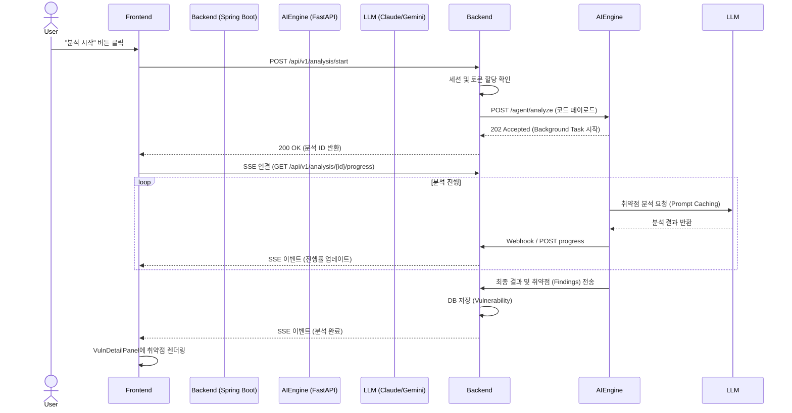
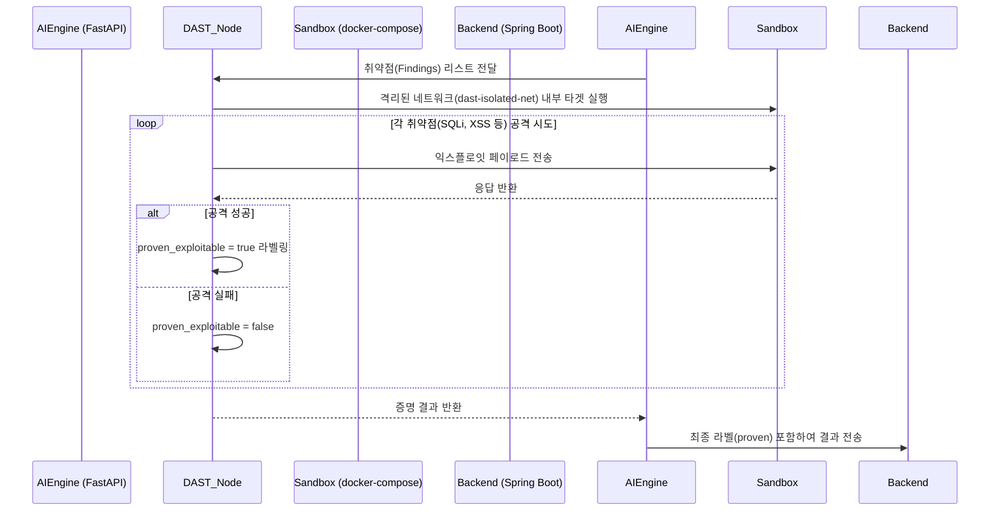
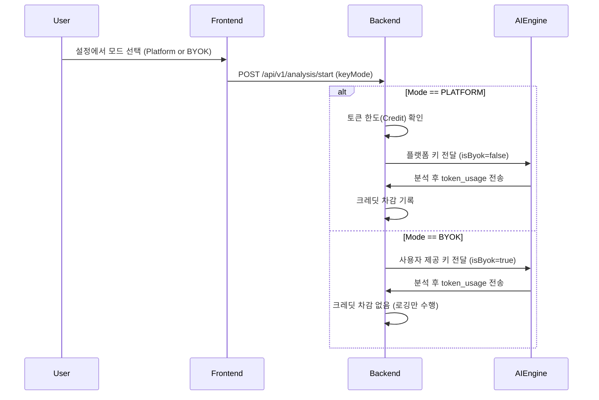
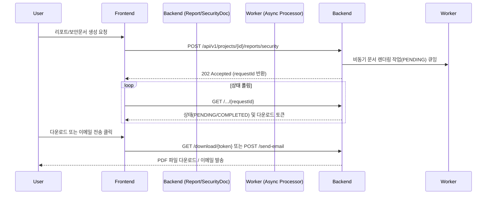

# SecureAI 유스케이스 및 흐름도 (Use Cases & Flows)

이 문서는 SecureAI 시스템의 핵심 유스케이스와 데이터 흐름을 시각적으로 설명하는 다이어그램 문서입니다.

## 1. 정적 분석 (SAST) 및 진행률 모니터링 흐름

사용자가 에디터에서 분석을 요청하면, 백엔드가 AI 엔진에 작업을 위임하고, SSE를 통해 실시간으로 프론트엔드에 진행 상황을 전달합니다.



## 2. 동적 분석 (DAST) 증명 흐름 (proven_exploitable)

SAST에서 발견된 의심 취약점을 격리된 샌드박스에서 실제로 공격하여 증명하는 흐름입니다.



## 3. 자동 패치 및 회귀 검증 흐름

발견된 취약점에 대해 AI가 패치를 제안하고, 이를 적용 후 재스캔 및 테스트하여 안전성을 검증합니다.

```mermaid
flowchart TD
    A[취약점 발견 (Findings)] --> B[AI 패치 생성 요청]
    B --> C[diff_generator 노드에서 패치 diff 생성]
    C --> D[patch_node에서 임시 워크스페이스에 패치 적용]
    D --> E{재스캔 (SAST)}
    E -- 취약점 잔존 --> B
    E -- 소거됨 --> F{테스트 스위트 실행}
    F -- 실패 (회귀 발생) --> B
    F -- 성공 --> G[검증된 패치 제안 (Verified Patch)]
    G --> H[사용자가 리뷰 후 PR 생성/Merge]
```

## 4. 토큰 및 결제 흐름 (EPIC-BILLING)

BYOK(사용자 API 키) 모드와 플랫폼 크레딧 대납 모드를 분기하는 흐름입니다.



## 5. 리포트 및 보안 문서 생성 흐름 (Report & Security Docs)

세션 분석 완료 후 ROI 리포트나 컴플라이언스 문서(CISO, ISMS 등)를 비동기로 생성하고 PDF로 다운로드하거나 이메일로 전송하는 흐름입니다.



## 6. 스케줄링 및 운영 백그라운드 흐름 (Scheduling & Ops)

엔터프라이즈 기능 중 백그라운드에서 실행되는 프로세스와 비용 최적화 흐름입니다.

```mermaid
flowchart TD
    subgraph Scheduling
    A[사용자가 야간 스캔 일정 등록] --> B(ProjectScheduleController)
    B --> C{백엔드 Cron Job 실행}
    C -- 지정된 시간 도달 --> D[대상 프로젝트 SAST/DAST 스캔 트리거]
    end

    subgraph AI Engine Optimization
    E[SAST 스캔 요청] --> F(cache_check_node)
    F -- 파일 SHA 해시 검사 --> G{캐시 히트 여부?}
    G -- Yes --> H[Redis 결과 반환 (LLM 호출 X)]
    G -- No --> I[api_discovery_node 에서 URL 추출]
    I --> J[LLM 분석 (URL 내 민감정보 노출 룰 적용 및 시크릿 스캐닝)]
    end
    
    subgraph Continuous Ops (Monitoring & Cleanup)
    K[새로운 CVE 발표] --> L[MonitoringCveReMatchListener]
    L --> M[기존 코드베이스 의존성과 재대조]
    M -- 매칭 시 --> N[DeviceTokenController를 통한 FCM 푸시 알림 발송]
    
    O[심야 시간대 도달] --> P[DB 백업, 만료 토큰 정리, 파티션 유지보수]
    end
```
