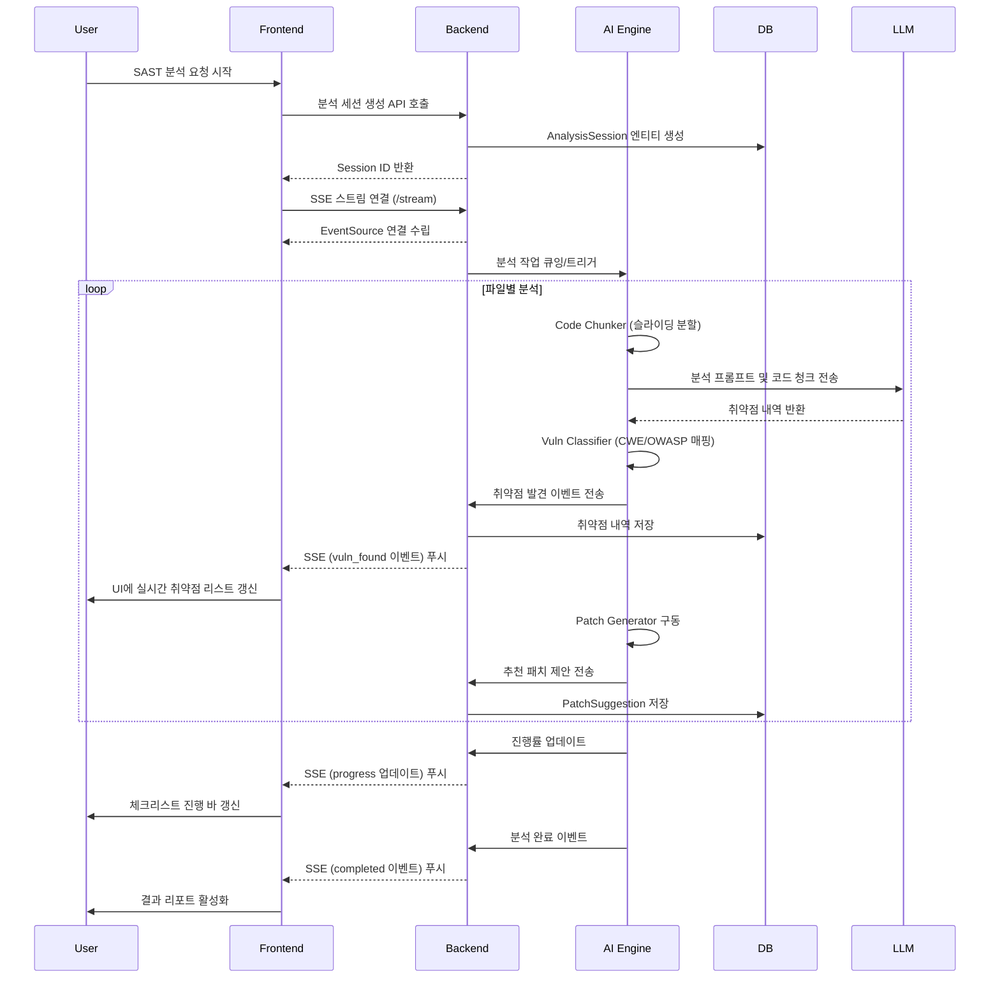
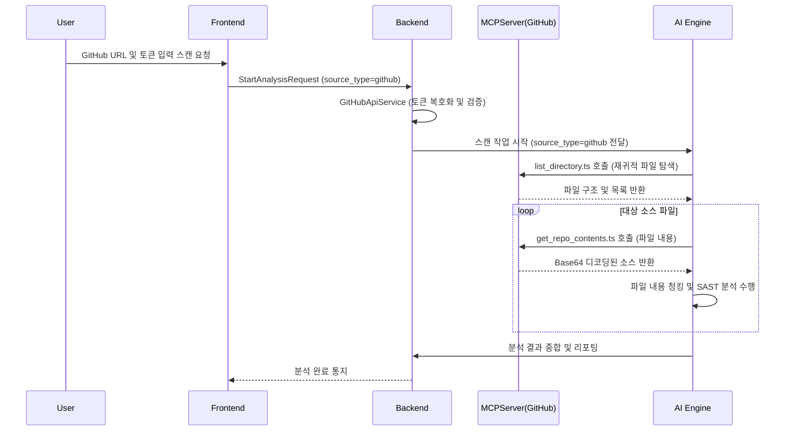
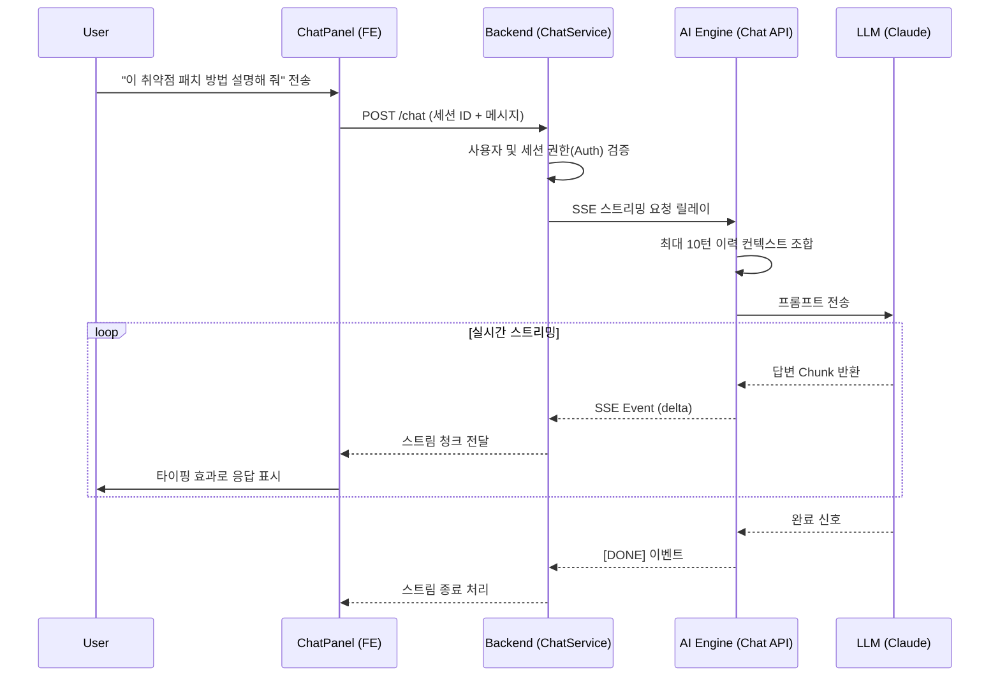

# SecureAI Sprint 1~4 리뷰 및 기능 요약

이 문서는 Sprint 1에서 Sprint 4까지 구현된 주요 기능들의 구현 위치(Backend, AI Engine 등)를 요약하고, 관련 테스트 스크립트의 존재 여부 및 시나리오 플로우를 Mermaid 다이어그램으로 제공합니다.

## 1. 기능 구현 요약

### 1) AI 에이전트 & SAST 파이프라인 (Sprint 2, 3)
*   **코드 청킹 및 분석 병렬화**
    *   **AI Engine**: `apps/ai_engine/agent/nodes/code_chunker.py` - `_analyze_chunks()`, `_dedup_vulns()`
*   **취약점 분류 및 CWE/OWASP 자동 매핑**
    *   **AI Engine**: `apps/ai_engine/agent/nodes/vuln_classifier.py` - `normalize_vuln()`, `classify_and_enrich()`
    *   **AI Engine**: `apps/ai_engine/agent/nodes/vuln_classifier.py` - `build_call_chain()`
*   **파일 배치 기반 SAST 스캔**
    *   **AI Engine**: `apps/ai_engine/agent/nodes/sast_node.py`
    *   **Backend**: `apps/backend/.../VulnerabilityQueryService.java` - `countBySeverity()`, `countByFilePath()`

### 2) GitHub 연동 (Sprint 3)
*   **GitHub 레포지토리 API 기반 코드 스캔**
    *   **Backend**: `apps/backend/.../GitHubRestClient.java`, `GitHubApiService.java`
    *   **MCP Server**: `apps/mcp_server/src/github/github_client.ts` - `getContents()`
    *   **MCP Server**: `apps/mcp_server/src/github/list_directory.ts` - `handleListDirectory()`
    *   **AI Engine**: `apps/ai_engine/agent/nodes/scan_files_node.py`

### 3) 패치 생성 및 SBOM (Sprint 3)
*   **자동 패치 코드 생성**
    *   **AI Engine**: `apps/ai_engine/agent/nodes/diff_generator.py` - `generate_unified_diff()`, `parse_patch_response()`
    *   **AI Engine**: `apps/ai_engine/agent/nodes/patch_node.py`
    *   **Backend**: `apps/backend/.../patch/PatchService.java` - `savePatchResults()`, `applyPatch()`
*   **CVE DB 및 SBOM 파싱**
    *   **Backend**: `apps/backend/.../cve/NvdApiClient.java`, `NvdSyncJob.java`
    *   **Backend**: `apps/backend/.../sbom/MavenPomParser.java` (및 Npm/Pip/Cargo 등 파서) - `parse()`

### 4) 프론트엔드 UI 및 SSE 실시간 스트리밍 (Sprint 4)
*   **SSE 실시간 진행률 및 취약점 스트리밍**
    *   **Backend**: `apps/backend/.../SseEmitterService.java`
    *   **Frontend**: `useSse.ts` - `fetch` + `ReadableStream`
*   **진행률 체크리스트 및 Markdown 다운로드**
    *   **Backend**: `apps/backend/.../ProgressLogService.java` - `getSummary()`
    *   **Frontend**: `ProgressPanel.tsx`, `useSecureStore.ts`
*   **취약점 필터 및 상세 패널**
    *   **Frontend**: `useVulnFilter.ts`, `FilterBar.tsx`, `VulnDetailPanel.tsx`
*   **AI 채팅 API**
    *   **AI Engine**: `apps/ai_engine/api/routes/chat.py`, `chat_client.py` - `stream()`
    *   **Backend**: `apps/backend/.../ChatService.java`, `ChatController.java`
    *   **Frontend**: `useChat.ts`, `ChatPanel.tsx`

---

## 2. 테스트 스크립트 구성 및 시나리오 검증

구현된 기능에 대응하는 테스트 스크립트는 각 모듈의 기능과 시나리오를 반영하여 구성되어 있습니다.

### AI Engine (`apps/ai_engine/tests/`)
*   **단위 테스트**
    *   `test_code_chunker.py` (13개): 큰 파일의 슬라이딩 윈도우 분할 및 경계 처리 시나리오
    *   `test_vuln_classifier.py` (27개): CWE/OWASP 자동 매핑, CallChain 추출 정규화 시나리오
    *   `test_diff_generator.py` (12개): 패치 생성 시 원본과 수정본의 unified diff 처리 시나리오
    *   `test_chat_route.py` (3개): AI 채팅의 다중 턴 유지 및 스트리밍 시나리오
*   **통합 테스트** (`tests/integration/`)
    *   `test_sprint3_integration.py` (7개): Redis 캐시 히트/미스 및 Claude API 연동 전체 파이프라인
    *   `test_backend_sprint3.py` (9개): DB 스키마 구조와 JSONB/GIN 인덱스 테스트

### Backend (`apps/backend/src/test/java/io/secureai/backend/`)
*   **단위/통합 테스트**
    *   `VulnerabilityQueryServiceTest.java`: CQRS 기반의 읽기 전용 쿼리 로직 시나리오
    *   `GitHubRestClientTest.java` / `GitHubApiServiceTest.java`: Rate Limit 처리 및 토큰 복호화 시나리오 (에러 및 재시도 검증)
    *   `PatchServiceTest.java` (5개): 생성된 패치의 상태(is_applied) 변경 및 이력 검증
    *   `SbomParserTest.java` (`MavenPomParserTest` 등): XXE 공격 방어가 적용된 DOM 파싱 및 의존성 추출 시나리오
    *   `ProgressLogServiceTest.java` (5개): 진행률 집계 로직
    *   `SseEmitterServiceTest.java` (6개): 이벤트 스트림 연결 타임아웃 및 에러 핸들링

---

## 3. 시나리오별 유즈케이스 Flow 다이어그램 (Mermaid)

### 시나리오 1: 로컬 파일 기반 SAST 스캔 파이프라인
사용자가 에디터에서 코드 분석을 요청하고, 분석 진행률과 결과를 실시간으로 확인하는 흐름입니다.



### 시나리오 2: GitHub Repository 스캔 연동
사용자가 GitHub 리포지토리 URL을 입력하여 프로젝트 전체 코드를 불러오고 스캔하는 흐름입니다.



### 시나리오 3: SBOM 추출 및 CVE 매칭
프로젝트 내부의 의존성 관리 파일(pom.xml 등)을 파싱하여 취약한 컴포넌트를 식별하는 흐름입니다.

```mermaid
flowchart TD
    A[프로젝트 소스 스캔] --> B{의존성 파일 존재 여부}
    B -- "pom.xml, package.json 등" --> C[SbomService 팩토리 라우팅]
    B -- 없음 --> Z[종료]
    C --> D[MavenPomParser / NpmPackageParser 실행]
    D --> E[종속성(DependencyComponent) 추출]
    E --> F[Redis 캐시 또는 NVD CVE DB 조회]
    F -- 캐시/DB 내 매칭 존재 --> G[cve_component_mapping 에 등록]
    F -- 미존재 --> H[NvdApiClient NVD 외부 연동]
    H --> I[CveData 저장]
    I --> G
    G --> J[프론트엔드 대시보드에 SBOM 리포트 표시]
```

### 시나리오 4: AI 대화형 질의 (채팅 패널)
사용자가 특정 취약점이나 패치 제안에 대해 질문을 하면 AI가 답변하는 흐름입니다.


