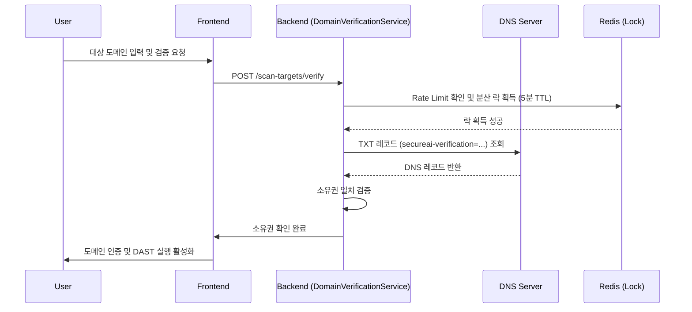
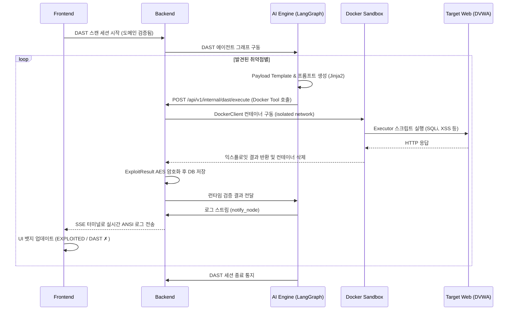

# SecureAI Sprint 5~6 리뷰 및 기능 요약

이 문서는 Sprint 5와 Sprint 6에서 계획 및 구현된 주요 기능들의 구현 위치를 요약하고, 관련 테스트 스크립트 및 시나리오 플로우를 Mermaid 다이어그램으로 제공합니다.

## 1. 기능 구현 요약

### 1) GitHub Layer 2 완성 (Sprint 5)
> **참고**: Sprint 5의 핵심 태스크(커밋 히스토리 스캔, PR Webhook 연동 등)는 구현 복잡도 및 외부 의존성(GitHub API, Webhook 환경 구성 등) 문제로 인해 백로그 상에서 이월되어, Sprint 10의 Enterprise / GitHub Integration 기능으로 병합 처리되었습니다.

### 2) DAST 엔진 및 Docker 샌드박스 인프라 (Sprint 6)
*   **Python 익스플로잇 실행기 (5종)**
    *   **AI Engine**: `apps/ai_engine/executors/sqli_executor.py`, `xss_executor.py`, `idor_executor.py`, `ssrf_executor.py`, `auth_bypass_executor.py`
    *   **AI Engine**: `apps/ai_engine/executors/dast_runner.py` (Strategy 패턴 매핑)
*   **Java Docker 샌드박스 통합**
    *   **Backend**: `apps/backend/.../DockerSandboxManager.java`, `DockerClientConfig.java`, `ContainerConfig.java` (`dast-isolated-net` 격리 설정)
    *   **Backend**: `apps/backend/.../ExploitResult.java`, `ScanStatus.java`
*   **도메인 소유권 확인 및 Rate Limit**
    *   **Backend**: `apps/backend/.../DomainVerificationService.java` (JNDI DNS TXT 조회)
    *   **Backend**: `apps/backend/.../DistributedLockService.java` (Redis SETNX 분산 락)
    *   **Backend**: `apps/backend/.../ScanTarget.java`
*   **DAST LangGraph 에이전트 및 REST 연결**
    *   **AI Engine**: `apps/ai_engine/agent/nodes/dast_node.py`, `after_dast.py`, `notify_node.py`, `docker_tool.py`, `dast_graph_builder.py`
    *   **AI Engine**: `apps/ai_engine/api/routes/dast.py` (`POST /agent/dast/start`, `GET /agent/dast/logs/{session_id}`)
    *   **Backend**: `apps/backend/.../DastController.java`, `DastExecutionService.java`, `DastResultHandler.java`, `ExploitResultPersister.java`
*   **pgvector 임베딩 통합 (가이드라인)**
    *   **AI Engine**: `apps/ai_engine/embedding_service.py`, `guidelines_client.py` (임베딩 검색 로직), `sync_guidelines.py`
*   **프론트엔드 터미널 확장 및 상태 UI**
    *   **Frontend**: `useDastStream.ts` (SSE 스트리밍), `useSecureStore.ts`
    *   **Frontend**: `DastTerminal.tsx` (ANSI 파싱 및 콘솔 렌더링), `VulnDetailPanel.tsx` (결과 뱃지)

---

## 2. 테스트 스크립트 구성 및 시나리오 검증

구현된 DAST 기능과 도메인 검증 로직은 다음 테스트 스크립트로 커버되고 있습니다.

### AI Engine (`apps/ai_engine/tests/`)
*   **단위/통합 테스트**
    *   `test_dast_graph.py` (15개): DAST 노드 순회, Docker Tool 호출 제어 및 에러 핸들링
    *   `test_dast_route.py` (6개): DAST 시작 API 및 로그 스트리밍 라우터 동작 검증

### Backend (`apps/backend/src/test/java/io/secureai/backend/`)
*   **단위 테스트 (총 42개 통과)**
    *   `DomainVerificationServiceTest.java` (11개): DNS TXT 레코드 기반 도메인 소유권 검증 및 실패 응답 제어
    *   `DistributedLockServiceTest.java` (5개): Redis 락 기반 Rate Limit
    *   `DastExecutionServiceTest.java` (8개): Docker 환경 변수 분리 주입 및 Shell Injection 방어 처리
    *   `DastControllerTest.java` (7개): 권한 검증 및 에러 응답 처리
    *   `DastResultHandlerTest.java` (7개): Redis 브로드캐스트 이벤트 전송 시나리오
    *   `ExploitResultPersisterTest.java` (4개): AES 암호화 저장 검증

### Frontend
*   **단위 테스트**
    *   `useSse.test.ts` 등 프론트 테스트에서 SSE 이벤트 매핑 오탈자 및 UUID 패스 파라미터 방어 검증

---

## 3. 시나리오별 유즈케이스 Flow 다이어그램 (Mermaid)

### 시나리오 1: 사용자 도메인 등록 및 소유권 확인 검증
DAST 스캔을 시작하기 전, 사용자가 입력한 대상 도메인이 실제 소유권이 있는지 확인하는 시나리오입니다.

### 시나리오 2: DAST 샌드박스 실행 파이프라인 (LangGraph & Docker)
승인된 도메인에 한해 취약점 발견 시 AI Engine이 Docker 컨테이너를 가동하여 직접 익스플로잇을 테스트하는 시나리오입니다.

