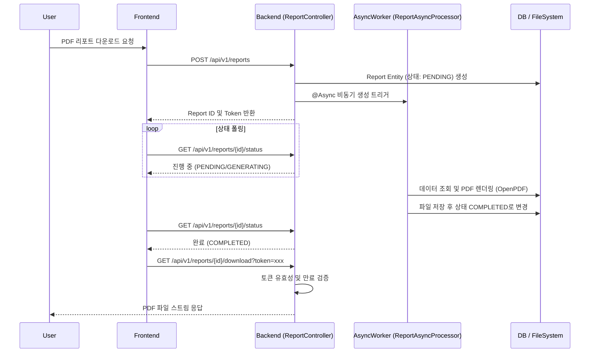
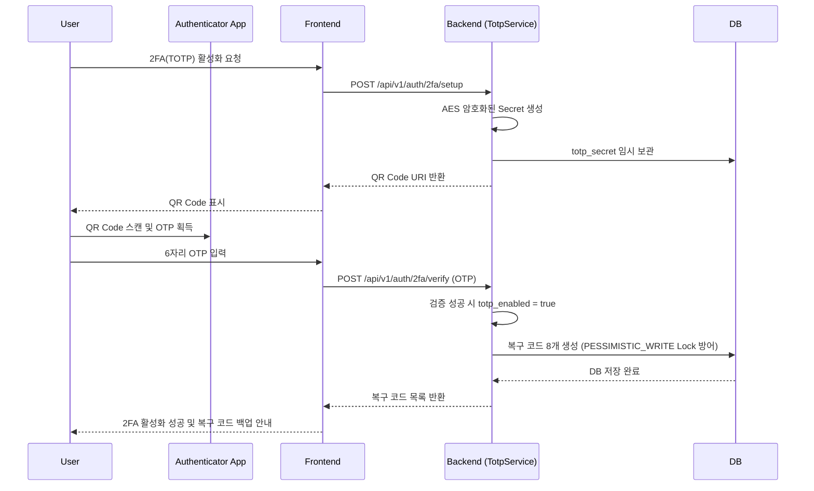

# SecureAI Sprint 7~8 리뷰 및 기능 요약

이 문서는 Sprint 7과 Sprint 8에서 구현된 주요 기능들의 구현 위치(Backend, Frontend, Android 등)를 요약하고, 관련 테스트 스크립트 및 시나리오 플로우를 Mermaid 다이어그램으로 제공합니다.

## 1. 기능 구현 요약

### 1) 리포트 & 웹 대시보드 (Sprint 7)
*   **PDF/JSON 리포트 생성 백엔드**
    *   **Backend**: `apps/backend/.../Report.java`, `V035__create_reports.sql`
    *   **Backend**: `apps/backend/.../PdfReportGenerator.java`, `JsonReportGenerator.java`, `ReportService.java`, `ReportAsyncProcessor.java`
*   **대시보드 차트 집계 API**
    *   **Backend**: `apps/backend/.../DashboardQueryService.java`, `DashboardCacheService.java`, `DashboardController.java`
    *   **Backend**: `apps/backend/.../VulnerabilityRepository.java` (`created_at::date` 기반 Native Query 집계)
*   **프론트엔드 UI 컴포넌트**
    *   **Frontend**: `PdfReportModal.tsx`, `DashboardPage.tsx`, `useDashboard.ts`
    *   **Frontend**: `SecurityScoreRing.tsx`, `SeverityBarChart.tsx`, `TrendLineChart.tsx`, `FileHeatmap.tsx`, `OwaspCoverageMatrix.tsx`

### 2) Android MVP 및 알림 (Sprint 7)
*   **Android 프로젝트 기반 및 인증**
    *   **Android**: `TokenStorage.kt` (AES256 암호화), `NetworkModule.kt`, `AuthViewModel.kt`, `LoginScreen.kt`, `RootDetector.kt`
*   **Android 대시보드 및 오프라인 캐시**
    *   **Android**: `DashboardScreen.kt`, `SecurityScoreGauge.kt`, `VulnListScreen.kt`, `VulnDetailScreen.kt`
    *   **Android**: `VulnerabilityEntity.kt`, `VulnRepository.kt` (Room Database 폴백)
*   **FCM Push & SSE 이중 전략**
    *   **Backend**: `DeviceTokenService.java`, `FcmPushService.java`, `SessionCompletedEventListener`
    *   **Android**: `SecureAiFcmService.kt`, `FcmTokenService.kt`, `SseClient.kt`, `AnalysisViewModel.kt`

### 3) 관측성 및 스케줄러 안정화 (Sprint 8)
*   **OpenTelemetry 분산 트레이싱**
    *   **전체**: Jaeger 연동, `build.gradle.kts`, `docker-compose.yml`, Python OTel SDK
    *   **AI Engine**: LangGraph 노드별 수동 Span (`tracer.start_as_current_span`)
*   **ShedLock (분산 스케줄러)**
    *   **Backend**: `V037__create_shedlock_table.sql`, 6개 주기적 Job (`ExpiredDataCleanupJob` 등)에 `@SchedulerLock` 적용

### 4) 보안 인증 강화 및 시스템 복원력 (Sprint 8)
*   **Circuit Breaker (장애 격리)**
    *   **Backend**: Resilience4j 적용 (`DefaultAiAgentClient`, `NvdApiClient`, `DomainVerificationService`에 `@CircuitBreaker` 지정)
*   **2FA (TOTP) 및 IP Allowlist**
    *   **Backend**: `TotpService.java`, `TotpController.java` (`@Lock(PESSIMISTIC_WRITE)` 복구 코드 보장), `V038__add_totp_fields.sql`
    *   **Backend**: `IpAllowlistFilter.java`, `SecurityConfig.java` (JWT 필터 체인 전 배치)
*   **GDPR 데이터 삭제 처리 API**
    *   **Backend**: `GdprController.java`, `GdprService.java`, `GdprReportCleanupHandler.java`

### 5) 추가 편의 및 최적화 기능 (Sprint 8)
*   **보안 문서 자동 생성 Level 1**
    *   **Backend**: `SecurityDocController.java`, `SecurityDocAsyncProcessor.java` (Thymeleaf HTML 렌더링 후 OpenHTMLtoPDF 변환)
*   **SBOM 웹 화면 연결 및 API 구성**
    *   **Backend / Frontend**: `SbomController`, `SbomPage.tsx`
*   **성능 최적화 및 Nginx 적용**
    *   **Backend**: `@EntityGraph`, `@BatchSize`, Redis TTL 최적화, Spring Security 헤더 적용
    *   **인프라**: `nginx.conf` (limit_req, HTTPS)

---

## 2. 테스트 스크립트 구성 및 시나리오 검증

구현된 시스템 안정화 및 신규 기능은 다음과 같은 테스트로 커버되고 있습니다.

### Backend (`apps/backend/src/test/java/io/secureai/backend/`)
*   **단위 및 통합 테스트**
    *   `ReportServiceTest.java` (10개) & `PdfReportGeneratorTest.java` (4개): PDF 생성 로직 및 토큰 접근 권한 테스트
    *   `DashboardQueryServiceTest.java` (17개): 차트용 데이터 집계 무결성 및 응답 정확성 검증
    *   `FcmPushServiceTest.java` (4개) & `DeviceTokenServiceTest.java` (5개): 푸시 토큰 생명주기 및 FCM 이벤트 트리거 확인
    *   `CircuitBreakerTest.java` (8개): 타 서비스 장애 시 Fallback 메서드 호출 로직 검증
    *   `GdprServiceTest.java` (7개): 연관 데이터 연쇄 삭제 무결성

### Android (`apps/android/app/src/test/`)
*   **단위 테스트 (총 38개 통과)**
    *   `TokenStorageTest.kt`, `AuthViewModelTest.kt`: 로컬 데이터 암호화 및 UI State 전환 보장
    *   `VulnerabilityDaoContractTest.kt`, `DashboardViewModelTest.kt`: Room 캐시 읽기/쓰기 검증
    *   `SseClientTest.kt`, `AnalysisViewModelTest.kt`: Foreground/Background 상태에 따른 SSE 구독 및 FCM 전환 로직 검증

---

## 3. 시나리오별 유즈케이스 Flow 다이어그램 (Mermaid)

### 시나리오 1: PDF 리포트 비동기 생성 및 다운로드 토큰 플로우
사용자가 대시보드에서 PDF 리포트를 요청하면 백엔드가 비동기로 파일을 생성하고, 접근 토큰을 발급하는 시나리오입니다.



### 시나리오 2: Android 알림 이중 전략 (Foreground SSE vs Background FCM)
Android 모바일 앱에서 분석 완료 시점을 인지할 때, 앱 활성화 상태에 따라 SSE(스트리밍)와 FCM(푸시) 알림을 분기하여 수신하는 시나리오입니다.

```mermaid
flowchart TD
    A[분석 완료 이벤트 발생] --> B[백엔드 Redis Subscriber]
    B --> C{앱이 현재 Foreground인가?}
    C -- Yes (SSE 연결됨) --> D[SseClient (OkHttp) 로 [DONE] 이벤트 수신]
    D --> E[AnalysisViewModel 상태 업데이트]
    E --> F[화면 갱신 및 In-app 알림]
    
    C -- No (Background / 종료) --> G[FcmPushService 동작]
    G --> H[Firebase Server 로 Payload 전송]
    H --> I[Android SecureAiFcmService 수신]
    I --> J[시스템 Notification 트레이 등록]
    J --> K[사용자 알림 탭 -> 앱 구동 (Deeplink)]
```

### 시나리오 3: 2FA(TOTP) 설정 및 복구 코드 발급 플로우
시스템 보안성 강화를 위해 사용자가 Google Authenticator를 연동하고, 긴급 복구 코드를 안전하게 발급받는 시나리오입니다.


