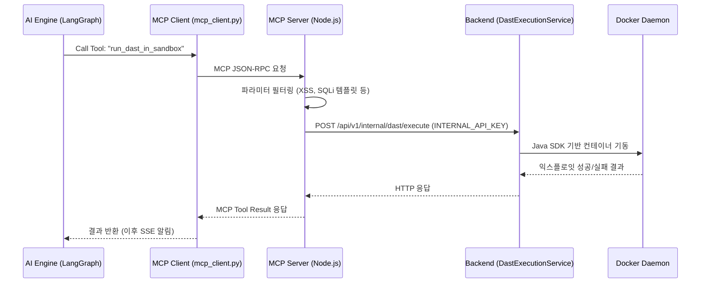
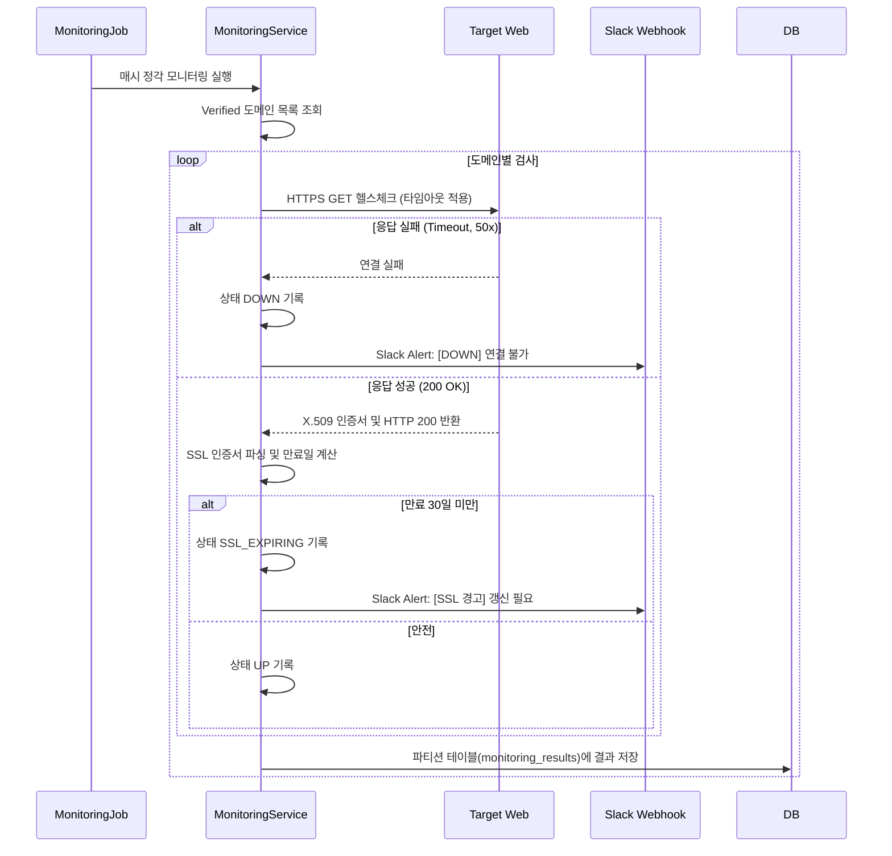

# SecureAI Sprint 9 리뷰 및 기능 요약

이 문서는 Sprint 9에서 구현된 MCP 아키텍처 전환, 운영 관측성 및 각종 서비스 기능의 구현 위치를 요약하고 관련 테스트 스크립트 및 시나리오 플로우를 Mermaid 다이어그램으로 제공합니다.

## 1. 기능 구현 요약

### 1) MCP 인프라 전환 (PostgreSQL & Docker)
*   **PostgreSQL MCP (Read-Only)**
    *   **AI Engine**: `apps/ai_engine/agents/utils/mcp_client.py` (멀티서버 MCP 세션 관리)
    *   **AI Engine**: `apps/ai_engine/agents/sast/sast_node.py` - `_fetch_prev_vuln_context()` (이전 동일 취약점 조회)
    *   **AI Engine**: `apps/ai_engine/agents/patch/patch_node.py` - `_fetch_prev_patch_example()` (과거 패치 이력 조회)
    *   **DB Migration**: `V041__create_mcp_readonly_user.sql` (`secureai_mcp_ro` 읽기 전용 계정)
*   **Docker DAST MCP (Thin-wrapper)**
    *   **MCP Server**: `apps/mcp_server/src/dast/dast_backend.ts` - `run_dast_in_sandbox` 툴
    *   **AI Engine**: `apps/ai_engine/agents/dast/dast_node.py` - `_execute_dast()`

### 2) 운영 관측성 (Prometheus + Grafana)
*   **메트릭 노출 및 커스텀 지표**
    *   **Backend**: `apps/backend/.../AnalysisMetrics.java` (Counter 4종), `AnalysisService.java`, `DastExecutionService.java`
    *   **AI Engine**: `main.py` (`prometheus-fastapi-instrumentator`), `internal_key_auth.py`
*   **인프라 환경 구성**
    *   **Docker**: `docker-compose.yml`, `prometheus.yml`, Grafana 프로비저닝 (JSON 대시보드 4패널)

### 3) GDPR 하드 삭제 스케줄러
*   **소프트 삭제 전환 및 하드 삭제 배치**
    *   **Backend**: `GdprService.java` (`user.markAsDeleted()`), `User.java`
    *   **Backend**: `GdprHardDeleteService.java` (배치 50건 및 연쇄 삭제), `GdprHardDeleteJob.java` (`@Scheduled`, `@SchedulerLock`)
    *   **Backend**: `GdprHardDeleteReportHandler.java`, `GdprController.java` (`/api/v1/admin/gdpr/pending-deletions`)
    *   **DB Migration**: `V042__add_gdpr_hard_delete_audit_action.sql`

### 4) 지속 모니터링 서비스
*   **헬스체크 및 SSL/CVE 스캔**
    *   **Backend**: `MonitoringService.java`, `MonitoringJob.java`, `MonitoringPartitionJob.java`
    *   **Backend**: `SslCertChecker.java` (X.509 파싱), `MonitoringResult.java`, `MonitoringStatus.java`
    *   **Backend**: `MonitoringCveReMatchListener.java`, `NvdSyncCompletedEvent.java`
*   **Slack 알림 연동**
    *   **Backend**: `SlackNotificationPort.java`, `SlackWebhookAdapter.java`
    *   **DB Migration**: `V043__create_monitoring_results.sql` (파티션 테이블)

### 5) 클라이언트 확장 (VSCode & Android)
*   **VSCode Extension MVP**
    *   **VSCode Ext**: `apps/vscode_ext/src/extension.ts`, `apiClient.ts`, `diagnosticProvider.ts`
*   **Android 고도화**
    *   **Android**: `NotificationChannelConfig.kt` (채널 3종 분리), `SecureAiFcmService.kt`
    *   **Android**: `ChatScreen.kt`, `ChatViewModel.kt` (채팅 스트리밍), `SharePdfIntent.kt` (PDF 외부 공유)

---

## 2. 테스트 스크립트 구성 및 시나리오 검증

### AI Engine (`apps/ai_engine/tests/`)
*   `test_mcp_postgres_tools.py` (11개): DB MCP 연결 및 읽기 전용 권한 우회 시도 차단 검증
*   `test_dast_mcp_tool.py` (10개): Docker MCP 툴이 백엔드 내부 API를 호출하고 결과를 반환하는 정상 플로우
*   `test_sast_node.py`: 메트릭 지표 수집 기능 검증

### Backend (`apps/backend/src/test/java/io/secureai/backend/`)
*   `GdprHardDeleteServiceTest.java` (7개) & `GdprServiceTest.java` (7개): 30일 초과 계정 선택 정확도, 29일 계정 예외 처리, 삭제 연쇄(트랜잭션) 및 이메일 발송
*   `AnalysisMetricsTest.java` (3개): 프로메테우스 Counter 증가 로직
*   `MonitoringServiceTest.java` (5개): 도메인 소유권(verified) 기반 화이트리스트 필터링, SSL 파싱 에러 핸들링, Slack 알림 호출 여부

---

## 3. 시나리오별 유즈케이스 Flow 다이어그램 (Mermaid)

### 시나리오 1: DAST 샌드박스 MCP 전환 플로우
기존의 직접적인 백엔드 HTTP 호출을 MCP 프로토콜로 추상화하여, 권한 모델을 유지하면서 AI Agent의 자율성을 높인 시나리오입니다.



### 시나리오 2: GDPR 소프트-하드 삭제 스케줄링 플로우
사용자가 데이터 삭제 요청을 하면 즉시 데이터베이스에서 지우지 않고 `deleted_at`을 기록하여 로그인만 차단하며, 30일 경과 후 스케줄러가 완전 삭제하는 시나리오입니다.

```mermaid
flowchart TD
    A[사용자 계정 삭제 요청] --> B[GdprService (소프트 삭제)]
    B --> C[User 테이블 deletedAt 시간 기록, 활성 해제]
    C --> D[Refresh Token 모두 회수 (로그인 차단)]
    
    E[GdprHardDeleteJob (매일 새벽 4시)] --> F[ShedLock 분산 락 획득]
    F --> G[GdprHardDeleteService 실행]
    G --> H{삭제 조건 충족? (deletedAt + 30일 경과)}
    
    H -- Yes (배치 단위 처리) --> I[감사 로그(Audit) 영구 기록]
    I --> J[ApplicationEvent 발행 (크로스 도메인)]
    J --> K[연관 데이터 CASCADE 영구 삭제 (Reports, Vulns 등)]
    K --> L[삭제 완료 안내 이메일 발송]
    H -- No --> M[Skip]
```

### 시나리오 3: 지속 모니터링 서비스 플로우
등록된 팀 프로젝트를 대상으로 웹 서버의 상태 및 SSL 인증서 만료 등을 주기적으로 헬스체크하고, 문제가 있을 경우 Slack으로 경고하는 시나리오입니다.


