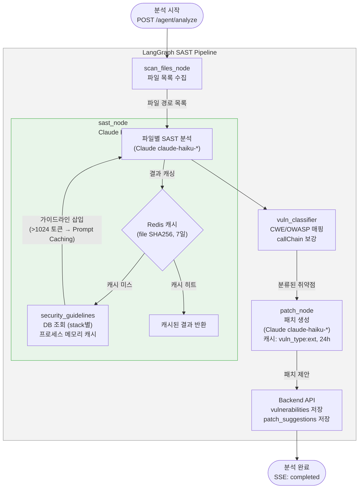
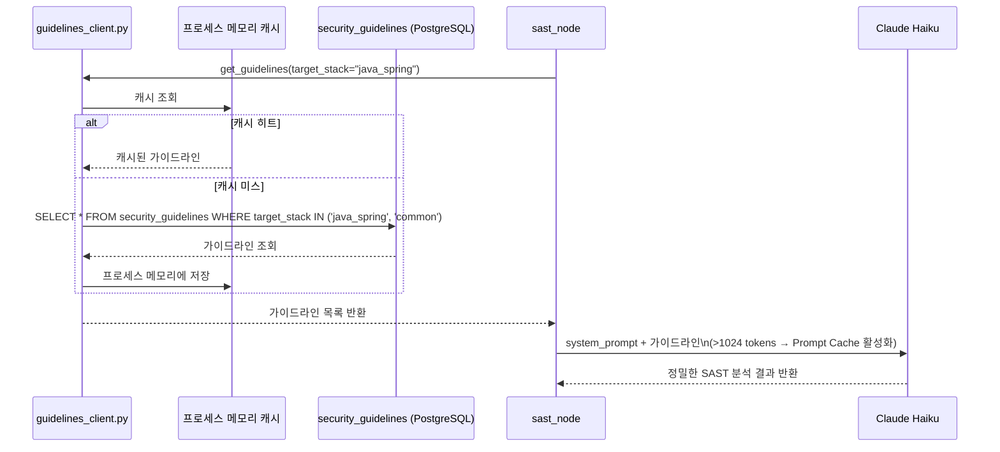
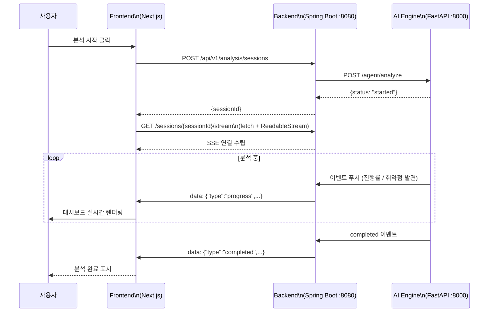

# 🚀 SecureAI Engine 핵심 기능 요약 (2026-06-13)

본 문서는 SecureAI 시스템의 코드베이스와 아키텍처 문서를 기반으로 핵심 기능들을 분석하여 정리한 요약본입니다.

## 🌟 주요 강조 기능 (Quick Links)
- [🔍 1. AI 기반 SAST 분석 파이프라인](#1-ai-기반-sast-분석-파이프라인-langgraph--claude): LangGraph와 Claude를 활용한 코드 정적 분석 및 자동 패치 생성 기능
- [🛡️ 2. 동적 보안 가이드라인 시스템](#2-동적-보안-가이드라인-시스템-prompt-caching): 기술 스택에 맞춤화된 보안 가이드라인을 Prompt Caching을 통해 동적 주입하는 기능
- [⚡ 3. 실시간 SSE 스트리밍 & AI 채팅](#3-실시간-sse-스트리밍--ai-채팅): 분석 진행 상황의 실시간 모니터링 및 발견된 취약점에 대한 AI 기반 챗봇 지원
- [📦 4. 격리된 DAST 샌드박스 환경](#4-격리된-dast-샌드박스-환경): Docker를 활용하여 외부 네트워크와 격리된 환경에서 안전하게 동적 모의 해킹(DAST)을 수행하는 기능

---

## 1. AI 기반 SAST 분석 파이프라인 (LangGraph + Claude)
정적 애플리케이션 보안 테스트(SAST) 파이프라인은 Python 기반의 `LangGraph`와 `FastAPI`로 구성되어 있으며, Anthropic의 Claude 모델을 활용하여 코드 내 취약점을 분석하고 수정 코드를 제안합니다.

- **scan_files_node**: 로컬 워크스페이스 또는 GitHub API를 통해 분석 대상 파일들을 수집합니다.
- **sast_node**: 수집된 코드를 Claude Haiku 모델이 분석하며, 빠른 처리를 위해 파일의 SHA256 해시를 기준(TTL 7일)으로 Redis 캐시를 사용합니다.
- **vuln_classifier**: 발견된 취약점에 대해 CWE 및 OWASP ID를 자동 매핑하고 API 호출 체인(Call Chain)을 분석합니다.
- **patch_node**: 취약점 유형 및 파일 확장자에 맞춰 Claude 모델이 수정 제안(Patch) 코드를 자동 생성합니다.

---

## 2. 동적 보안 가이드라인 시스템 (Prompt Caching)
분석 대상 프로젝트의 기술 스택(Java Spring, FastAPI, React 등)에 맞는 맞춤형 보안 가이드라인을 DB(`security_guidelines`)에서 동적으로 조회하여 AI의 프롬프트에 주입하는 기능입니다. 시스템 프롬프트가 1024 토큰을 초과할 때 발생하는 Anthropic Prompt Caching을 의도적으로 활용하여 API 비용을 절감하고 분석 속도를 높입니다.

---

## 3. 실시간 SSE 스트리밍 & AI 채팅
Next.js 프론트엔드와 Spring Boot 백엔드, AI 엔진 간 통신은 SSE(Server-Sent Events)를 기반으로 하여 비동기적으로 실시간 통신을 수행합니다. 
`EventSource` API의 보안 헤더(`Authorization`) 지원 한계로 인해 `fetch + ReadableStream` 방식을 채택하여 인증 과정을 완벽하게 보장하고 있습니다.

- **실시간 분석 진행 모니터링**: 백엔드를 경유하여 AI 분석 엔진의 상세한 진행률, 발견된 취약점 내역 등을 즉각적으로 프론트엔드(Zustand 스토어)에 업데이트합니다.
- **컨텍스트 기반 AI 채팅**: 취약점 분석 결과를 컨텍스트로 삼아 Claude 모델과 직접 대화하며 보안 수정 방안을 논의할 수 있고, 응답 역시 SSE Delta 스트림으로 실시간 제공됩니다.

---

## 4. 격리된 DAST 샌드박스 환경
동적 애플리케이션 보안 테스트(DAST) 수행 시, OWASP ZAP 기반 능동 스캔이 이뤄집니다. 스캔 대상 시스템 보안을 유지하고 호스트 자원에 영향을 주지 않도록 네트워크가 엄격하게 차단된 도커 샌드박스 환경(`dast-isolated-net`)에서 작업을 실행합니다. Docker SDK를 통해 샌드박스의 생명주기를 자동으로 관리하며 SQLi, XSS, IDOR, SSRF 등 다양한 모의 해킹을 안전하게 지원합니다.

---

## 5. 인프라, 인증 및 Observability
엔터프라이즈 레벨의 프로덕션 운영을 위한 강력한 아키텍처 및 보안 체계가 구성되어 있습니다.
- **보안 및 인증**: JWT 기반의 이메일 인증, Refresh Token Rotation, Redis를 통한 CSRF 방어 지원 GitHub OAuth 연동 기능이 구현되어 있습니다. Rate Limiting과 2FA(TOTP), IP Allowlist를 지원합니다.
- **분산 트레이싱 및 모니터링**: OpenTelemetry(Jaeger) 기반 분산 트레이싱 기능(`trace-net`)과 더불어 Prometheus 시스템 지표 수집 및 Grafana 시각화 대시보드를 제공합니다.
- **비동기 배치 및 스케줄링**: `ShedLock`을 기반으로 하여 분산 환경에서도 안정적으로 동작하는 지속적인 모니터링 알림, GDPR 규정 기반 사용자 하드/소프트 데이터 삭제 등의 백그라운드 작업을 실행합니다.
- **멀티 클라이언트 연동**: 웹 애플리케이션(Next.js) 뿐만 아니라, 개발자를 위한 VSCode 확장(Extension), 모바일 모니터링을 위한 Android 기반 MVP 애플리케이션 등 다양한 플랫폼을 통한 플랫폼 연동을 지원합니다.
