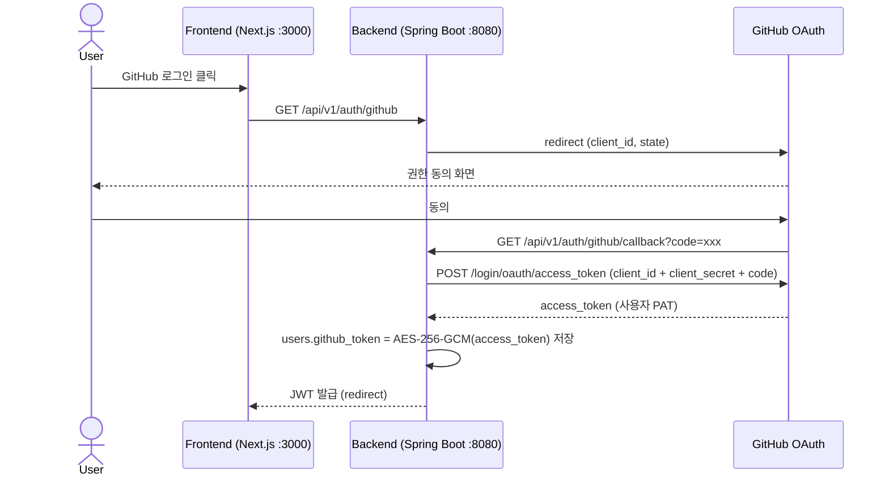
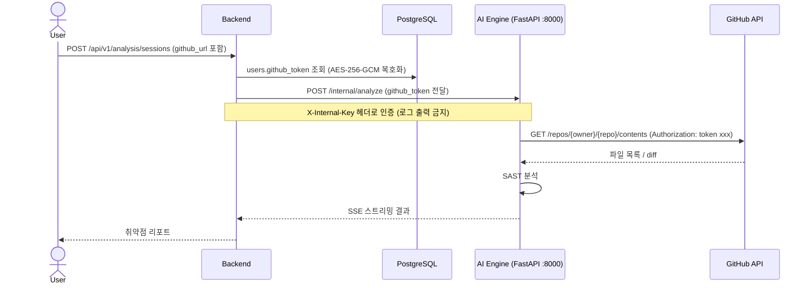
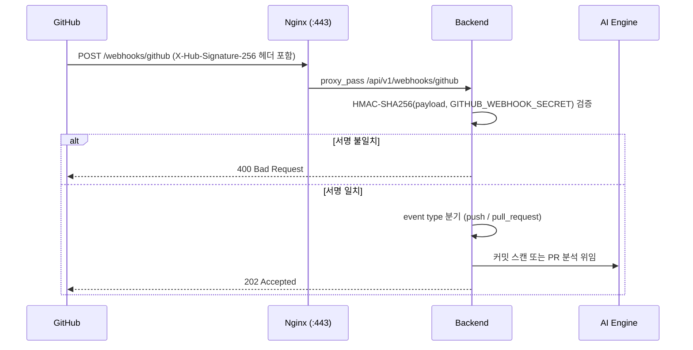
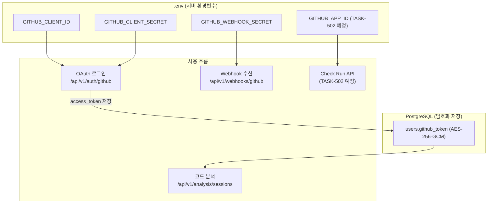

# GitHub 토큰 흐름 정리

> 작성일: 2026-05-25  
> 배경: Sprint 10 GitHub App 설정 중 "기존 토큰이 어디서 쓰이고 있는지" 파악하면서 정리

---

## 전체 흐름 요약

GitHub 관련 인증은 **3가지 토큰**이 독립적으로 사용된다.

| 토큰 | 용도 | 저장 위치 | 환경변수 |
|------|------|----------|---------|
| **OAuth Client ID/Secret** | 사용자 GitHub 로그인 (OAuth flow) | `.env` | `GITHUB_CLIENT_ID`, `GITHUB_CLIENT_SECRET` |
| **사용자 PAT (Personal Access Token)** | GitHub API 호출 (파일 조회, 커밋 조회) | DB (`users.github_token`, AES-256-GCM 암호화) | — |
| **Webhook Secret** | Webhook 수신 시 HMAC-SHA256 서명 검증 | `.env` | `GITHUB_WEBHOOK_SECRET` |
| **GitHub App ID** | Check Run API (PR 머지 차단) | `.env` (TASK-502 때 추가 예정) | `GITHUB_APP_ID` |

---

## Mermaid 다이어그램

### 1. 사용자 로그인 흐름 (OAuth)

### 2. 코드 분석 흐름 (PAT 사용)

### 3. Webhook 수신 흐름 (Webhook Secret 사용)

### 4. 전체 토큰 의존 관계

---

## 컴포넌트별 역할

### `GitHubOAuthService.java`
- `GITHUB_CLIENT_ID` + `GITHUB_CLIENT_SECRET` 사용
- GitHub OAuth flow 처리 → 사용자 PAT 획득 → DB 저장

### `GitHubApiService.java`
- DB에서 사용자 `github_token` 복호화 (`@Convert(AesEncryptionConverter)`)
- URL 파싱 + 레포 접근 권한 검증
- 실제 HTTP 호출은 `GitHubRestClient`에 위임 (DIP)

### `GitHubWebhookService.java`
- `GITHUB_WEBHOOK_SECRET`으로 HMAC-SHA256 서명 검증
- `webhookSecret` 미설정 시 경고 로그 + 검증 스킵 (개발 환경 허용)
- PR opened/synchronize 이벤트 → 분석 트리거

### `GitHubConfig.java`
- `@ConfigurationProperties(prefix = "secureai.github")`
- `webhookSecret` → `secureai.github.webhook-secret` (= `GITHUB_WEBHOOK_SECRET`)
- `checkRunAppId` → `secureai.github.check-run-app-id` (= `GITHUB_APP_ID`, TASK-502 예정)

### `AiAgentClient.java` / `DefaultAiAgentClient.java`
- AI Engine 호출 시 `github_token` 파라미터로 전달
- **로그 출력 금지** (보안 규칙)

---

## 주의사항

1. **PAT은 절대 로그에 출력 금지** — `AiAgentClient`, `GitHubApiService`, `CommitSecretService` 모두 주석으로 명시
2. **Webhook Secret 미설정** 시 서명 검증 생략 — 개발 환경 전용, **운영 환경 반드시 설정 필요**
3. **GitHub App vs OAuth App 구분**
   - OAuth App: Client ID/Secret으로 사용자 로그인만
   - GitHub App: OAuth + Webhook + Check Run API까지 지원 → Sprint 10에서 GitHub App으로 전환
4. **Check Run API** (TASK-502): `GITHUB_APP_ID` + Private Key(JWT)로 Installation Token 생성 필요 — 현재 미구현

---

## 관련 파일

| 파일 | 역할 |
|------|------|
| `apps/backend/.../config/GitHubConfig.java` | webhook-secret, check-run-app-id 바인딩 |
| `apps/backend/.../config/GitHubRestClientConfig.java` | GitHub API RestClient @Bean |
| `apps/backend/.../auth/service/GitHubOAuthService.java` | OAuth 로그인, PAT 저장 |
| `apps/backend/.../analysis/service/GitHubApiService.java` | PAT 복호화, 레포 접근 검증 |
| `apps/backend/.../analysis/service/GitHubWebhookService.java` | Webhook 서명 검증, 이벤트 분기 |
| `apps/backend/.../analysis/service/CommitHistoryScanner.java` | 커밋 페이지네이션 (TASK-501) |
| `apps/backend/.../analysis/controller/GitHubWebhookController.java` | `POST /api/v1/webhooks/github` |
| `apps/backend/.../auth/controller/AuthController.java` | `GET /api/v1/auth/github/callback` |
| `apps/ai_engine/agent/tools/mcp_github_tools.py` | MCP 경유 GitHub API 래퍼 |
