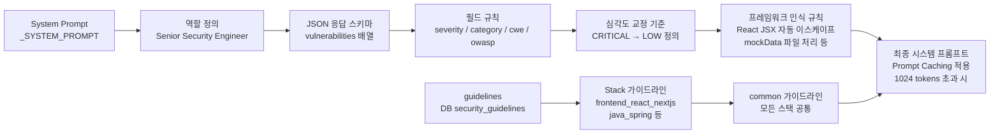
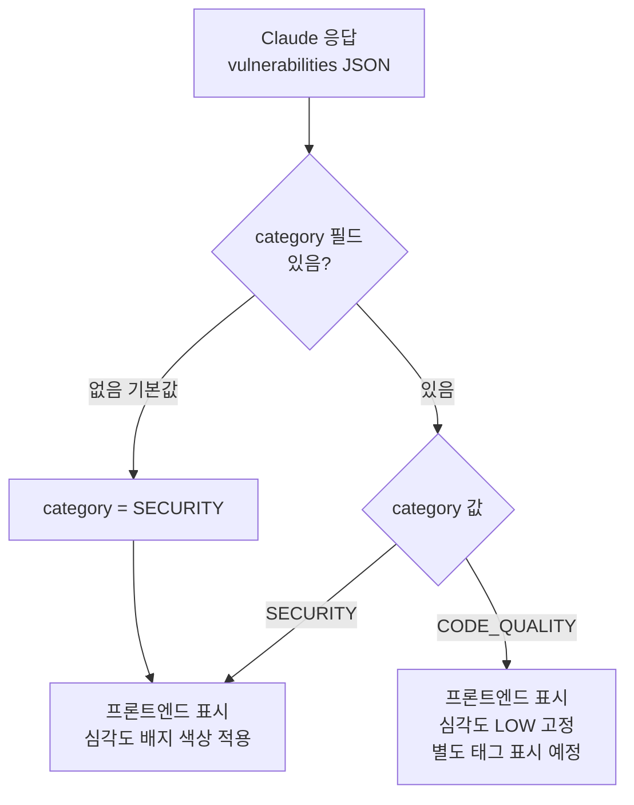

# SAST 분석 워크플로우

## 현재 구조 요약

| 항목 | 현황 |
|------|------|
| 모델 | `claude-haiku-4-5` (기본) / BYOK 설정 시 사용자 지정 모델 |
| 가이드라인 DB | `security_guidelines` 테이블 — **현재 비어있음** (docs/security/ 문서 미입력) |
| docs/security/ 참조 | ❌ 직접 읽지 않음 — DB 경유 필요 |
| category 필드 | ✅ `SECURITY` / `CODE_QUALITY` 구분 (2026-05-10 추가) |

---

## LangGraph 실행 흐름

```mermaid
flowchart TD
    START([분석 요청\nPOST /analysis/sessions]) --> A

    A[scan_files_node\n파일 목록 수집]
    A -->|source_type=local| A1[MCP Filesystem\nlist_directory]
    A -->|source_type=github| A2[GitHub API\nlist_github_files]
    A1 & A2 --> B

    B{파일 있음?}
    B -->|없음| END_EMPTY([END — 빈 결과])
    B -->|있음| C

    C[cache_check_node\nRedis SHA256 조회]
    C -->|캐시 HIT| D[next_file_node]
    C -->|캐시 MISS| E

    E[sast_node\nClaude SAST 분석]
    E --> E1[파일 내용 읽기\nMCP / GitHub API]
    E1 --> E2[스택 감지\n확장자 → java_spring\nfrontend_react_nextjs 등]
    E2 --> E3[guidelines 로드\nDB security_guidelines\ntarget_stack + common]
    E3 --> E4{300줄 초과?}
    E4 -->|단일 청크| E5[Claude 단일 호출]
    E4 -->|청크 분할| E6[asyncio.gather\n병렬 Claude 호출]
    E5 & E6 --> E7[response_parser\nJSON 3단계 복구 파싱]
    E7 --> E8[vuln_classifier\nCWE/OWASP 정규화\ncallChain 추론\ncategory 기본값 보장]
    E8 --> E9[Redis 캐시 저장\nTTL 7일]
    E9 --> E10[Backend API\nPOST /internal/vulnerabilities]
    E10 --> D

    D[next_file_node\n다음 파일로 이동]
    D -->|파일 남음| C
    D -->|모든 파일 완료| F

    F[aggregate_node\n전체 결과 집계]
    F --> G[Redis Pub/Sub\nsecureai:progress:{sessionId}]
    G --> H[RedisSubscriber\nSpring Backend]
    H --> I[SSE 전송\nEventSource → Frontend]
    H --> J[DB 세션 상태\nanalysis_sessions.status = completed]
    I --> END_OK([분석 완료])
```

---

## Claude 시스템 프롬프트 구조



---

## category 필드 처리 흐름



---

## 현재 미해결 문제 및 개선 방향

### 1. `security_guidelines` 테이블 비어있음 ❌
`docs/security/stacks/` 문서가 DB에 입력되지 않아 스택별 가이드라인이 적용되지 않고 있음.

**해결책**: `docs/security/` → `security_guidelines` 테이블 임포트 스크립트 필요

```sql
-- 예시: frontend_react_nextjs 가이드라인 입력
INSERT INTO security_guidelines (target_stack, category, title, content)
VALUES ('frontend_react_nextjs', 'xss', 'React XSS 방어', '...');
```

### 2. 분석 대상에 mockData.ts 포함 ❌
테스트/데모용 파일이 분석 대상에 포함되어 false positive 발생.

**해결책**: `scan_files_node`에서 제외 패턴 추가
```python
EXCLUDE_PATTERNS = ["mockData", "fixtures", "seeds", "__tests__", ".test.", ".spec."]
```

### 3. 모델 교체 권장
Haiku → Sonnet 으로 교체 시 FP율 대폭 감소 예상 (React 프레임워크 이해도 차이).
