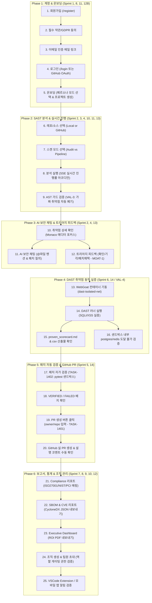

# SecureAI (Pagori) Master End-to-End User Scenario (Sprint 1 ~ 14)

본 문서는 **SecureAI (개발 프로젝트명: Pagori) 플랫폼의 Sprint 1부터 Sprint 14까지 구현된 모든 핵심 기능**을 유기적으로 검증할 수 있는 통합 마스터 사용자 시나리오입니다. 

사용자가 최초 가입하는 단계부터 프로젝트 생성, 정적 분석(SAST), AI 기반 보안 채팅 및 트리아지, DAST 샌드박스를 이용한 동적 취약점 실증, AI 패치 자동 생성 및 검증(Sandbox), 마지막으로 GitHub PR 생성 및 컴플라이언스 리포트 내보내기까지의 전체 시스템 라이프사이클을 포함합니다.

---

## 🗺️ 전체 시나리오 흐름도 (End-to-End Flow)



---

## 📝 단계별 상세 수동 테스트 시나리오

### Phase 1: 계정 생성 및 온보딩
본 단계는 계정 관리 인프라, 비밀번호 보안 규정, 그리고 페르소나별 랜드페이지 기능이 올바르게 작동하는지 검증합니다.

1. **회원가입 정보 입력 및 검증**
   * **테스트 경로**: `/register`
   * **행동**: 이메일, 사용자명, 비밀번호 입력.
   * **체크포인트**: 
     * 비밀번호 규칙 미충족(8자 미만, 대/소문자/숫자 미포함) 시 가입 버튼 비활성화 또는 경고 노출 여부.
     * 이용약관 및 개인정보처리방침 필수 체크박스를 비우고 제출할 때 400 Bad Request 에러로 차단되는지 확인.
2. **이메일 인증 링크 활성화**
   * **행동**: 가입 완료 후 발송된 이메일에서 '이메일 인증하기' 버튼 클릭.
   * **체크포인트**:
     * 인증 처리 페이지(`/auth/verify-email`)로 랜딩되어 성공 메시지가 표시되는지 확인.
     * 인증 메일 토큰의 유효기간(24시간) 만료 후 접근 시 적절한 토큰 오류 화면이 나오는지 검증.
3. **로그인 가드 및 세션 테스트**
   * **테스트 경로**: `/login`
   * **행동**: 등록한 이메일/비밀번호로 로그인하거나 `🐙 GitHub로 계속하기`로 OAuth 로그인 수행.
   * **체크포인트**:
     * 비밀번호 5회 연속 실패 시 계정이 15분간 잠금 상태로 자동 전환되는지 확인 (Brute-force 보호).
     * 로그인이 완료되면 JWT와 Refresh Token이 쿠키/스토리지에 정상 발급되는지 개발자 도구에서 관찰.
4. **온보딩 페르소나 모드 설정**
   * **테스트 경로**: `/onboarding`
   * **행동**: '개발자'(에디터 중심)와 '보안담당'(대시보드 중심) 중 하나를 선택하고 첫 프로젝트 `my-service` 생성.
   * **체크포인트**:
     * 설정값에 따라 대시보드 메인 화면의 레이아웃과 랜드페이지 라우팅이 분기되는지 확인.

---

### Phase 2: 소스 스캔 (SAST) 및 실시간 진행률
로컬 소스 또는 연동된 GitHub 프로젝트를 정적으로 스캔하여 취약점을 수집하고 오탐을 결정론적으로 1차 필터링하는 단계입니다.

1. **분석 대상 설정 및 모드 선택**
   * **테스트 경로**: `/editor` (좌측 파일 트리 및 분석 설정 화면)
   * **행동**: 분석하고자 하는 폴더/파일을 파일 트리에서 선택. 스캔 모드를 `⚡ Audit` (속도/저비용) 또는 `🔬 Pipeline` (정밀)로 전환.
   * **체크포인트**:
     * `Audit` 모드는 Haiku 모델을 사용하여 저비용으로 분석을 마치는지, `Pipeline` 모드는 Sonnet 모델을 통해 정밀 스캔을 실행하는지 검증.
2. **실시간 SSE 진행률 모니터링**
   * **행동**: "⚡ 분석 시작" 버튼을 클릭하여 파이프라인 기동.
   * **체크포인트**:
     * 화면 상단 진행바 및 API 카테고리(인증, 결제 등)별 아코디언 컴포넌트가 SSE(Server-Sent Events)를 통해 실시간으로 0%에서 100%까지 채워지는지 확인 (B-001 진행률 고정 버그 재현 방지).
3. **AST 할루시네이션 가드 작동 (VAL-3)**
   * **행동**: 분석 결과가 데이터베이스에 최종 저장되기 전에 로깅 확인.
   * **체크포인트**:
     * AI 엔진이 찾은 취약점 중 실제 코드상 존재하지 않는 가짜 라인(File:Line)이나 공백/주석을 대상으로 생성된 오탐 건이 `validate_findings_node`에서 차단 및 폐기(`discarded_findings`)되는지 로그를 검증.

---

### Phase 3: AI 보안 채팅 및 트리아지 피드백
발견된 취약점을 분석하고 수정 제안을 확인하여, 오탐(False Positive) 판정에 대한 AI 엔진의 피드백 루프를 검증합니다.

1. **취약점 위치 탐색 및 에디터 연동**
   * **행동**: 취약점 결과 목록에서 심각도가 가장 높은 건(예: SQL Injection) 클릭.
   * **체크포인트**:
     * Monaco 에디터 화면이 해당 파일 및 취약점이 의심되는 라인(Line)으로 자동 하이라이트 및 포커스 이동되는지 확인.
2. **AI 보안 채팅 및 파일 멘션**
   * **행동**: 우측 하단의 AI 채팅 팝업 활성화. 입력창에 `@파일명`을 태그한 뒤 "해당 코드의 SQLi 문제를 파라미터 바인딩으로 안전하게 수정하는 코드를 제안해줘"라고 질의.
   * **체크포인트**:
     * 챗봇이 해당 파일의 맥락을 인식하고 안전한 패치 코드 블록을 제안하는지 답변 확인.
3. **트리아지 의사결정 및 피드백 누적 (MOAT-1)**
   * **행동**: 취약점 세부 패널에서 `✓ 확인` (취약점 인정), `✕ 기각(오탐)` (오탐 마킹), `🩹 패치 채택` 버튼을 교대로 클릭해 봄.
   * **체크포인트**:
     * `기각(오탐)` 버튼 클릭 시 사유 입력 창이 팝업되며 기각 사유를 등록하면, `triage_feedback` 테이블(append-only)에 레코드가 즉시 적재되어 향후 리랭커(Re-ranker) 학습 자산으로 격리 수집되는지 확인.
     * 낙관적 갱신(Optimistic Update)이 적용되어 클릭 순간 UI 배지가 변경되고, 새로고침 시에도 상태가 서버 동기화되어 유지되는지 확인 (FE VulnStatus 타입 매핑 확인).

---

### Phase 4: DAST 취약점 동적 실증 검증 (VAL-4)
AI가 정적으로 진단한 결과가 실제로 익스플로잇 가능한 "진짜 취약점"인지 샌드박스에서 모의 공격을 전개하여 실증하는 단계입니다.

1. **타깃 테스트베드 준비 및 기동**
   * **행동**: WebGoat 컨테이너 기동.
     ```bash
     docker compose -f apps/ai_engine/benchmarks/proven_exploit/targets/docker-compose.webgoat.yml up -d
     ```
2. **동적 실증 러너 실행**
   * **행동**: 격리 네트워크(`dast-isolated-net`)에서 러너 기동.
     ```bash
     cd apps/ai_engine
     $env:DAST_NETWORK="dast-isolated-net"
     python -m benchmarks.proven_exploit.runner --target-url http://localhost:8081
     ```
     > WebGoat는 호스트 8081로 노출됩니다(백엔드가 8080을 점유하므로 충돌 회피).
3. **체크포인트 및 가드 검증**:
   * [ ] **Exploit 실증 성공**: SQLi 또는 XSS 카테고리에서 공격 페이로드 전송에 성공하여 증적(evidence) 데이터를 확보하는지 관찰.
   * [ ] **산출물 검증**: `proven_scorecard.md`와 `proven_exploitable.csv` 파일이 정상적으로 쓰이고 통계 지표가 업데이트되었는지 확인.
   * [ ] **샌드박스 포트 스캔 거부 (격리 확인)**: 샌드박스 내부 테스트 이미지에서 외부 호스트의 postgres(5434) 또는 redis(6379)로의 비인가 도달이 불가한지 확인 (보안 규칙 준수).
   * [ ] **오설정 가드 작동**: `DAST_NETWORK` 환경변수를 비운 상태에서 실행을 시도하면 실행이 중단되며 비0 종료 코드를 반환하는지 확인.

---

### Phase 5: 패치 자가 검증 및 PR 자동 생성
AI가 제안한 소스 코드 패치를 테스트 컨테이너에서 임시 빌드해 검증하고, 정상으로 판명된 코드에 대해 GitHub Pull Request를 자동 오픈하는 통합 단계입니다.

1. **패치 임시 테스트 케이스 자동 생성 및 빌드 (TASK-1402)**
   * **행동**: 프론트엔드 패널에서 특정 취약점 패치에 대해 "검증 요청" 수행.
   * **체크포인트**:
     * AI 엔진이 Claude API를 통해 pytest 검증 테스트 코드를 자동으로 생성하고, `dast-isolated-net` 환경변수가 설정된 임시 pytest Docker 컨테이너를 구동하여 패치된 파일의 테스트를 실행하는지 로그 확인 (Python+pytest 단일 언어 기준).
     * 통과 시 `VERIFIED` 상태로, 테스트 실패 시 `FAILED` 상태로 변환되어 프론트엔드 배지 색상(그린/레드)에 동적으로 반영되는지 확인.
2. **GitHub Pull Request 생성 요청 (TASK-1401)**
   * **행동**: 검증 성공(`VERIFIED`) 패치 옆의 "PR 생성" 클릭. 모달 창에 테스트용 `owner/repository`를 적어 제출.
   * **체크포인트**:
     * API 호출(`POST /api/v1/patches/{id}/pull-request`)이 백엔드의 `GitHubRestClient`를 거쳐 타깃 리포지토리에 새 브랜치(`secureai/patch-*`)를 만들고 PR을 생성하는지 확인.
     * **Auto-Merge 차단**: GitHub 웹사이트에서 생성된 PR을 보았을 때 `Merge pull request`가 자동 처리되지 않고 사용자의 수동 머지 승인을 기다리는지 검증.
     * **PR 코멘트 확인**: PR 설명란 및 코멘트 창에 패치 요약 정보 및 보안 분석 검증 내용이 올바르게 덧붙여졌는지 확인.
     * **권한 예외 처리**: 권한이 없거나 App이 등록되지 않은 리포지토리를 기입했을 때 화면상에 `GITHUB_AUTH_REQUIRED` 경고 문구가 정상 노출되는지 검증.

---

### Phase 6: 컴플라이언스, SBOM & 관리자 도구
스캔 완료 후 규제 통제 준수 보고서를 작성하고, 대시보드를 통해 누적 ROI를 모니터링하며, 조직 내 권한 및 통합 관리 설정을 조율합니다.

1. **규제 준수(Compliance) 리포트 매핑 확인**
   * **테스트 경로**: `/projects/{id}/compliance`
   * **체크포인트**:
     * 취약점들이 ISO 27001, NIST CSF, PCI-DSS 등의 규제 통제 항목과 어떻게 매핑되었는지 진행 도넛 차트 및 리스트 조회. PDF 내보내기 시 통계가 깨지지 않고 깔끔하게 출력되는지 확인.
2. **CycloneDX SBOM 컴포넌트 및 의존성 CVE 매칭**
   * **테스트 경로**: `/projects/{id}/sbom`
   * **체크포인트**:
     * 프로젝트 내부 라이브러리(lodash 등)의 CVE 취약점 리스트와 CVSS 위험 지수 점수가 올바르게 표시되는지 확인. `CycloneDX JSON` 내보내기 파일의 유효성 검증.
3. **경영진 뷰(Executive View) 대시보드 및 ROI 산출**
   * **행동**: 대시보드 메인의 분석가 뷰를 '경영진 뷰'로 전환한 후 'ROI 리포트 PDF' 다운로드.
   * **체크포인트**:
     * 이번 달 스캔 수, 위험 감소율, 평균 조치 시간(MTTR) 지표 및 절감 비용 통계가 반영된 보고서가 다운로드되는지 확인.
4. **조직 관리 및 권한 게이팅 (BUG-1105-2 수정분 검증)**
   * **테스트 경로**: `/team/{slug}/members`
   * **행동**: 조직 대시보드로 접속하여 이메일을 통한 멤버 초대 발송.
   * **체크포인트**:
     * 본인의 권한이 `owner` 또는 `admin`일 때만 멤버 초대 버튼이 보이고 작동하는지 확인. 일반 `member` 계정으로 접속했을 때는 멤버 초대 기능에 제한(403 Forbidden 및 UI 미노출)이 걸리는지 역할 검증 수행.
5. **BYOK 설정 및 외부 스캔 연동**
   * **테스트 경로**: `/settings` (설정 탭)
   * **체크포인트**:
     * 본인의 Claude API Key를 암호화하여 정상 저장(BYOK 모드)할 수 있는지 확인.
     * VSCode Extension 연동 스캔 및 안드로이드 모바일 클라이언트에서 세션 상태 알림이 푸시되는지 E2E로 수동 검사.
